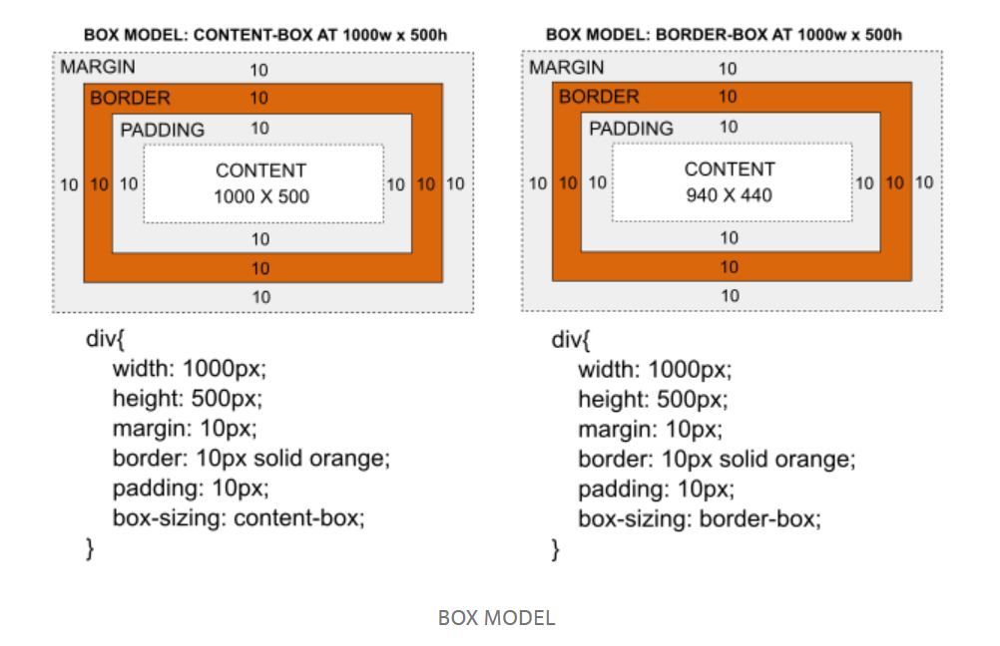

# box-model

-   **모든 HTML element**는 **box 모양의 영역**을 갖고 있다.

-   이 box 모양은 4가지 속성인, **margin, border, padding, content**로 구성되어있다.

-   element에 따라서 margin과 padding의 기본값을 지니고 있다. 그래서 이를 조절하기 편하게 하기 위해서 모든 element의 margin과 padding을 0으로 놓고 CSS의 구현을 시작하기도 한다.

    ```css
    * {
        margin: 0;
        padding: 0;
    }
    ```

-   margin, border, padding은 상하좌우의 크기를 모두 조절 할 수 있다.

    ```css
    p {
        margin: 10px; /*상하좌우 모두 같은 값 설정*/
        margin: 10px 5px; /*상하 좌우 2가지로 나누어서 같은 값 설정*/
        margin: 10px 5px 20px; /*상 좌우 하 3가지로 나누어서 값 설정*/
        margin: 5px 10px 15px 20px; /*상 우 하 좌(시계방향) 각각의 값 설정*/
    }
    ```

    > 4가지 방법으로 적을 수 있다는 것을 보여준다. (4가지 중 원하는 방법 1가지를 골라서 적는 것!)

    > -top, -bottom, -left, -right 이런식으로 따로 따로 지정이 가능하다.

-   border에는 border-style과 border-color를 설정할 수 있다. 이 property도 마찬가지로 상하좌우 값을 4가지 방법으로 설정할 수 있다.

-   content는 width와 height로 크기를 조절할 수 있다. 이 때 width와 height가 어느 영역을 의미하는지를 결정하는 property가 box-sizing이다. 2가지의 property값을 갖는다

    -   content-box : 기본값, width와 height값이 content영역을 의미한다.
    -   border-box : width와 height값이 content와 padding과 border를 포함한 영역을 의미한다. border-box 속성이 박스의 크기를 쉽게 설정할 수 있다.


    > box-sizing을 무엇으로 설정하는냐에 따라서 같은 값의 width와 height일지라도 box크기가 달라질 수 있다.




# Ref

-[Introduction to Box Model](https://medium.com/altcampus/introduction-to-box-model-e237de4f87a3)
