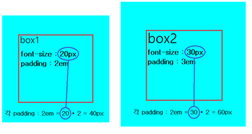
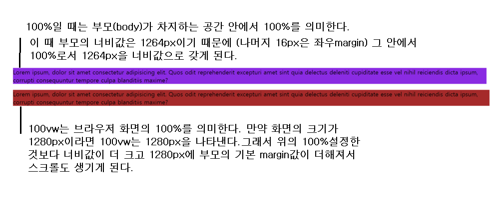

# CSS Unit

> 우리가 익숙하지 않은 단위를 중심으로 정리합니다.

## %

> `부모가 만들어준 공간` 안에서의 너비 비율

## em

-   `n em` 이라고 하면, 현재 사용된 폰트사이즈(혹은 상속 받은 폰트사이즈)를 기준으로 `n배`한 값이 표현된다.

```HTML
    <div class="container">
            <div class="box1">box1</div>
            <div class="box2">box2</div>
    </div>
```

```CSS
    div {
        display: inline-block;
    }
    .box1 {
        width: 10rem;
        height: 10rem;
        background-color: aqua;
        font-size: 20px;
        padding: 2em;
        margin-right: 20px;
    }
    .box2 {
        width: 10rem;
        height: 10rem;
        background-color: aqua;
        font-size: 30px;
        padding: 2em;
    }
```



> box1은 현재 폰트사이즈의 2배를 40px의 padding값을 갖게 되고 box2는 3배를 한 60px의 padding값을 갖게 된다. 이처럼 폰트 사이즈에 따라서 유동적으로 바뀌게 디자인을 하고 싶다면 `em단위`를 사용하는 것이 바람직하다.

> em단위는 폰트사이즈의 상속에서 따라서 바뀔수 있기 때문에 주의를 해야한다. 같은 `2em`일지라도 `2em`에 어떤 상황에서 쓰이는지를 정확히 살펴야한다.

## rem

-   최상위 요소(html element)인 폰트사이즈를 기준으로 하는 단위이다.

-   예를 들어 `10rem`이라고 하면 브라우저마다 다르지만 일반적으로 최상위 요소(html element)인 폰트사이즈는 `16px`이기 때문에 `160px`을 의미한다.

-   만약에 rem의 `16px` 기준을 변경하고 싶다면 아래와 같이 나타내주면 된다.

```css
:root {
    font-size: 12px;
}
```

> 이제 rem의 기준은 `12px`이 된다.

## viewport 단위

> `viewport`란 화면에 표시되는 영역(브라우저에 표시되는 영역)을 말한다.

### vw / vh

-   `1vw`는 브라우저 너비 값을 `1/100`을 나타낸다.
-   `1vh`는 브라우저 높이 값을 `1/100`을 나타낸다.
-   예를 들어 브라우저의 너비가 `1000px`일 때 `50vw`라고 하면 `1000px * 50/100` 의 너비를 나타낸다.

-   `vw vh` vs `%`

1. 화면의 절반에 해당하는 높이를 갖는 박스를 만들어보자

    > `%` 를 사용

    ```HTML
    <div class="container">
        <div class="box">
            Lorem ipsum, dolor sit amet consectetur adipisicing elit. Quos odit reprehenderit
            excepturi amet sint quia delectus deleniti cupiditate esse vel nihil reiciendis
            dicta ipsum, corrupti consequuntur tempore culpa blanditiis maxime?
        </div>
    </div>
    ```

    ```CSS
        .box {
            width: 100%;
            height: 50%;
            background-color: beige;
        }
    ```

    > 위의 코드대로 구현을 하면 div.box는 절대 화면 페이지의 절반에 해당하는 높이를 갖지 못한다. 이것은 `%에 대한 정의`때문이다. 위에서 언급했듯이 %는 부모가 만드는 공간에서 맞추어 정의 된다. 즉 위 코드에서는 어디에도 `div.container, body, html에 대한 높이`를 설정해준적이 없기 때문에 div.box가 차지하고 있는 공간이 바로 부모의 공간이 된다. 내가 원하는대로 구현하고자 한다면 아래와 같이 CSS를 추가해줘야한다.

    ```CSS
        html {
            height: 100%;
        }
        body {
            height: 100%;
        }
        .container {
            height: 100%;
        }
    ```

    > 위와 같은 코드를 `vh`를 사용하면 한방에 해결이 가능해진다.

    ```CSS
        .box {
            width: 100%;
            height: 50vh;
            background-color: beige;
        }
    ```

    > `50vh`는 브라우저의 화면에서 50(비율)만큼을 차지하라는 의미이다. 그래서 %에서 처럼 부모의, 부모의 ...높이를 계속 설정해 줄 필요가 없어진다.

2. `width : 100%` vs `vw : 100%`
   

### vmin / vmax

-   vmin : 웹브라우저(뷰포트)의 높이와 너비 중에서 작은 값을 기준으로 1/100을 한 값
-   vmax : 웹브라우저(뷰포트)의 높이와 너비 중에서 큰 값을 기준으로 1/100을 한 값

> 예를 들어 웹브라우저의 높이가 900px, 너비가 1200px이라면, 1vmin은 `900px *1/100`로 `9px`을 나타낸다. 또 1vmax라고 한다면 `1200px*1/100`으로 `12px`을 의미한다.

# More

-   em과 rem은 언제 사용해야할까

# Ref

-   [CSS 프로퍼티 값의 단위](https://poiemaweb.com/css3-units)
-   [em, rem, vw, vh 알아보기\_바위처럼의Ezweb_Youtube](https://www.youtube.com/watch?v=PYBJ9bF1doc&list=PL-qMANrofLyvQ6FuaIe3YRRX82eISDy11&index=96&t=250s)
