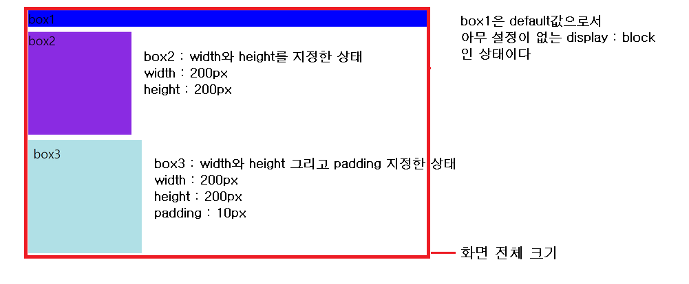
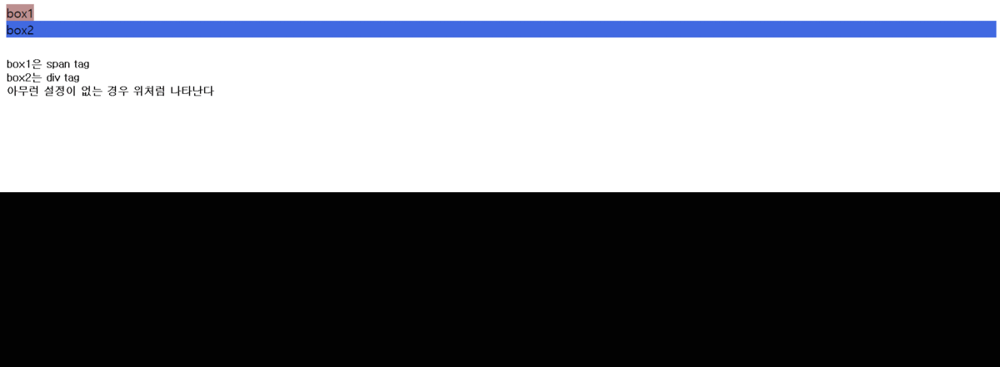
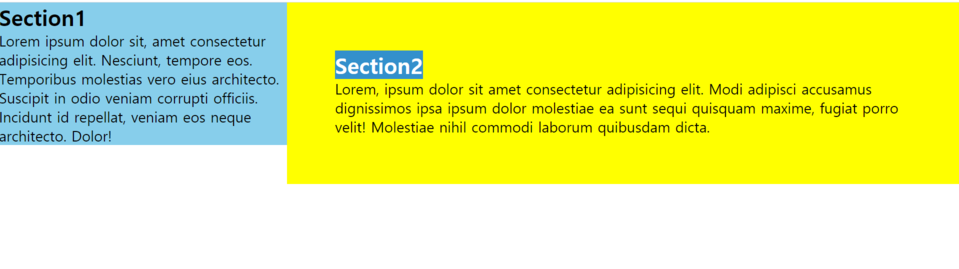

# display

> CSS layout을 제어하기 위해서 알아야할 가장 중요한 property

> 모든 인간이 `성별`을 갖고 있듯이 모든 엘리먼트는 `block` 혹은 `inline` 이라는 display 속성을 지니고 있다.

## block

-   대표적인 태그 : div, h1/2/3/4/5, p 등
-   기본적으로 부모영역의 `width 100%`를 차지하여 block이라는 말처럼 큰 박스를 형성한다. 그렇기 때문에 width를 설정하지 않는 경우, 페이지의 너비에 따라서 알아서 유동적으로 크기를 변경된다.
-   특별한 설정없는 경우 컨텐츠를 담고있는 큰 블럭을 만든다.
-   `width`, `height`, `padding`, `margin` 을 설정할 수 있다.
-   항상 새로운 라인에서 시작한다.



```HTML
    <div class="box1">box1</div>
    <div class="box2">box2</div>
    <div class="box3">box3</div>
```

```CSS
    div {
        margin: 10px 0;
        font-size: 1.5rem;
    }
    .box1 {
        background-color: blue;
    }
    .box2 {
        width: 200px;
        height: 200px;
        background-color: blueviolet;
    }
    .box3 {
        background-color: powderblue;
        width: 200px;
        height: 200px;
        padding: 10px;
    }
```

## inline

-   대표적인 태그 : span, a, strong, img 등
-   기본적으로 컨텐츠의 양만큼의 가로 공간(width)을 차지한다.
-   block 속성과는 다르게 inline은 속성은 한 줄안에 여러 개의 inline속성의 엘리먼트들이 공존할 수 있다.
-   `width`, `height`, `margin-top`, `margin-bottom`을 설정할 수 없다.(크기 조절 불가능)


```HTML
    <span class="box1">box1</span>
    <span class="box2">box2</span>
    <span class="box3">box3</span>
```

```CSS
    span {
        font-size: 1.2rem;
    }
    .box1 {
        background-color: powderblue;
    }
    .box2 {
        background-color: purple;
        width: 200px;
        height: 200px;
    }
    .box3 {
        background-color: rosybrown;
        padding: 10px;
        margin: 20px;
    }
```

## inline-block

-   inline의 장점(?)과 block의 장점(?)을 합쳐진 속성이다.
-   inline 속성처럼 한 줄안에 여러 개의 엘리먼트들을 위치 시킬 수 있다.
-   block 속성처럼 width, height, margin을 모두 설정할 수 있다.
-   아무런 설정이 없다면 기본적으로 컨텐츠의 양 만큼만 가로 공간을 갖는다.



```HTML
    <span class="box1">box1</span>
    <div class="box2">box2</div>
```

```CSS
    .box1 {
        display: inline-block;
        background-color: rosybrown;
        width: 200px;
        height: 200px;
        margin: 20px 40px;
    }
    .box2 {
        display: inline-block;
        background-color: royalblue;
        width: 100px;
        height: 100px;
        margin: 10px 30px;
    }
```

## none

-   `display : none` 으로 설정하면 그 엘리먼트가 화면에서 사라지게 된다. 엘리먼트를 동적으로 사라졌다 나타났다를 구현하기 위해서 자주 사용된다. 이 때 존재했던 엘리먼트의 공간도 사라진다는 사실을 알고 있어야 한다.

## 활용 : inline, block, inline-block을 이용한 2단 컬럼 만들어보기



```HTML
  <div class="container">
        <section class="item item1">
            <h1>Section1</h1>
            <p>
                Lorem ipsum dolor sit, amet consectetur adipisicing elit. Nesciunt, tempore eos.
                Temporibus molestias vero eius architecto. Suscipit in odio veniam corrupti
                officiis. Incidunt id repellat, veniam eos neque architecto. Dolor!
            </p>
        </section>
        <section class="item item2">
            <h1>Section2</h1>
            <p>
                Lorem, ipsum dolor sit amet consectetur adipisicing elit. Modi adipisci
                accusamus dignissimos ipsa ipsum dolor molestiae ea sunt sequi quisquam maxime,
                fugiat porro velit! Molestiae nihil commodi laborum quibusdam dicta.
            </p>
        </section>
    </div>
```

```CSS
  * {
        margin: 0;
        padding: 0;
        box-sizing: border-box;
    }
    .container {
        font-size: 0;
        /* section과 section 사이의 여백이 공간을 차지하기 때문에 이를 해결하기위한 것 */
    }
    .item {
        display: inline-block;
        font-size: 1.2rem;
    }
    .item1 {
        width: 30%;
        background-color: skyblue;
    }
    .item2 {
        width: 70%;
        background-color: yellow;
        padding: 5%;
        vertical-align: top;

    }
```

> `vertical-align: top` - 기본값이 base-line이기 때문에 글자 하단부를 기준으로 정렬된다. 이로 인해 item2인 div가 아래로 정렬되어 상단에 빈공간이 생긴다. 이를 막기위해서, 상단의 빈공간을 없애기 위한 설정이다.\*/

> `box-sizing: border-box` - 만약에 기본값인 `content-box`였다면 item1과 item2의 width값을 설정할 때 `padding값과 margin값`의 유무를 고려해야 한다.

> 위의 이미지 처럼 2단 칼럼을 `inline-block 속성`에 대한 이해만으로 구현할 수 있다. 또한 너비 역시 화면의 크기에 따라서 유동적으로 움직이기 때문에 러프하지만 활용 가능한 레이아웃을 만들수 있다.

# Ref

-   [2.5 CSS3 Display](https://poiemaweb.com/css3-display)
-   [CSS 레이아웃\_1분코딩](https://www.youtube.com/watch?v=Zny5Vxqk6Mk&t=1460s)
