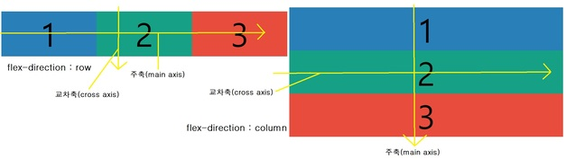
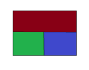
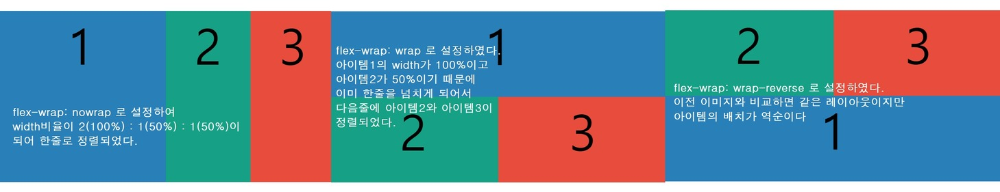
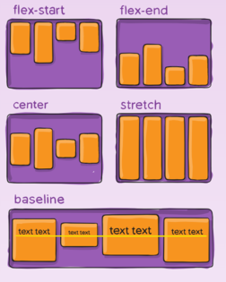
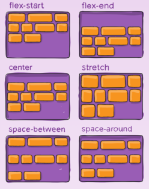
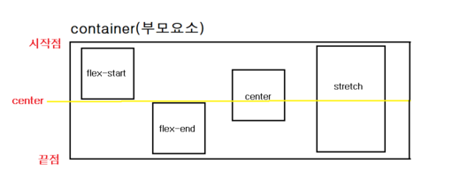
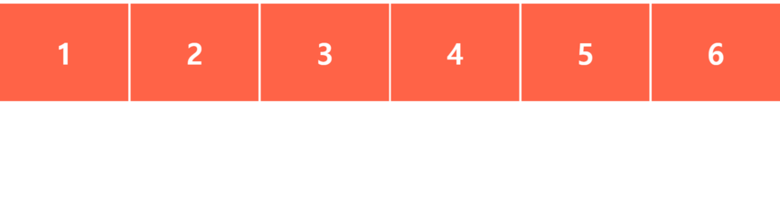
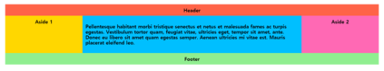

# Flexbox

> 플랙스박스란 CSS layout을 짜는 새로운 방식이다.

> syntax

```HTML
<div class="container">
    <div class="item"></div>
    <div class="item"></div>
    <div class="item"></div>
</div>
```

```CSS
.container { /*부모요소*/
    width: 100%;
    height: 500px;
    display: flex;
}
.item {
    width: 100%;
    height: 200px;
}
/*자식구분을 위한 코드*/
.item:first-child {
    background-color: #2980b9;
}
.item:nth-child(2) {
    background-color: #16a085;
}
.item:last-child {
    background-color: #e74c3c;
}
```

## Basic

> 위의 코드를 보면 **부모요소**에 `display : flex`를 설정해주면, **자식요소인 item**은 그에 맞게 `행` 혹은 `열`로 정렬하게 된다.

> flex layout을 이해하기 위해선 가장 중요한 것은 `두 개의 축`을 이해하는 것이다. 이 두 개의 축이 행 혹은 열로 정렬할 수 있는 기준을 정해준다.

> > 두 개의 축 : `주축(main axis)`과 `교차축(cross axis)`

-   두 개의 축은 `flex-direction`이라는 속성에 의해서 설정된다. 기본값은 `row`이기 때문에 주축은 기본적으로 `행`이다.
    -   row(기본값) : 아이템이 **행을 기준**으로 정렬하게 된다.
    -   row-reverse : **행을 기준**으로 정렬하되 아이템의 순서가 **역순**이 된다.
    -   column : 아이템이 **열을 기준**으로 정렬하게 된다.
    -   column-reverse : **열을 기준**으로 정렬하되 아이템의 순서가 **역순**이 된다.



> `flex-direction`의 설정에 따라서 주축의 변화가 일어나고 또한 정렬 방식이 달라지는 것을 볼 수 있다. 즉 `플래스의 정렬방식`을 설정하고 싶다면, `주축을 무엇으로 설정할 것`인지를 결정해야한다.

## Flex 속성

> flex의 속성은 크게 2가지, `부모(container)에게 주는 속성`과 `자식(items)에게 주는 속성`으로 분류할 수 있다.

```
✅부모(container)에게 주는 속성
1. display : flex
2. flex-direction
3. flex-wrap
(4. flex-flow)(shorthand)
5. justify-content
6. align-items
7. align-content

✅자식(items)에게 주는 속성
1. align-self
2. order
3. flex
```

1. flex-wrap
    > 플랙스 아이템들을 몇 줄에 걸쳐서 배치할건지를 결정하는 속성으로 `플랙스 컨테이너(부모)의 width`보다 `모든 플랙스 아이템들(자식)의 width의 합`이 크다면 아이템들을 어떻게 배치할건지를 결정한다.

-   no-wrap(기본값) : 모든 아이템을 `한 줄(one line)`에 배치
-   wrap : `아이템들의 width 합이 넘치면 다음 줄`에 배치
-   wrap-reverse : `아이템들의 width 합이 넘치면 다음 줄`에 배치하되 아이템들의 순서가 역순

    > 시나리오 : 아래와 같은 레이아웃을 짜고 싶다면 🚀

    

    ```css
    .container {
        width: 100%;
        height: 500px;
        display: flex;
        flex-direction: row;
        /* 
        flex-wrap: nowrap; // 1
        flex-wrap: wrap;   // 2
        flex-wrap: wrap-reverse; //3 
        */
    }
    .item {
        width: 100%;
    }
    /*아이템1*/
    .item:first-child {
        background-color: #2980b9;
    }
    /*아이템2*/
    .item:nth-child(2) {
        background-color: #16a085;
        width: 50%;
    }
    /*아이템3*/
    .item:last-child {
        background-color: #e74c3c;
        width: 50%;
    }
    ```

    

    > 위의 코드에서 주석처리한 부분을 한개씩 해제하면서 구현한 모습이다. HTML은 맨 위의 코드와 동일하다.

2. flex-flow

    > 위에서 설명한 `flex-direction`와 `flex-wrap`를 합혀서 `flex-flow`라는 속성으로 설정할 수 있다. 일종의 shorthand으로 축약표현이라고 생각하면 된다.

3. justify-content

    > `주축`에서 아이템을 배치하는 방법이다.

-   flex-start(default) : 앞쪽부터 채워진다.
-   flex-end : 뒤쪽부터 채워진다.
-   center : 가운데정렬
-   space-between : 양사이드 아이템은 끝에 붙이고 그 사이 여백은 동일하게 나눈다.
-   space-around : 각각 아이템 좌우에 동일한 여백을 준다.
-   space-evenly: 모든 아이템의 여백을 동일하게 분배해준다.

    

4. align-items
    > `교차축`에서 아이템 배치방법, `justify-content`의 `교차축 버전`이라고 생각하면 된다.

-   strech(default) : 부모가 가진 공간에서 꽉찬 높이의 값을 갖게 배치한다.
-   center : 교차축의 가운데에 정렬한다
-   flex-start : 교차축의 시작점에 정렬한다.
-   flex-end : 교차축의 끝점에 정렬한다.
-   baseline : 부모의 baseline을 기준으로 정렬된다.

    

5. align-content

    > `교차축`에서의 라인(아이템들)의 배치 방법이다. 이 속성은 아이템들이 한 줄일 때는 아무런 변화가 없다.

-   stretch(default) : 교차축에서 행마다 분배된 공간의 최대치를 차지하며 정렬한다.
-   flex-start : 컨테이너의 위쪽(시작점)부터 채워진다.
-   flex-end : 컨테이너의 아래쪽(끝점)부터 채워진다.
-   center : 가운데에 모인다.
-   space-between : 양사이드 행은 끝에 붙이고 그 사이 행의 여백은 동일하게 나눈다.
-   space-around : 각 행의 좌우에 동일한 여백을 준다.
-   space-evenly: 모든 행의 여백을 동일하게 분배해준다.

    > 위 설명은 `flex-direction`이 row인 경우를 가정하고 한 설명입니다

    

6.  align-self

    > `교차축기준`으로 단일 아이템을 정렬할 수 있다. 즉, 플랙스아이템 중에서 어느 한가지만 다르게 정렬시키고 싶을 때, 이 속성을 사용할 수 있다. 아이템의 정렬은 다른 속성보다 `align-self`가 우선순위를 갖는다.

    -   auto (default) : 부모의 `align-items` 속성을 상속받는다.
    -   flex-start
    -   flex-end
    -   center
    -   baseline : 아이템을 baseline(문자기준선)에 정렬시킨다.
    -   stretch

    > `float`, `clear`, `vertical-align` 속성들은 플랙스아이템에 영향을 미치지 못한다.

    

7.  order

    > 아이템의 순를 설정한다. 아이템에 숫자를 설정하고 숫자가 클수록 뒤로 밀린다(나중에 정렬된다). HTML에 관계없이 정렬시킬 수 있는 장점이 있다.

    > 기본값은 0이다. 음수도 가능하다. 같은 값을 갖는 경우는 HTML에 있는 순서대로 보여진다.

8.  flex

    > 아이템의 크기 비율 설정하는 속성이다. 이 속성이 있어서 플랙스의 `유연함`이 한층 더 강조되는 것이라고 한다. (난 아직 잘...🤯)

    -   flex-grow(기본값 0) : 여백이 있을 때, 아이템의 크기를 늘릴 수 있다. 즉 `아이템의 증가너비 비율`을 설정하는 것
        -   `flex-grow`의 기본값이 0이기 때문에 기본적으로 사용가능한 전체 공간에 맞게 확장되지는 않는다. 기본적으로 컨텐츠 양에 맞게 아이템 크기를 갖는다.
        -   하지만 `flex-grow = 1`로 바꾸면 가능한 큰 공간을 차지하게 된다. 즉 `flex-grow = 1`은 아이템이 확장 가능하도록 만들어주는 설정이라고 할 수 있다.
    -   flex-shrink(기본값 1) : 아이템의 크기가 넘칠 때, 크기를 줄일 수 있다. 즉 `아이템의 감소너비 비율`을 설정하는 것
        -   `flex-shrink`의 기본값이 1이기 때문에 화면의 크기가 줄어들면 그 화면 크기에 맞게 아이템의 크기도 줄어들고 그에 맞게 컨텐츠의 형태로 바뀌게 된다. 하지만 `flex-shrink : 0`으로 설정하면 화면크기가 줄어도 아이템 영역 및 컨텐츠들의 변화가 생기지 않는다.
    -   flex-basis(기본값 auto) : 기본 크기를 설정한다. 즉 `아이템의 기본 너비` 설정

        -   `flex-grow`나 `flex-shrink`속성에 의해 크기에 맞게 조절하기 전에 기본적으로 `flex-basis`에 의해서 **초기 크기가 지정**된다. 기본값이 `auto`이기 때문에 초기 크기는 플랙스 아이템의 컨텐츠에 따라서 자동으로 설정된다. 또한 컨텐츠를 늘리게 되면 자동으로 초기 크기가 늘어가게 되어있다.
        -   그런데 이 `flex-basis`를 고정 크기를 갖게 되고 이후 아이템의 컨텐츠가 증가하여도 아이템의 크기는 일정값을 유지하게 된다.
        -   `flex-basis : 0`일 때 고정너비를 설정하지 않고 앞의 속성을 따르겠다는 의미이다. 즉, `flex-grow`에서 설정된 최대의 아이템 공간을 따라가는 결과가 나온다.

    -   shorthand(축약형)

        > `flex : [flex-grow] [flex-shrink] [flex-basis]` , `flex-grow`와 `flex-shrink`가 같은 경우, 축약하여 `flex-grow` 속성 한 개만 적기도 한다. 이 때는 `flex : 정수`형태로 변하게 되는데 그 `정수의 비율`별로 `아이템의 영역이 결정`된다.

        > W3C에서는 각각의 속성을 따로 따로 적어주는 것을 추천한다.

## Example

> 직접 만들어보자 😎

### 1



> 추가1 : 미디어쿼리(big/middle/small screen)

### 2


> 추가1 : 각 메뉴아이콘(Home/About/Products/Contact)에 hover effect

> 추가2 : 미디어쿼리(big/middle/small screen)

### 3



# Ref

-   [MDN flexbox의 기본 개념](https://developer.mozilla.org/ko/docs/Web/CSS/CSS_Flexible_Box_Layout/Flexbox%EC%9D%98_%EA%B8%B0%EB%B3%B8_%EA%B0%9C%EB%85%90)

-   [A Complete Guide to Flexbox](https://css-tricks.com/snippets/css/a-guide-to-flexbox/)

-   [CSS Flex(Flexible Box) 완벽 가이드](https://heropy.blog/2018/11/24/css-flexible-box/)

-   [CSS3 Flexbox Layout](https://poiemaweb.com/css3-flexbox)
-   [Flexbox 이해: 당신이 알아야 할 모든 것 (Understanding Flexbox: Everything you need to know) 번역](https://www.vobour.com/2-flexbox-%EC%9D%B4%ED%95%B4-%EB%8B%B9%EC%8B%A0%EC%9D%B4-%EC%95%8C%EC%95%84%EC%95%BC-%ED%95%A0-%EB%AA%A8%EB%93%A0-%EA%B2%83-understa)
