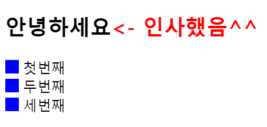

# 선택자(Selector)

-   CSS에서 스타일을 지정할 때 그 대상을 가르키기 위해 사용하는 것

## 선택자의 종류

-   타입선택자 (Type Selector)
    -   element(tag)를 선택자로 나타낸다.
        ```CSS
         a {
            text-decoration : none;
        }
        ```
-   전체선택자(Universe Selector)
    -   스타일을 지정하기 전에 padding, margin, border등을 초기화 시키는데 주로 사용한다.
        ```CSS
        * {
            margin : 0;
            padding : 0;
        }
        ```
-   하위선택자(Descendant Selector)

    -   공백으로 분리된 두 개 이상의 선택자로 만들어진다 깊이(depth)에 관계없이 선택자에 해당하는 모든 element를 선택한다.
        ```CSS
        body p{
            margin : 10px;
        }
        ```
        > body안에 있는 element 중에서 깊이에 상관없이 p element를 모두 선택한다.

-   자식선택자(Child Selector)

    -   '>'로 분리된 두 개이상의 선택자로 만들어진다. 1깊이(1depth)에 있는 자식들만 선택된다.

        ```HTML
        <body>
            <p>first</p>
            <div>
                <p>second</p>
            </div>
            <p>third</p>
        </body>
        ```

        ```CSS
        body > p{
            color : red;
        }
        ```

        > body의 1깊이 밑의 p element를 모두 선택한다.
        > first와 third의 색만 변한다. second는 2깊이이기때문에 선택되지않는다.

-   인접선택자((Adjacent) Sibling Selector)

    -   '+' 로 분리된 두 개이상의 선택자들로 이루어진다. a + b의 형태일 경우 a element와 같은 깊이에 있는 다음의 b element를 선택한다. 이런 형태가 여러 개 나오면 여러 개가 모두 선택된다.
        ```HTML
        <body>
            <div>first
                <p>second</p>
            </div>
            <div>third</div>
            <p>fourth</p>
        </body>
        ```
        ```CSS
        div + p{
            color : red;
        }
        ```
        > third div element와 같은 깊이인 fourth의 p element가 선택된다. 그 위의 p element는 깊이가 다르기 때문에 선택되지 않는다.

-   속성선택자(Attribute Seletor)

    -   각 element가 갖는 속성으로 접근하는 선택자.
    -   활용할 수 있는여러가지 형태가 존재

        -   element[attr]
            -   attr이라는 속성을 갖는 element를 선택한다.
                ```CSS
                input[value]{
                    color :  red;
                }
                ```
        -   element[attr=value]
            -   attr이라는 속성과 그 값이 정확히 value에 해당하는 element를 선택한다.
                ```CSS
                input[value='name']{
                    color :  red;
                }
                ```
        -   element[attr~=value]
            -   attr이라는 속성과 그 값이 정확히 value에 해당하는 element를 선택한다. 속성값에 value가 포함되어있는 element도 선택한다.
                ```CSS
                img[alt~='dog']{
                        width : 100px;
                }
                ```
        -   element[attr|=value]
            -   속성값이 value로 시작하는 element를 선택한다.
        -   element[attr^=value]
            -   속성값이 value로 시작하는 element를 선택한다.(접두사설정)
        -   element[attr$=value]

            -   속성값이 value로 끝나는 element를 선택한다. (접미사 설정)

                ```CSS
                    div[class^='main']{
                        background-color : red;
                    }

                    div[class$='main']{
                        background-color : blue;
                    }
                ```

                ```HTML
                    <div class="first main">first</div>
                    <div class="main second">second</div>
                ```

                > main이 접두사인 second div는 빨간색 배경을 갖게되고, main이 접미사인 first div는 파랑색 배경을 갖게된다.

        -   element[attr*=value]
            -   속성값 안에 value가 1개라도 존재한다면, 그 element가 선택된다.

-   클래스/아이디 선택자(Class/ID Selector)

    -   클래스나 아이디를 이용하여 선택한다. 일반적으로 많이 사용하는 방식이다. 특정 엘리먼트에만 스타일을 적용시킬 수 있다. 클래스같은 경우 복수의 엘리먼트에 스타일을 줄 때, 아이디같은 경우는 특정(단일) 엘리먼트에 스타일을 줄 때 사용한다. 클래스는 .클래스명{ }, 아이디는 #아이디명{ } 이런식으로 사용한다.

-   가상클래스(Pseudo Class)

    -   선택될 element의 특정한 상태(상황)을 지정하는 선택자이다. 예를들면, element:active는 element를 클릭할 때 어떠한 스타일을 줄 수 있다. _주의할 점 : 앞뒤로 공백이 존재해서는 안된다._
    -   자주 사용되는 예시
        -   element:link : 아직 방문한적이 없는 링크
        -   element:visited : 방문한 링크
        -   element:hover : 마우스가 위에 있는 경우
        -   element:active : 클릭하는 경우
        -   element:first-child : element의 sibling element 중에서 첫번째
        -   element:last-child : element의 sibling element 중에서 마지막
        -   element:nth-child(산수식가능) : n이 산수식에 따라 sibling element를 선택
            ```CSS
                ul:nth-child(2n+1){
                    background-color : red;
                }
            ```
            > ul element의 자식 중에서 2n+1번째에 해당하는 자식들만 선택하는 것. **n은 0부터 들어가고, 자식은 첫번째 자식부터 존재한다.**

-   가상요소(Pseudo Selector)
    -   가상클래스처럼 선택자에 추가되는 형태는 비슷하지만 (가상클래스 : 사용 / 가상요소 :: 사용(':' 1개만 사용가능)) 문서의 특정부분을 가상으로 스타일을 지정할 수 있다.
    -   자주 사용되는 예시
        -   element::before
        -   elemnt::after
            ```HTML
                <h2>안녕하세요</h2>
                <div>첫번째</div>
                <div>두번째</div>
                <div>세번째</div>
            ```
            ```CSS
                h2::after{
                    content : "<- 인사했음^^";
                    color : red;
                }
                div::before{
                    content : " ";
                    width : 15px;
                    height : 15px;
                    background-color : blue;
                    display : inline-block;
                    margin-right : 5px;
                }
            ```
            > h2의 뒷부분에, 모든 div의 앞부분에 지정한 스타일이 가상의 요소로서 적용된다. 가상요소를 사용하기 위해선 반드시 content요소를 사용하여야 한다. 또한 가상요소이기 때문에 텍스트와는 다르게 드래그해도 먹히질않는다.
            >
            > > _OUTPUT_ 

# 참고

-   [Opentutorials.org : CSS Reference 선택자의 종류](https://opentutorials.org/module/484/4150)
-   [MDN CSS Selector ](https://developer.mozilla.org/ko/docs/Glossary/CSS_Selector)
