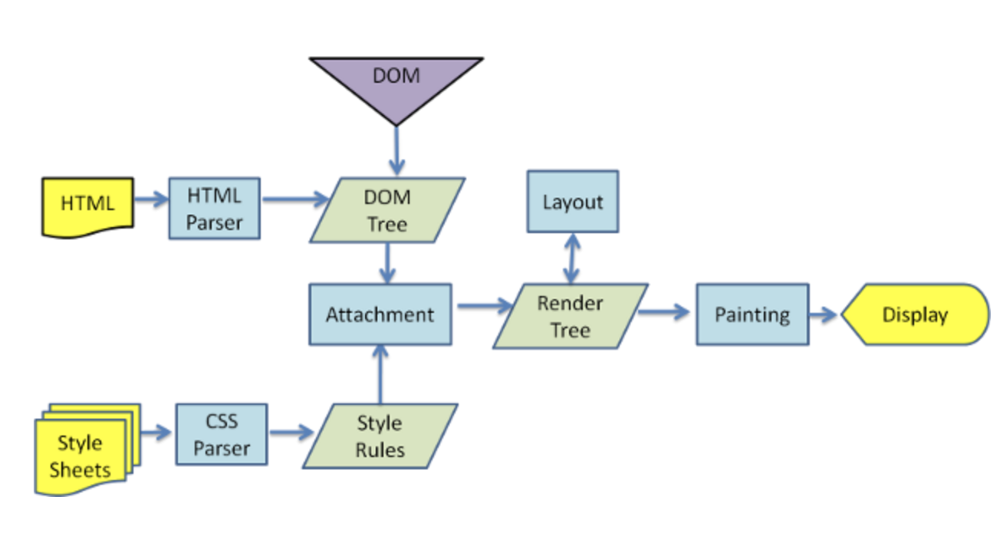

# How Browsers Work

> 브라우저의 작동 원리

> 간단하게 살펴본 것이라 나중에 나의 지식 수준이 더욱 DEEP해지면, 브라우저 작동 원리에 대한 더욱 DEEP한 부분을 알아가야 하겠다.

> 위의 이미지는 아주 유명한 브라우저에서의 랜더링 하는 과정을 표현한 다이어그램이다.

> 위의 과정을 `Critical Rendering Path`라고 한다. 이는 브라우저가 서버로 부터 HTML 응답을 받아 화면을 그리기 위한 과정을 말한다.

### 랜더링이란 무엇인가?

> 랜더링이란 논리적인 문서의 표현식을 그래픽으로 변형시켜서 화면에 표현하는 과정이다. 크게 2가지 과정을 거친다. 첫번째는 DOM요소와 스타일요소를 기반에 둔 레이아웃을 계산한다. 두번째는 계산된 요소를 그리는 과정이다.

### 파싱이란?

> 서버로부터 받은 문서를 브라우저가 이해할 수 있도록 변환하는 과정을 말한다.

## 랜더링과정(Critical Rendering Path)

1. 브라우저는 HTML을 전달받고 이를 파싱하여 DOM tree를 생성한다. DOM tree에는 각각의 태그에 상응하는 노드가 존재한다.
2. 스타일시트 파일을 전달받고 이에 대한 파싱 후 스타일 구조체를 생성한다.(스타일 구조에 대한 정보가 들어있다)
3. 이 두가지를 합쳐서 Render tree를 생성한다. 이 과정에서 각 노드가 페이지의 정확한 위치에 놓일 수 있도록 계산된다.
4. 여기까지 진행되면 모든 노드들이 페이지의 어느 곳에 어떤 형태로 보여져야 할지 계산이 끝났다. 이제 랜더링 엔진은 이를 토대로 페이지에 랜더 트리를 토대로 화면에 표시한다.

5. 자바스크립트 파일의 경우는 파서가 이를 만나면 진행하던 파싱을 중지하고 제어권한을 자바스크립트 엔진에 넘겨서 자바스크립트 파일이 파싱이 일어나게 된다. 이 과정이 종료 후에 다시 진행하던 파싱을 한다. 그렇기때문에 중간에 자바스크립트 파싱이 일어난다면, DOM tree가 생성이 되기 전에 일어나는 것이기때문에 오류가 발생할 수 있다. 그래서 자바스크립트 파일은 DOM tree가 다 생성된 후, body 태그 바로 앞에 위치하는걸 추천한다.

# Ref

-   [브라우저는 어떻게 동작하는가?\_Naver D2](https://d2.naver.com/helloworld/59361)

-   [브라우저 렌더링](https://12bme.tistory.com/140)
