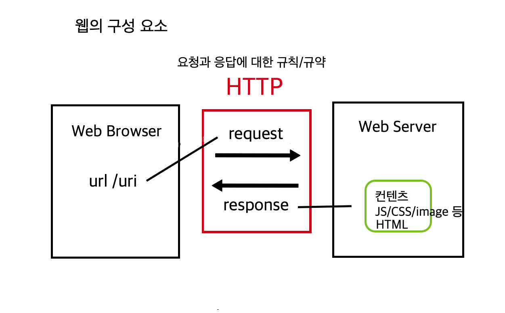
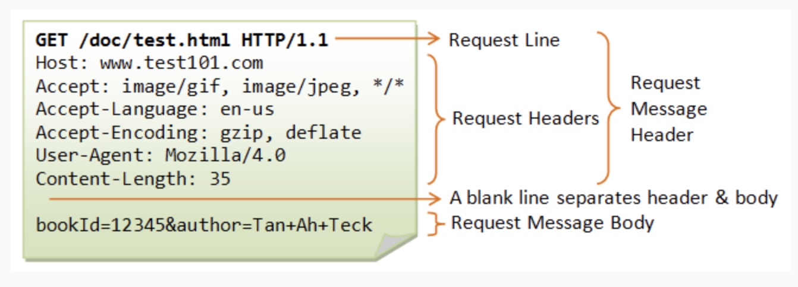
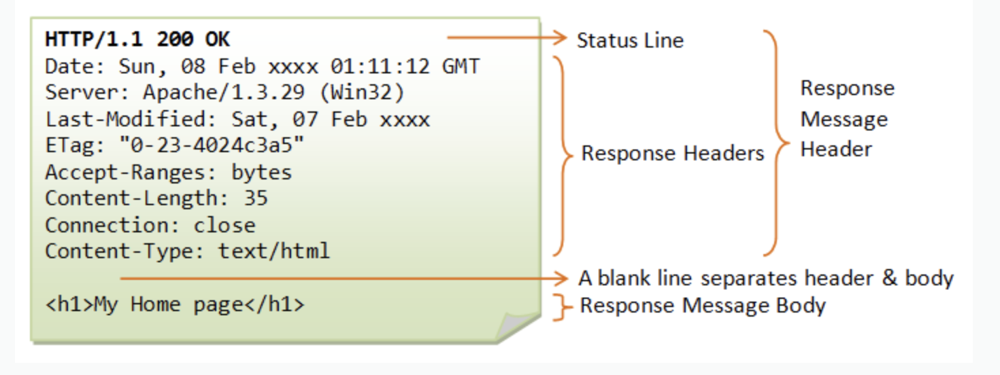

# HTTP에 대해서

> 전반적인 웹의 흐름을 나타내는 모식도이자, HTTP기반 시스템의 구성요소에 대한 다이어그램이다. 이를 통해서 HTTP가 어느 과정에서 관여하는지에 대해서 알 수 있다.

> HTTP는 `Hyper Text Transfer Protocol` 약자로서 클라이언트(여기선 브라우저)의 요청과 웹서버의 응답에 대한 규약을 정한 것이다.

> 요청과 응답에 대한 방식을 구체화하여 적어놓은 것이 HTTP 메세지로 각 메세지의 헤더에서 확인할 수 있다. 또한 요청과 응답시 구체적인 내용(컨텐츠)가 있는 경우라면 바디에 그 내용이 들어간다. 메세지는 브라우저의 네트워크 탭에서 확인이 가능한다.

# HTTP 특징

`비연결성(connectionless)`

> 클라이언트와 서버 사이에 요청과 응답이 끝나면 연결을 끊어버리는 특징을 말한다. 이러한 특징으로 인해서 지속적으로 연결하기 위해 필요한 리소스를 줄이면서 더 많은 연결을 할 수 있게 된다. 하지만 연결하고 있지 않다는 점은 매번 새로운 연결을 시도하는 것이기 때문에 매 번 연결과 해제에 대한 오버헤드가 들어가게 된다.

`무상태성(stateless)`

> 무상태성은 위의 비연결성으로 인해서 나타나는 특징이다. 말 그대로 HTTP는 상태를 갖을 수 없다. 로그인을 예를 들면, 유저가 로그인 후에 그 상태를 지속적으로 유지할 수 없다. 하지만 이러한 것을 극복하기 위해서 등장한 개념이 쿠키, 세션, 웹스토리지 같은 기술이다. 여기에 상태를 저장시켜서 서버가 상태를 알 수 있게 만들어 준다.

# HTTP 메세지

> HTTP 메세지에는 두 종류가 존재한다. request message와 response message이다.

> HTTP 메세지의 헤더에는 해당 요청과 응답에 해당하는 규약이 `key-value` 형태로 적혀있다. 다양한 옵션들이 존재하기때문에 여기서 이를 다 설명하는 것은 부적절하다고 생각한다. 단, [MDN HTTP 레퍼런스](https://developer.mozilla.org/ko/docs/Web/HTTP)에 각각에 옵션들에 대해서 설명해 놓고 있다.

## request message

`request line:`

-   HTTP메소드 | 요청하는 리소스에 대한 경로(URI) | HTTP프로토콜의 버전

`request header:`

-   Host : 요청되는 타겟의 URL주소

-   Accept-Language : 해당 요청이 받을 수 있는 언어 타입

-   Accept-Encoding : 해당 요청이 받을 수 있는 인코딩(압축) 형태

-   User-Agent : 요청하는 클라이언트의 정보, 이 경우는 모질라 파이어폭스 브라우저가 된다

-   Content-Length : 요청 메세지 바디의 길이

`request message body:`

-   요청 메세지의 실제 내용으로서 여기서는 get 메소드를 통해서 검색하고자 하는 내용이 적혀있다. 요청시 전송하는 내용이 없다면 비어 있을 수 있다.

## response message

> 기본적으로 요청 메세지와 유사하다. 다른 부분을 중심으로 설명하겠다.

`status line:`

-   HTTP프로토콜의 버전 | 상태코드(요청의 성공여부) | 상태메세지(상태코드에 대한 짧은 설명)

`response header:`

-   Date : 날짜

-   Server : 서버에 대한 정보

-   Last-Modified : 서버가 알고 있는 리소스에 대한 가장 최신의 수정 날짜와 시각 표시

-   Accept-Ranges : 부분 요청 지원을 알리는 표시로서, 이 표시가 존재하면 서버에서 다운이 중단된 이후 다시 다운 받는 경우 중단된 부분부터 다시 다운이 시작된다.

-   Content-Length : 응답 메세지 바디의 길이

-   Connection : 현재 전송이 완료된 이후에 네트워크의 접속을 유지할지 말지에 대한 제어를 나타낸다. `close`는 연결이 끊기지만 `keep alive`인 경우 연결이 지속된다.

-   Content-type : 응답 메세지의 컨텐츠의 타입, 클라이언트가 브라우저인 경우, 이 타입에 따라서 브라우저가 내용을 적절하게 처리할 수 있다.

`response message body:`

-   응답 메세지에 대한 실제 내용

## 참고

### status code(상태 코드)

> 상태 코드는 특정 HTTP 요청에 대한 결과를 알려주는 코드

> 응답 코드의 앞자리만이 응답 코드의 클래스를 정의한다. 그렇기 때문에 크게 `5가지`로 분류할 수 있다.

-   `1xx` : 서버가 요청을 받았고, 서버와 연결된 클라이언트는 작업을 지속하라는 의미를 나타낸다.
    > > 자주 마주치는 상태코드는 아닌 것 같다.
-   `2xx` : 요청이 성공적으로 전달되었음을 의미한다.
-   `3xx` : 리다이렉트를 나타낸다. 응답을 완료하기 위해선 추가적인 조치가 필요함을 의미한다.
-   `4xx` : 클라이언트 오류로서 클라이언트의 요청이 무엇인가(요청의 문법 등..) 잘못되었음을 뜻한다.
-   `5xx` : 서버 오류로서 명백하게 유효한 요청을 서버가 제대로 수행하지 못했음을 의미한다.

### HTTP method

-   `GET` : 특정 리소스를 가져오도록 요청
-   `POST` : 서버로 데이터를 전송
-   `PUT` : POST와 유사하지만, `멱등성`을 갖는다.
    > 멱등성을 갖는다란 의미는 PUT을 통해서 한 번 요청을 하거나 여러 번 요청을 하여도 같은 효과를 보인다. 즉, 매번 상태코드가 같다는 의미
-   `CONNECT` : 요청한 리소스에 대한 양방향 연결을 시작하는 메소드
-   `DELETE` : 지정한 리소스를 삭제
-   `HEAD` : 특정 리소스를 GET 했을 경우, 되돌아올 헤더를 요청한다.
-   `OPTIONS` : 목표 리소스와 통신옵션을 설명하기 위해서 사용
-   `PATCH` : 리소스의 부분적인 수정을 요청
-   `TRACE` : 원격지 서버에 루프백 메시지 호출하기 위해 테스트용으로 사용

    > > HTTP method를 다 설명했지만, 실제적으로 사용한 경험은 GET과 POST뿐이다. 그 외의 메소드들을 우선 알아보자는 취지로 적은 것이기에 모두 이해하고 적은 것은 아니다.😓

# Ref

-   [생활코딩 HTTP](https://opentutorials.org/module/3621)
-   [MDN HTTP](https://developer.mozilla.org/ko/docs/Web/HTTP/Overview)
-   [요청/응답 메세지 이미지](https://documentation.help/DogeTool-HTTP-Requests-vt/http_request.htm)
