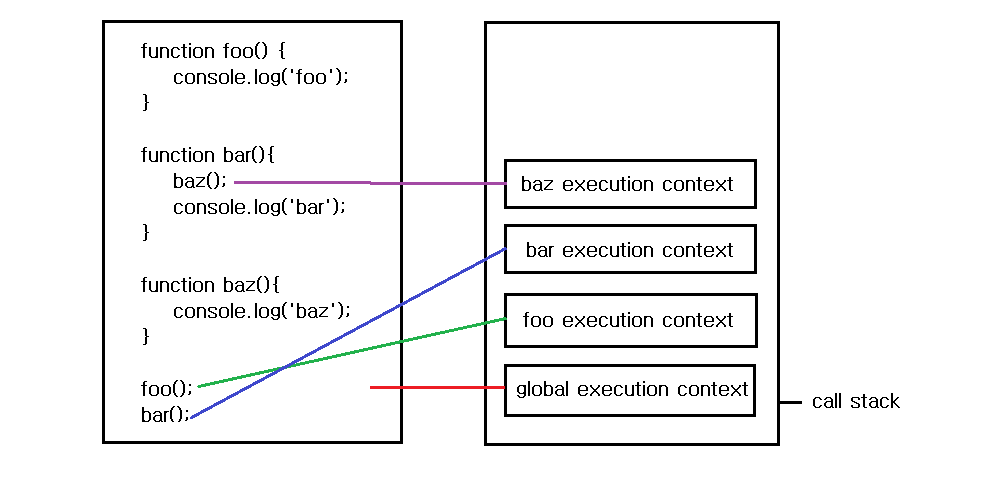

# Closure

```
A closure is the combination of a function bundled together (enclosed) with references to its surrounding state
(the lexical environment). In other words, a closure gives you access to an outer function’s scope from an inner
function. In JavaScript, closures are created every time a function is created, at function creation time.
```

> 위의 문장은 [MDN Closures](https://developer.mozilla.org/en-US/docs/Web/JavaScript/Closures)에서 클로저에 대해서 정의한 것이다. 모자란 영어 능력을 총 동원해서 해석해보겠다.😅

```
클로저는 클로저 주변의 상태에 대한 참조(lexical environment)를 함께 묶은 함수의 조합이다. 다른 말로 말하면, 클로저는
함수 내부에서 함수 외부에 접근 할 수 있게 해준다. 자바스크립트에서 클로저는 함수가 생성되는 시기에 생성된다.
```

> 클로저를 이해하기 위해선 먼저 `클로저 주변의 상태에 대한 참조(lexical environment)`가 무엇인지를 알아야 한다. 또한 `lexical environment` 을 정확히 알기 위해선 `execution context`에 대해서 알아야 한다. 그렇기 때문에 이 두가지에 대해서 알아보는 것이 클로저를 이해하기 위한 선행학습이라고 할 수 있다. 이 두가지가 클로저와 어떻게 연결되는지 알아보자.

# Execution context 와 Lexical environment

1. execution context(실행 컨텍스트)란 무엇인가

- **`실행 가능한 코드`를 만났을 때 생성되는 컨텍스트**이다. 다시 말해 실행 컨텍스트는 스크립트 혹은 함수등이 실행될 때 생성되는 것으로서 실행에 필요한 요소를 객체 묶음으로 담고 있다.

  > 실행 가능한 코드란 `1)전역코드` `2)함수코드` 3)eval코드가 있다. (_eval코드는 관점이 다르기 때문에 여기서 논외로 하겠다._)

  

  > 위 코드의 스크립트가 실행된다고 하자. 첫번째로 1)스크립트가 실행될 때 가장 먼저 `글로벌 실행 컨텍스트`가 생성된다. 이제 위에서부터 코드를 읽어나가면서 각각의 `function object`들이 생성된다. 그러다가 함수 호출부를 만난다. 2)함수 foo가 호출될 때 `함수 foo의 실행 컨텍스트`가 생성된다. 함수 foo가 종료되고 3)함수 bar가 호출 된다. 이 때 `함수 bar의 실행컨텍스트`가 생성된다. 함수 bar 안에서 3)함수 baz가 호출되고 그 때 `baz의 실행컨텍스트`가 생성된다.

  > 이렇게 각각의 함수가 호출될 때(실행될 때), 실행컨스트가 생성되고 이 실행컨텍스트는 콜스택의 맨 위에 쌓이게 된다.(위의 이미지는 순서를 의미하는 것이지 정확히 맞는 것은 아니다. 함수가 종료되면 실행컨텍스트는 사라진다.)

2.  실행컨텍스트의 구성

3.  그렇다면 `lexical environment` 은 무엇일까?

> `lexical`의 사전적 의미는 `어휘적, 사전적`이란 의미이다. 그렇다면 `lexical environment`은 `어휘적 환경` 이라는 말이 된다. 이 의미를 듣고 '아하' 하고 깨달음을 얻는다면 그 의미를 알려주시길 바란다. 이 용어를 처음 접했을 때, 무슨 의미인지 **NEVER** 이해하지 못했다. 지금은 약간 이해한다고 말할 수 있을까?

-

# 이제 closure가 무엇인지 `감` 잡을수 있을까?

> 간단한 예를 통해 클로저라는 것이 무엇인지 알아보자

```javascript

```

# Why we need closure

- 접근권한보호
- 지역변수 보호
- 데이터 보존 및 활용

# Quiz

## 1

## 2

## 3

# Ref

- [MDN Closures](https://developer.mozilla.org/ko/docs/Web/JavaScript/Guide/Closures)

- [Understanding Scope in JavaScript](https://scotch.io/tutorials/understanding-scope-in-javascript#toc-context)

- [Understanding Execution Context and Execution Stack in Javascript](https://blog.bitsrc.io/understanding-execution-context-and-execution-stack-in-javascript-1c9ea8642dd0)
