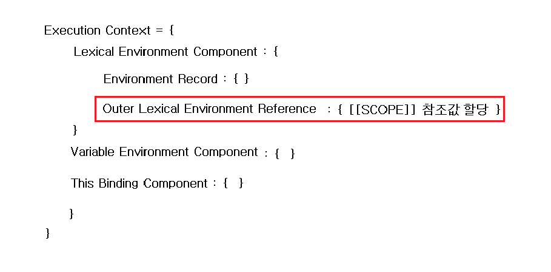

# Execution Context

## Execution Context(실행컨텍스트)란?


### 실행 컨텍스트의 구성


>  아래 코드의 실행 컨텍스트 처리 과정을 정리해보기

```javascript
function book(){
    function get(){
        return point;
    }

    var point = 123;
    return get();
}
console.log(book());

```
<준비단계>

1. `function` 키워드를 만나면 `function object(book)`를 생성한다.
2. 이 때, `function object` 안의 내부프로퍼티인 `[[SCOPE]]` 에 **함수 밖의 스코프**(여기선 global scope)를 설정
> 이렇게 생성되는 것을 `Lexical Environment(정적환경)`에 의해 결정된 스코프이다.

> 처음 `function object`를 생성할 때는 함수의 내부를 해석하지 않는다.

3. 이 후 `book()이 호출`되면, 해당 함수의 `실행컨텍스트가 생성`된다.
4. 엔진은 이 생성된 실행컨텍스트 안으로 이동한다.

<준비 단계>

5. 실행 컨텍스트 안의 여러가지 컴포넌트와 레코드를 생성한다.
   이 때 생성된 컴퍼넌트와 레코드는 우선 빈 값을 갖게 된다.

6. function object 생성시 결정되었던 `[[SCOPE]]`의 `참조값`을 실행 컨텍스트 안의 `Lexical Environment Component`의 `Outer Lexical Environment Refenence`에 첨부한다.

> 여기까지의 실행컨텍스트의 상태



<초기화 단계>

7. 이제부터 함수 내부의 변수와 함수를 초기화 한다. 

>  함수 내부의 변수와 함수들은 실행 컨텍스트 안의 `Lexical Environment Component`의 `Environment Record`의 `Declarative Environment Record`안에 설정된다.

8. 여기서 내부의 함수 `function get() { }`로 된 `함수 선언식`이 있기 때문에 다시 위에 한 작업을 진행한다. 즉 함수에 대한 `function object`를 생성하고 이 `function object 외부 환경`을 `[[SCOPE]]`에 연결 해준다.

9.  변수의 경우, `변수이름 = undefined`로 초기화 된다.(변수의 선언)

> `var` 가 아닌 `let, const`같은 경우, `변수 이름 = uninitialized` 가 된다. `ES6`의 차이점이다

10. `parameter`가 있다면, 넘겨받은 값을 `값`으로, parameter의 이름을 `이름`으로 하여 함수의 parameter에 `맵핑`시켜서 설정한다. 또한 이 때 `Arguments` 객체가 생성된다.


> 여기까지의 실행컨텍스트의 상태


<실행 단계>

11. 이제 변수 `point`에 값을 할당하고, 값을 return 한다.
 이 때 return값이 함수 호출하는 것이기 때문에 get()에 대한 실행 컨텍스트가 생성되고 `준비 단계와 초기화 단계`를 거쳐서 `point`에 대한 `indentifier resolution`이 되어 `123`이라는 값이 출력된다.

> 여기까지의 실행컨텍스트의 상태


# Ref
- [자바스크립트 중고급자 되기: 근본 핵심 이해](https://www.inflearn.com/course/%EC%9E%90%EB%B0%94%EC%8A%A4%ED%81%AC%EB%A6%BD%ED%8A%B8-%EC%A4%91%EA%B3%A0%EA%B8%89)

- [모던 자바스크립트 입문 8장](http://www.yes24.com/Product/Goods/59410698)