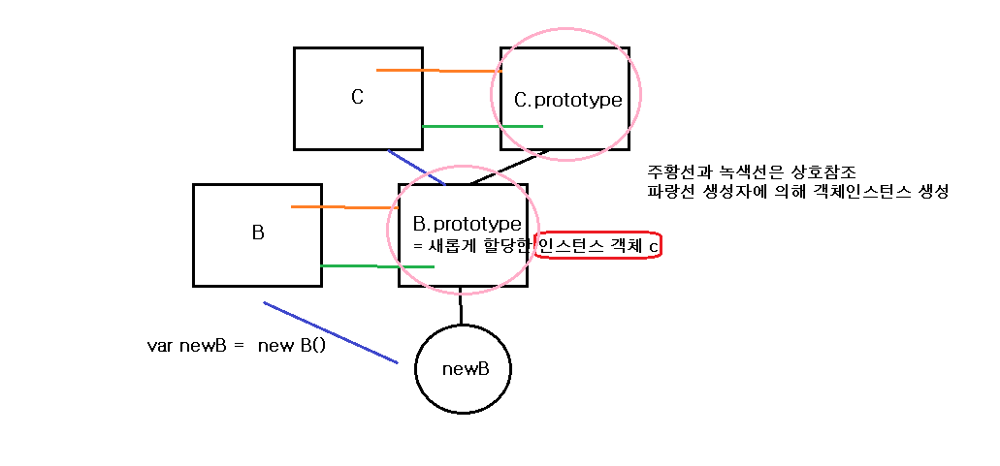

# Understanding instance and instanceof

## What is instance?

-   객체와 인스턴스는 다른 것일까? 객체와 인스턴스는 같은 의미를 가진 다른 말(?)이다. 크게보면 같은 의미를 갖지만 정확히 말하면 다른말이다. (상황에 따라서 다르게 부르는 말이라고 생각한다.💨)
-   자바스크립트에서 원시타입을 제외하고 객체가 아닌 것은 없다. 함수도 객체이다. 객체는 함수에 의해서 만들어진다. **모든 함수는 `new연산자`에 의해서 객체를 만들 수 있다.** 하지만 특별하게 우리가 객체를 생성하는 함수를 지정하여 생성자 함수라고 한다. 이것은 우리가 알기위해서 그렇게 지정하는 것이지 자바스크립트 내부에서 지정한 것이 아니다.( 주로 대문자로 표기한 함수는 생성자 함수를 말한다.)
-   자바스크립트의 상속관계를 이해하면 모든 객체는 어떤 생성자 함수에 의해서 만들어졌음을 알 수 있을 것이다. 이렇게 `생성자 함수에 의해서 만들어진 것들`을 `인스턴스`라고 한다. 하지만 상황에 따라서 이것을 그냥 객체라고 부르기도 한다.
-   객체와 인스턴스라는 용어가 나올때, 생성자 함수에 의해서 생성된 객체에 대해서 이야기 하는 것인지 그냥 일반적인 객체를 말하는 것인지 대해서 문맥에 맞게 이해하면 될 것이다.

## instanceof

-   `instanceof` 는 연산자 이다.
-   syntax : `object instanceof constructor`

    > object : 객체를 의미

    > construcotr : 생성자 함수를 의미
    >
    > > 하지만 모든 함수는 다 가능하다. 왜냐하면 자바스크립트의 모든 함수는 생성자 함수의 자격을 갖고 있기 때문이다 `[constructible]`

-   object의 `프로토타입 체인(prototype chain)`안에 `생성자의 프로토타입(constructor.prototype)`이 존재하면 true, 그렇지 않으면 false를 반환한다.

## 코드로 살펴보기

```javascript
function A() {}
function B() {}
function C() {}
var a = new A();
var a1 = new A();
var b = new B();
var c = new C();

console.log(a instanceof A); //1
console.log(b instanceof B); //2
console.log(c instanceof C); //3

console.log(a instanceof a1); //4

B.prototype = c;
console.log(b instanceof A); //5
console.log(b instanceof B); //6
console.log(b instanceof C); //7

console.log(b.__proto__);
//아직 이전의 B.prototype을 가르키고 있다.
//그렇다면 b는 어떤 프로토타입 체인에 속할까?
//여기서는 아직 알 수 없다.

var newB = new B();
console.log(newB instanceof B); //8
console.log(newB instanceof C); //9

C.prototype = new A();
console.log(c instanceof A); //10
console.log(c instanceof B); //11
console.log(c instanceof C); //12
```

1. true
2. true
3. true
4. error

    > error message : Uncaught TypeError: Right-hand side of 'instanceof' is not `callable`

    > 여기서 `callable`이란 `부를수 있는, 호출할 수 있는`의 뜻으로서 함수의 { }안에 정의된 코드들을 실행할 수 있다는 것을 의미한다. 에러메세지를 해석해보면, instanceof 우변의 피연산자가 함수로서 { } 안의 코드를 실행시킬 수 없다는 것을 의미한다. 이것으로 보면 `instanceof의 우변`은 반드시 `함수`가 와야함을 알 수 있다.

5. false
6. false
7. false

    > 인스턴스 객체 b의 상태를 설명하면, `생성자함수 B`는 prototype 프로퍼티에 새로운 값이 할당되었기 때문에 이전의 B.prototype이 아닌 `새로운 B.prtotype (새로운 프로토타입 객체)`이 되었다. 하지만 `인스턴스 객체 b`의 **proto**에는 새로운 값이 주어진 것이 아니기 때문에 아직 `예전의 B.prototype`을 가르키고 있다.

    > 이 부분은 밑에서 다시 조작해보겠다.

8. true
9. true

    > B.prototype이 변경된 생성자 함수 B로 인스턴스 객체를 생성해보았다. 과연 그 인스턴스 객체는 어떤 프로토타입 체인에 속할지 궁금하였다. 8번은 당연히 true이다. 생성자 함수 B로 만든 것이기때문에!!

    > 그렇다면 9번은? B.prototype은 인스턴스 객체인 c이다. 인스턴스 객체 c는 생성자 함수 C로 만들어지고 프로토타입 객체인 C.prototype과 연결되어있다. 이렇게 연결되어 올라갈 수 있는 것이 `인스턴스 객체 newB`의 `프로토타입 체인`이다. 이 안에 C.prototype이 속해있는지를 보면 역시나 속해있기 때문에 true가 된다.

    

    > 위의 프로토타입체인을 간단하게 그려본 이미지이다. 참고로 프로토타입 체인은 여기서 끝나는 것은 아니고 **proto**가 null이 될때까지 이어진다. `Object.prototype.__proto__ = null` 이기 때문에 마지막은 항상 위 상태가 된다.

10. false
11. false
12. false

> 위 상황은 아까와 같은 상황이다. C.prototype에 새로운 객체가 할당됨으로서 인스턴스 객체 c의 프로토타입 체인인 끊기게 된다.

## 길을 잃은 `프로토타입 객체`에게 길을 찾아주고 싶다면

> 아까 위에서 B.prototype에 새로운 객체를 할당함으로서 b의 프로토타입 체인이 끊기게 되었다. 그래서 b는 어떠한 체인에도 속하지않은 상태가 되었다. 이것을 이 b와 연결된 `예전의 B.prototype(현재 b.__proto__)` 를 다시 사용하기 위해 조작해보려고 한다.

```javascript
1   function B1() {}
2
3   var prototypeB = Object.getPrototypeOf(b);
4   console.log(prototypeB === b.__proto__);
5
6   B1.prototype = prototypeB;
7
8   console.log(b.__proto__ === B1.prototype);
9   console.log(b instanceof B1);
```

# Ref

-   [MDN\_객체지향 자바스크립트 개요](https://developer.mozilla.org/ko/docs/Web/JavaScript/Introduction_to_Object-Oriented_JavaScript)
-   [MDN_instanceof](https://developer.mozilla.org/ko/docs/Web/JavaScript/Reference/Operators/instanceof)
