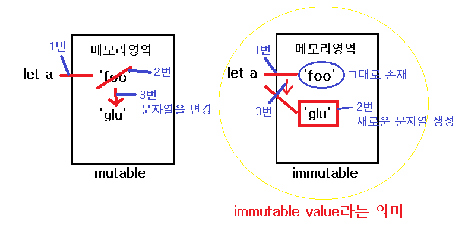

# Primitive Type(원시자료형)

자바스크립트의 자료(데이터)에는 크게 2가지 타입이 존재

-   원시자료형 : 6가지 ✅

    -   Number, String, Boolean, Null, Undefined, Symbol
    -   `변경불가능한 값(immutable value)`을 갖는다.
    -   원시자료형은 변수에 그 자료형 자체의 값을 저장하고 그 값으로 비교가능하다.

-   참조자료형 : 원시자료형이 아닌 모든 것
    -   Object ( ⊃ Array, Function )
    -   `변경가능한 값(mutable value)`을 갖는다.
    -   참조자료형은 변수에 값을 바라보는 참조값이 저장되기 때문에 같은 값을 갖고 있더라도 서로 다른 참조값을 갖을 수 있다.

👁‍🗨 **변경불가능한 값**의 의미

-   메모리 영역에서의 변경이 불가능하다는 의미로서 재할당은 가능하다.
-   재할당의 의미는 할당된 값이 변경되는 것이 아니라 새로운 원시타입의 값이 생성되어서 할당되었던 변수에 다시 들어가는(할당되는) 것을 의미한다.

```javascript
let a = 'foo';
a = 'glu';
```



## Number

-   우리가 알고 있는 모든 숫자를 나타낸다. C, Java와는 다르게 여러가지 종류(double, float, short, long등)의 숫자 타입이 존재하지 않는다. 모든 숫자는 다 `Number`라는 타입을 갖는다.
-   `+/-Infinity(전역속성으로 무한대를 나타냄)`, `NaN(Not a Number: 숫자가 아님을 나타냄)` 모두 `Number` 타입을 갖는다.

## String

-   '' or ""를 통해서 만들어지는 값, 텍스트 데이터를 나타낸다.
-   위에서 언급했지만 C와는 다르게 JavaScript의 문자열을 `immutable value`이다.(Java의 String class와 유사)
-   숫자와 문자열과 `+`연산을 하는 경우, 수학의 더하기 연산이 아닌 암묵적으로 결합 연산으로 변환된다. 하지만 다른 타입의 경우는 문자열로 형변환을 해줘야 결합 연산이 가능하다.
-   문자열의 각각의 글자를 마치 배열의 index처럼 지정하여 접근할 수 있다.

## Boolean

-   기본적으로 `true` or `false` 값을 갖는다.
-   `truthy value` or `falsy value`를 갖는 다른 자료형이 암묵적으로 `boolean`으로 변경 가능하다.

```
null undefined ''(empty string) 0 NaN false

```

> 위의 값들을 `falsy value`로서 암묵적으로 `false`와 등가이다. 이외의 모든 값은 `truthy value`로서 `true`와 등가이다.

## Null

-   `null` 값을 갖는다
-   의도적으로 비어있는 값을 나타내고자 할 때 사용된다. 그렇기 때문에 값을 초기화 할 때 사용한다.

## Undefined

-   값을 할당하지 않는 변수는 `undefined`값을 갖는다.

## Symbol

-   ECMAScript 6 에서 추가된 자료형으로서 **유일**하고 **변경불가능한** 기본값이다.

# More

-   [Wrapper Object]()<br>
-   [Dynamic Typing(동적타이핑)](dynamicType.md)

# Ref

[Primitive Types](https://flow.org/en/docs/types/primitives/)<br>
[자바스크립트의 자료형 MDN](https://developer.mozilla.org/ko/docs/Web/JavaScript/Data_structures)
