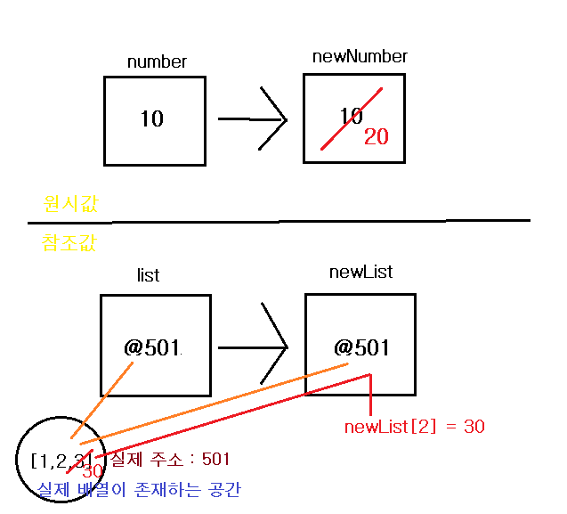

# Quiz를 통해 원시값과 참조값에 대한 개념 명확히 하기

> [개념 다시보기](valueType-vs-referenceType.md)

## Quiz 1

```javascript
var number = 10;
var newNumber = number;
newNumber = 20;
console.log(number, newNumber); //?
```

<details>
<summary>정답</summary>
<div markdown="1">
> 10 | 20
</div>
</details>

> 원시값은 우리가 지극히 알고있는 상식선에서 생각하면 된다. 반대로 참조값은 원시값과는 다르게 동작한다. 밑의 퀴즈의 살펴보자.

## Quiz 2

```javascript
var list = [1, 2, 3];
var newList = list;
newList[2] = 30;
console.log(list, newList);
```

<details>
<summary>정답</summary>
<div markdown="1">
> [1,2,30] | [1,2,30]
</div>
</details>

> 위의 두가지 퀴즈에서 원시값과 참조값의 동작의 `차이점`을 이미지로 나타내었다.

> 이미지의 표현이 엄밀하게 정확한 것은 아니만 메모리관련내용을 이해하기 쉽게 축약하여 표현하였습니다. 자세히 알고싶다면 [JavaScript’s Memory Model](https://medium.com/@ethannam/javascripts-memory-model-7c972cd2c239) 를 참고하거나 [개념 다시보기](valueType-vs-referenceType.md)를 보시면 됩니다.



> Quiz 2에서 `newList`에 `list`를 할당하면 `newList`에는 실제 배열값이 아니라 `실제 배열 값이 있는 공간의 주소값`을 할당하게 된다. 그렇기 때문에 newList를 변경하면 list의 값 역시 같이 변경된다.

## Quiz 3

```javascript
var a = 10;
var b = a;

function change(x) {
    x = 100;
}

change(b);
console.log(a, b); //?
```

<details>
<summary>정답</summary>
<div markdown="1">
> 10 | 10
</div>
</details>

> `함수 change`내부에서 일어나는 과정을 코드로 표현해보겠다.

```javascript
function change(x) {
    //2. 매개변수 x 는 함수 안에서 선언 및 초기화되는 또 다른 변수라고 생각하면 된다.
    //3. var x = b; : 매개변수 x에 b의 값을 할당
    x = 100;
    //4. x가 바뀌었지만 x의 스코프는 함수 change안이기 때문에 변수 b와는 무관하다.
}

change(b); //1. b의 값인 10을 인수로 전달
```

### 참고 : 위 코드와 아래 코드의 차이점는 `매개변수의 유무`

> `함수 change`안에 매개변수가 없다.

```javascript
var a = 10;
var b = a;
function change() {
    b = 100;
}
change();
console.log(a, b); //?
```

<details>
<summary>정답</summary>
<div markdown="1">
> 10 | 100
</div>
</details>

> 위 코드는 원시값과 참조값의 차이보다 `스코프에 대한 개념`을 물어보는 것이다.

> 함수 change안의 b의 스코프는 전역에서 선언된 변수이다. 그렇기 때문에 함수 안에서 값을 재할당하는 변수는 전역에 있는 변수 b가 된다. 함수 안에서의 변화가 변수 b에 영향을 미치는 이유는 원시값과 참조값 관련된 것이 아니라 `변수의 스코프`와 관련된 것이다.

## Quiz 4

```javascript
var human = {
    name: 'jjanmo',
};

function makeMonster(obj) {
    obj.name = 'godzilla';
}

makeMonster(human);

console.log(human); //?
```

<details>
<summary>정답</summary>
<div markdown="1">
> { name : 'godzilla' }
</div>
</details>

> 자바스크립트에서는 매개변수에 전달되는 방식은 모두 `call by value`이다. 하지만 위의 퀴즈를 보면 마치 `call by reference`처럼 보인다. 하지만 다시 한 번 강조하지만 이것 역시 `call by value`이다. 단지 함수에 넘겨지는 것이 `객체의 주소값`이고 그 주소값의 프로퍼티에 접근해서 값을 변경했기 때문에 원래 객체(human)의 프로퍼티가 변한 것이다.

## Quiz 5

```javascript
var foo = {
    bar: 'javascript',
};

function baz(item) {
    item = null;
}

baz(foo);
console.log(foo); //?
```

<details>
<summary>정답</summary>
<div markdown="1">
>  { bar: 'javascript'};
</div>
</details>

> 이 퀴즈를 보면 참조값을 매개변수로 넘기는 것이 `call by reference`가 아님을 알 수 있을 것이다. 만약에 `call by reference` 라면 객체 foo는 null이 되어야 한다. 하지만 실제로 객체 foo는 변함이 없다. 이 과정을 코드로 재구성해보겠다.

```javascript
function baz(item) {
    //2. 함수 안에 foo의 값 5001가 전달된다.
    //3. var item = 5001 : 매개변수가 함수 안에서 선언되고 초기화 된다.
    item = null; //4 .item에 null이 재할당된다.
    //5. 변수 item은 함수 안에서만 유효하다.(함수 스코프)
}

baz(foo); //1. foo의 주소값(ex. @5001)이 넘어간다
```

## Quiz6

```javascript
function changeAgeAndReference(person) {
    person.age = 25;
    person = {
        name: 'John',
        age: 50,
    };
    return person;
}
var personObj1 = {
    name: 'Alex',
    age: 30,
};
var personObj2 = changeAgeAndReference(personObj1);
console.log(personObj1); // -> ?
console.log(personObj2); // -> ?
```

> [Ref](https://codeburst.io/explaining-value-vs-reference-in-javascript-647a975e12a0)

<details>
<summary>정답</summary>
<div markdown="1">
> personObj1 = {name: 'Alex', age: 25} | personObj2 = {name: 'Alex', age: 50}
</div>
</details>
