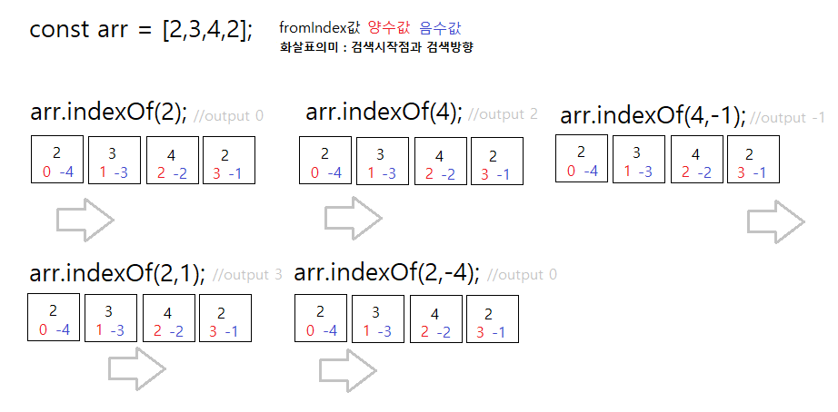
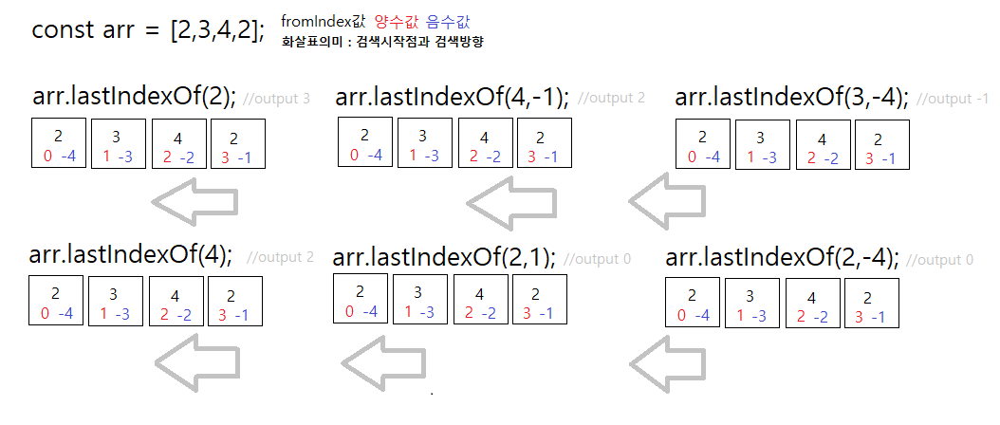

## 반드시 알아야 할 Array methods 2탄
> 검색할 때 유용한 메소드 


### filter()
 - syntax : arr.filter(callback(element[, index[, array]])[, thisArg])
 - 판별하는 함수(콜백함수)를 **통과하는 요소만**을 모아서 **새로운 배열을 리턴**한다. 콜백함수에서 true가 나올 경우 그 요소는 새로운 배열에 포함되는 것이고 false는 버린다. 또 모든 요소가 false인 경우엔 빈배열을 리턴한다.

📖 Example : filter(), indexOf()
```javascript
    const arr = ["JavaScript", "Java", "Python", "Nodejs", "Golang"];

    function findWord(word) {
        return arr.filter(function(ele) {
            return ele.toLowerCase().indexOf(word.toLowerCase()) > -1;
        });
    }

    console.log(findWord("java"));  //[ 'JavaScript', 'Java' ]
    console.log(findWord("o"));     //[ 'Python', 'Nodejs', 'Golang' ]

```

### find()
 - syntax : arr.find(callback(element[, index[, array]])[, thisArg])
 - 주어진 함수(콜백함수)를 만족하는 **첫번째 요소**를 반환한다. 만족하는 요소가 없는 경우에는 **undefined**를 반환한다.
  

### findIndex()
 - syntax : arr.findIndex(callback(element[, index[, array]])[, thisArg])
 - 주어진 함수(콜백함수)를 만족하는 첫번째 요소의 **인덱스값**를 반환한다. 만족하는 요소가 없는 경우에는 **-1**를 반환한다.

📖 Example : find(), findIndex()
```javascript
    const users = [
        { name: "Mike", age: 20 },
        { name: "Tom", age: 17 },
        { name: "Sumi", age: 32 },
        { name: "Ava", age: 15 }
    ];

    function checkAdult(ele) {
        return ele.age > 19;
    }

    console.log(users.find(checkAdult).name); //Mike
    console.log(users.findIndex(checkAdult)); //0
```

> 객체가 들어있는 배열인 users에서 19살이 넘는 사람을 찾는 판별함수를 만들었다. 배열 안에는 19살이 넘는 사람이 2명이지만, find()와 findIndex() 모두 첫번째 요소(Mike, 20)만을 찾고 종료하였다. 즉 판별함수에 만족하는 첫번째 요소의 값 혹은 인덱스값만을 리턴함을 알 수 있다.  


### indexOf()
 - syntax : arr.indexOf(searchElement[, fromIndex])
 - 배열에서 찾을 요소(searchElement)를 배열의 앞에서 부터 검색하여서 처음 나오는 인덱스값을 반환한다. 찾을 요소가 없는 경우는 -1을 반환한다.
 - fromIndex는 검색을 시작하는 인덱스값으로 기본값은 0이다. 음수값인 경우에는 배열의 마지막 요소를 -1로 놓고 계산하면 된다.


#### &#10067; findIndex()와 indexOf()의 차이점
* indexOf() : 매개변수의 첫번째 값(찾을 요소)이 특정 값을 나타내기 때문에 배열 안에서 찾고자 하는 것이 `primitive types(string, number, or boolean)` 인 경우 indexOf()를 사용하는 것이 좋다. 
* findIndex() : 첫번째 매개변수가 콜백함수로서 찾고자 하는 조건을 콜백함수에서 좀 더 복잡하게 정교하게 만들 수 있다. 그렇기 때문에 단순한 값보다 배열 안의 `non-primitive types(objects)`에 접근하기가 용이하다. 

### lastIndexOf()
 - syntax : arr.lastIndexOf(searchElement[, fromIndex])
 - 배열에서 찾을 요소(searchElement)를 배열의 뒤에서부터 검색하여서 처음 나오는 인덱스값을 반환한다. 찾는 요소가 없는 경우는 -1을 반환한다.
 - fromIndex은 검색을 시작하는 인덱스값으로 기본값은 arr.length - 1(배열의 마지막 인덱스값)이다.
 - 검색방향이 indexOf()와 반대이다. 배열의 뒤에서부터 거슬러 올라가면서 검색한다.  


### includes()
 - syntax : arr.includes(valueToFind[, fromIndex])
 - 배열의 특정요소(valueToFind)가 있는지를 확인한다. 있으면 true, 없으면 false를 반환한다. 
 - 특성요소가 영어인 경우 대소문자를 구분한다.
 - fromIndex의 기본값은 0이고 음수인 경우 -1은 배열의 마지막의 인덱스값을 가르킨다. 항상 fromIndex값으로부터 배열의 정방향(->)으로 검색한다.
 - boolean값을 리턴하기 때문에 조건문에서 많이 활용할 수 있다. 

📖 Example : includes()
```javascript
    [1, 2, 3].includes(2);     // true
    [1, 2, 3].includes(4);     // false
    [1, 2, 3].includes(3, 3);  // false
    [1, 2, 3].includes(3, -1); // true
```  

## 참고
[MDN Array.prototype.filter()](https://developer.mozilla.org/ko/docs/Web/JavaScript/Reference/Global_Objects/Array/filter)<br>
[MDN Array.prototype.find()](https://developer.mozilla.org/ko/docs/Web/JavaScript/Reference/Global_Objects/Array/find)<br>
[w3schools.com Array find() Method](https://www.w3schools.com/jsref/jsref_find.asp)<br>
[MDN Array.prototype.findIndex()](https://developer.mozilla.org/ko/docs/Web/JavaScript/Reference/Global_Objects/Array/findIndex)<br>
[MDN Array.prototype.indexOf()](https://developer.mozilla.org/ko/docs/Web/JavaScript/Reference/Global_Objects/Array/indexOf)<br>
[MDN Array.prototype.lastIndexOf()](https://developer.mozilla.org/ko/docs/Web/JavaScript/Reference/Global_Objects/Array/lastIndexOf)<br>
[MDN Array.prototype.includes()](https://developer.mozilla.org/ko/docs/Web/JavaScript/Reference/Global_Objects/Array/includes)<br>
[Difference Between indexOf and findIndex function of array](https://stackoverflow.com/questions/41443029/difference-between-indexof-and-findindex-function-of-array)<br>