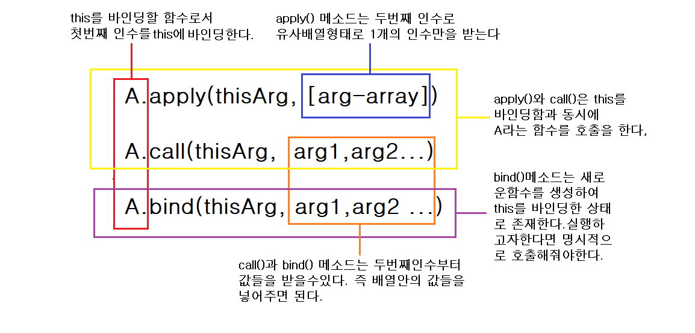

# call() vs apply() vs bind()
> 여기서는 `call() apply() bind()` 메소드들 간의 차이점과 실제 예시를 중심으로 살펴보겠다.

## 비교


<br>

> example1
```javascript
var name = 'global';

const bar = {name: 'bar'};

function greeting() {
    console.log(`My name is ${this.name}`);
}

const foo = {
    name: 'foo',
    sayHello: greeting,
};

foo.sayHello(); //this === foo : My name is foo

const baz = foo.sayHello;

baz(); //1 this === window(global) : My name is global
baz.call(foo); //2 this === foo : My name is foo
baz.apply(bar); //3 this === bar : My name is bar
baz.bind(foo); //4 this === foo : no result
baz.bind(foo)(); //5 My name is foo
```
> 1번은 일반함수의 호출이기 때문에 이 때 this는 global object이다. 그래서 전역변수 name을 찾게된다. 

> 2~5번까지는 `apply() call() bind()`에 넣어준 인수에 의해서 this가 바운드 되어진다. 단, bind()의 경우엔 바로 함수가 호출 되지 않고 명시적으로 호출을 다시해줘야 그 결과값을 볼 수 있다.
 
<br>  

> example2 
```javascript
const obj = {number: 7};
const arr = [1, 2, 3];

function getSum(a, b, c) {
    return this.number + a + b + c;
}

console.log(getSum.call(obj, 1, 2, 3)); //13
console.log(getSum.apply(obj, arr)); //13
const newFunc = getSum.bind(obj, 1, 2, 3);
console.log(newFunc()); //13
```


# Ref

[The difference between call / apply / bind](https://medium.com/@ivansifrim/the-differences-between-call-apply-bind-276724bb825b)
