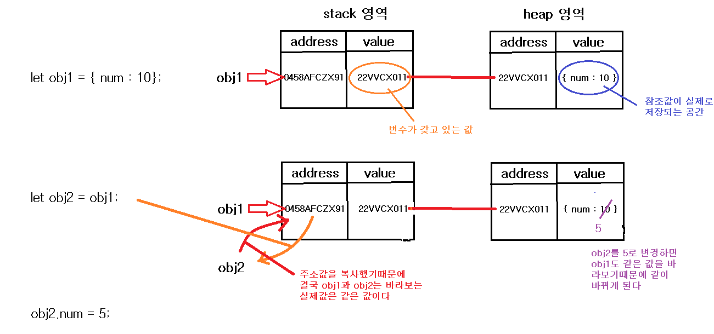
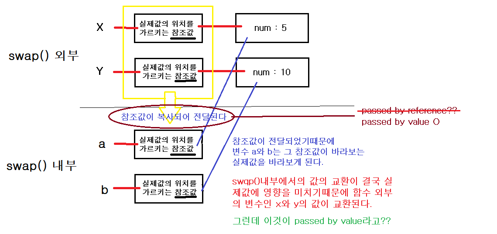
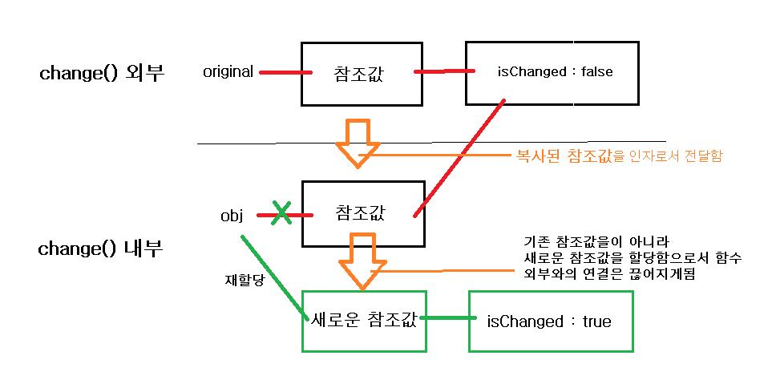

# 값 타입(Value Type)과 참조 타입(Refecrence Type)

1. 원시타입

- Number, String, Boolean, Null, Undefined, Symbol
- 원시타입값은 우리가 일반적으로 알고있는 변수의 값으로서 메모리의 스택영역에 저장된다.
- 원시타입은 모두 immutable value이다.

2. 참조타입

- Object( ⊃ Array, Function)
- 참조타입값은 할당된 변수에 값을 직접 저장하지않고 그 값이 존재하는 참조값(위치정보)을 저장한다.
- 말그대로 참조, 실제값이 아니라 값을 참조할 수 있는 링크를 저장하는 것
- 참조타입은 mutable value이다.

## 값의 복사

```javascript
let a = 10; //1
let b = a; //2
console.log('before', a, b); //a : 10, b : 10
b = 5; //3
console.log('after', a, b); //a : 10, b : 5
```


> 2번코드인 `let b = a;`에서 값의 복사가 이루어진다. 즉 a와 b는 별개의 값을 갖게 되는 것이다.


> 좀 더 깊이있게 바라보면(메모리 관점에서),엄밀하게 2번코드인 `let b = a;`에서는 같은 값을 바라보고 있지만, 값이 변경되면서 새로운 값을 생성하게된다. 즉 원시타입은 immutable value이기 때문에 값의 변경이 이루어지면 안되기 때문에 새로운 값을 생성해서 그 값의 메모리 주소를 b에 할당하는 것이다.

## 참조의 복사

```javascript
let obj1 = {
  num: 10,
};
let obj2 = obj1;
console.log('before', obj1.num, obj2.num); //obj1.num : 10, obj2.num : 10
obj2.num = 5;
console.log('after', obj1.num, obj2.num); //obj1.num : 5, obj2.num : 5
```



# Passed by value and Passed by reference

- 인자를 전달하는 방식에 따라서 함수를 호출 방법은 passed by value(값에 의한 전달;call by value), passed by reference(참조에 의한 전달;call by reference)가 존재한다. 각각이 무슨 의미인지 알아보자.

1. passed by value(값에 의한 전달;call by value)

   - 인자가 전달될 때, arguments로 **복사된 값**이 넘어온다.
   - 함수 안에는 복사된 값이 전달되었기 때문에 함수 안에서 어떤한 수정이 일어나도 **함수 밖의 변수에는 어떠한 영향도 주지 않는다.**.

2. passed by reference(참조에 의한 전달;call by reference)
   - 인자가 전달될 때, arguments로 **reference(값에 대한 주소값)** 가 넘어온다.
   - reference, 즉 주소값이 전달되었기 때문에 함수 안에서 일어나는 일들이 **함수 밖의 변수에 영향을 준다**.

- 모든 자바스크립트의 인자를 전달하는 방식은 **Passed by value**이다.
  > 이 부분이 중요하다!! 자바스크립트를 보면 참조타입의 경우 마치 passed by reference처럼 보이지만 이는 사실이 아니다.

## Passed by value of primitives values

> 원시타입의 인자 전달

```javascript
function swap(a, b) {
  const temp = a;
  a = b;
  b = temp;
}

let x = 5;
let y = 10;
console.log('before swap', x, y); // 5, 10
swap(x, y);
console.log('after swap', x, y); // 10, 5?? (X) -> still 5, 10
```

- 인자로 넘어갈 때, x와 y의 값이 복사되어서 `a = 5, b = 10`인 형태로 넘어간다.
- 그렇기때문에 함수 밖의 x,y에는 전혀 영향이 없는 상태가 된다.


## Passed by value of references

> 참조타입에서의 인자 전달

```javascript
function swap(a, b) {
  const temp = a.num;
  a.num = b.num;
  b.num = temp;
}

const x = { num: 5 };
const y = { num: 10 };

console.log('before swap', x, y); // x = {num : 5} y = {num : 10}
swap(x, y);
console.log('after swap', x, y); // x = {num : 10} y = {num : 5}
```



- 위의 참조타입에서의 인자 전달을 보면 마치 passed by reference처럼 보이지만, 사실은 passed by value이다.
- 전달된 값이 같은 참조값이지만 정확하게는 복사된 참조값이 되는 것!
- 복사된 참조값 역시 같은 값을 가르키고 있기 때문에 함수 외부의 변수에 영향을 미치게 되는 것이다.

## 참조타입의 인자 전달이 Passed by reference가 아닌 이유

```javascript
function change(obj) {
    console.log("before", original === obj); //주소값비교 : true
    obj = {
        isChanged : true;
    }
    console.log("after", original === obj); // 주소값비교 : false
}
const original = { isChanged : false};
change(original);
console.log(original)  //{ isChanged: false }
```

- 만약 `passed by reference` 라면, 전달된 인자인 obj는 외부의 참조값과 같기 때문에 함수 내부 코드를 통해서 함수 밖의 변수인 original도 변경이 가능해져야한다. 그래서 예상된 결과는 `original = { isChanged : true}`여야만 한다. 하지만 실제 결과는 `original = { isChanged : false}`이다. 이 말은 함수에 전달된 참조값이 바뀔 수 있다는 것을 의미한다. 만약 `passed by reference` 라면, 참조값이 바뀌어서는 안된다. 즉 참조타입의 인자 전달이 `passed by reference`가 아니라는 것을 보여준다.
- 전달된 인자는 **복사된 참조값**이다. 그 복사된 참조값이 `before`단계에서는 같은 참조값을 갖고 있지만 함수 내부의 코드에 의해 `after`단계에서는 새로운 참조값으로 재할당 되었음을 볼 수 있다.
- obj에 참조값 재할당으로 인해 외부 변수인 original과의 연결이 끊어지게된다.



## Quiz1

```javascript
function changeStuff(a, b, c) {
  a = a * 10;
  b.item = 'changed';
  c = { item: 'changed' };
}

var num = 10;
var obj1 = { item: 'unchanged' };
var obj2 = { item: 'unchanged' };

changeStuff(num, obj1, obj2);

console.log(num); //1
console.log(obj1.item); //2
console.log(obj2.item); //3
```

<details>
<summary>정답</summary>
<div markdown="1">
> 10 | changed | unchanged
</div>
</details>

## Quiz2

```javascript
var foo = {
  bar: 'javascript',
};

function baz(item) {
  item = null;
}

baz(foo);
console.log(foo); //?
```

<details>
<summary>정답</summary>
<div markdown="1">
> { bar : 'javascript' }
</div>
</details>

## [DO YOU WANNA MORE QUIZ ?](quizs.md)

# Ref

[JavaScript Primitive vs. Reference Values](https://www.javascripttutorial.net/javascript-primitive-vs-reference-values/)
<br>
[Understanding JavaScript Pass By Value](https://www.javascripttutorial.net/javascript-pass-by-value/)<br>
[자바스크립트 개발자라면 알아야 할 33가지 개념 #3 값(value) vs 참조(reference) (번역)](https://velog.io/@jakeseo_me/2019-04-01-1904-%EC%9E%91%EC%84%B1%EB%90%A8-2bjty7tuuf)
<br>
[NomadCoders : Value Types and Reference Types](https://www.youtube.com/watch?v=hYHv5m1NMFE&list=PL7jH19IHhOLMmmjrwCi7-dMFVdoU0hhgF&index=9&t=0s)
<br>
[자바스크립트의 메모리 모델(번역)](https://junwoo45.github.io/2019-11-04-memory_model/)
<br>
[Quiz by stackoverflow](https://stackoverflow.com/questions/518000/is-javascript-a-pass-by-reference-or-pass-by-value-language)
<br>
[call by value vs call by reference](https://perfectacle.github.io/2017/10/30/js-014-call-by-value-vs-call-by-reference/)
<br>
[call by value](https://blueshw.github.io/2018/09/15/pass-by-reference/)
