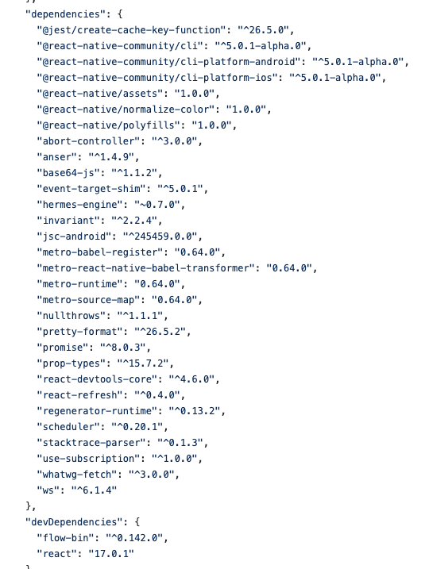

# Semantic Versioning(유의적 버전)

> 유의적 버전이란 무엇일까? 뭔가 처음 들어보는 말인데,,, 하지만 용어만 거창할 뿐 우리가 매일 보는 것들이다. 유의적 버전이란 무엇이고 어떤 식으로 버전을 관리하는 것이 유의적 버전 관리인지 알아보자.

## Motivation

보통 `NPM`이라는 아주 편한 패키지 관리 매니저를 통해서 프로젝트 내의 패키지를 관리한다. 그러던 중 뜻밖에 난생 처음보는 오류가 뜨는 경우가 있다. 나같은 경우는 RN(리액트 프로젝트)을 하던 도중 `Invariant Violation: Tried to register two views with the same name RNCWebView` 이런 오류를 마주한다. 지금은 의연하게(?) 대처하지만 처음 마주하게 되면 이게 영어를 해석한다한들 이게 어디서, 무엇때문에 나온 에러인지 알 수가 없었다. 왜냐하면 난 진짜 아무것도 하지 않았기 때문이다. 단지 나의 의지와 관계없이 버전이 달라졌을 뿐... 이 후 여러 번의 이러한 에러와 마주하고 해결하면서 이 문제는 버전과 관련된 문제였고 이를 이해하기 위해선 유의적 버전을 따르는 NPM의 버전 관리 방식에 대해서 이해가 필요하다고 생각하여 이를 정리하고자 한다.



> react native 의 package.json : 많은 패키지들의 버전 정보가 유의적 버전 체계로 쓰여져 있다.

## 유의적 버전 정의

유의적 버전이란 버전 번호를 관리하기 위한 체계(시스템)를 말한다. 만약에 버전 정보를 프로그램을 만드는 측마다 자유분방하게 나타낸다면, 이를 사용하는 사용자 입장에서는 어떤 버전에 맞춰서 사용해야할지 어떤 버전끼리 호환이 되는지 등등을 아는데 매우 불편할 것이다. 그래서 유의적 버전이라는 체계에 맞춰서 버전 관리를 하게 되었다.

## 표기법

```
x . y . z
```

> 각 3가지의 버전으로 구분되며, 각 버전을 변경하는 기준은 아래와 같다.

-   `x` : `주버전(majar version)`을 의미한다. 기존 버전과 호환되지 않게 변경한 경우(API의 호환성이 깨질만한 변경사항을 의미), 버전의 큰 변화가 일어났을 때를 나타낸다.

-   `y` : `부버전(minor version)`을 의미한다. 기존 버전과 호환되면서 기능이 추가된 경우를 말한다.

-   `z` : `수버전(patch version)`을 의미한다. 기존 버전과 호환되면서 버그를 수정한 경우를 말한다.

    

## 틸드(~), 캐럿(^) 의미

### 틸드(~)

-   현재 버전에서 마지막 자리 내의 범위에서만 자동으로 업데이트 한다. 마이너 버전이 명시되어있다면, 패치 버전의 업데이트르 허용한다. 만약에 마이너버전이 명시되어있지 않다면, 마이너 버전의 업데이트를 허용한다.

-   `~ version` : **Approximately equivalent to version(거의 동등한 버전)**

-   실제 예
    | 버전 | 범위 |
    |---:|:--:|
    |~1.2.3 |`1.2.0 <= 🀰 < 1.3.0`|
    |~1.2|`1.2 <= 🀰 < 1.3`|
    |~1| `1.0 <= 🀰 < 2.0`|

### 캐럿(^)

-   Node.js 모듈이 SemVer(Semantic Versioning) 의 규약을 따른다는 것을 신뢰한다는 가정하에 동작한다. 마이너 버전과 패치 버전의 경우 하위호환성을 보장하기 때문에 업데이트를 한다.

-   <u>메이저 버전이 0이 아닌 이상</u> 마이너버전과 패치버전의 업데이트를 허용하겠다는 의미

-   `^ version` : **Compatible with version(호환가능한 버전)**

-   실제 예
    | 버전 | 범위 |
    |---:|:--:|
    |^1.2.3 |`1.2.3 <= 🀰 < 2.0.0`|

#### 캐럿(^)의 예외

-   정식버전이 아닌 경우(pre-release / 메이저 버전이 0으로 시작하는 경우)에서는 캐럿이 **패치 버전만의 업데이트를 허용**한다.

-   정식 릴리즈 이전 버전의 경우는 API가 수시로 급격하게 변하기 때문에 마이너 버전만의 변화만으로도 하위호환성을 지키지 못하는 경우가 많기 때문에 이와 같은 예외를 적용한다.

-   실제 예
    | 버전 | 범위 |
    |---:|:--:|
    |^0.2.3 |`0.2.0 <= 🀰 < 0.3.0`|
