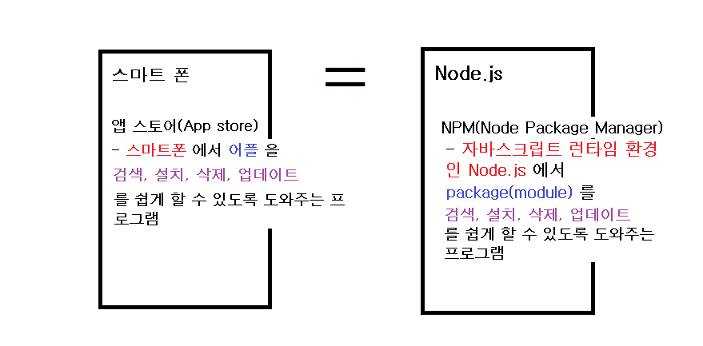
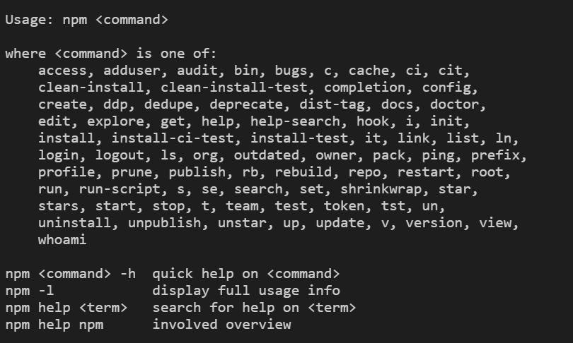

# NPM(Node Package Manager) 이란?

- Node.js 환경에서 package(module)를 관리하는 manager(프로그램)이다.

  

## NPM 설치

- Node.js를 설치하면 NPM이 같이 설치된다.

- NPM 설치 확인
  - `node -v` : node.js 의 버전 확인
  - `npm -v` : npm의 버전 확인
    > 정확히 설치되었다면, node.js와 npm의 해당 버전 정보가 출력된다.
  - `npm` : npm 명령어 사용설명서
    > npm 명령어를 모를 때는 `npm` 을 통해서 찾아볼 수 있다.

## NPM을 알아야 하는 이유?

웹기술의 발달에 비해 브라우저에서 현재 기술의 지원 상황은 항상 뒤쳐진다. 그렇기 때문에 최신 기술을 사용하여 웹 개발을 하는데 제약이 따른다. 이를 해결하기 위해서는 `바벨`과 같은 트렌스파일러 혹은 Node.js 기술로 만들어진 `웹팩`이나 `NPM`과 같은 것을 사용하여 개발환경을 구성해야만 좀 더 나은 환경에서 개발을 진행할 수 있다. NPM도 이러한 관점에서 어느 정도는 알고 있어야 하는 부분이라고 볼 수 있다.

 

## NPM은 어떻게 개발환경을 구성하는가?

점점 복잡해지는 프로그램을 체계적으로 관리하기 위해서 프로젝트의 각각의 부분을 모듈화시켜서 개발을 진행한다. 이 때 외부의 모듈을 가지고 와서 사용할 때도 존재하는데, 그 모듈 역시 관리해야 할 필요가 있다. 이 때 사용하는 것이 `NPM`이다.

사실, NPM이라고 하면 많은 패키지(모듈)이 저장되어 있는 [저장소](https://www.npmjs.com/)를 말한다. 이 공간에서는 누구나 무엇이든 공개할 수 있고 공유할 수 있다. 이 곳에서 공개된 패키지를 이용하고 싶을때 `npm`이라는 명령어를 통해서 패키지를 프로젝트로 가져와서 관리할 수 있다.

> 위의 내용을 요약해보면, NPM은 NPM이라는 공간에 존재하는 외부 패키지를 개발자가 `npm`이라는 명령어를 통해서 해당 프로젝트로 손쉽게 가져와서 사용하고 관리하기 위해서 필요한 것이라고 볼 수 있다.

 

## 자주 사용하는 명령어들

`package.json`:

package.json은 파일형식에도 써있듯이 JSON형식으로 되어있는 package에 대한 메타정보를 담은 파일이다.(프로젝트의 설정 파일이라고 볼 수 있다. ) 이를 통해서 해당 프로젝트의 패키지(모듈)을 관리하게 된다.

> package.json에는 프로젝트에 대한 모든 정보가 담겨서 있기 때문에 설정할 수 있는 많은 속성들이 존재한다. 아래 링크에서 package.json 안에서 다루고 있는 것에 대해서 알려주고 있다.

> **참고)** [Specifics of npm's package.json handling](https://docs.npmjs.com/files/package.json)

 

`npm help`:

`npm help`는 npm 명령어에 어떠한 것들이 존재하는지에 대한 리스트를 보여준다. 무슨 npm 명령어를 사용해야 할지 모르는 경우 참고할 수 있다.

> 이미지의 마지막 부분에 `npm help` 이외에도 명령어를 검색하는 방법들이 있다.

 

`npm init`:

프로젝트를 시작하게 되면 빈 공간에 어떠한 파일도 존재하지않게 된다. 이 때 `npm init`라는 명령어를 사용하면 현재 프로젝트에 대한 메타정보를 입력하여 <u>package.json이라는 파일을 생성</u>한다. 이 하나의 명령어가 아주 쉽게 프로젝트를 생성하고 npm이 프로젝트를 관리 할 수 있는 개발환경을 만들어 주는 것이다.

> `npm init -y` 를 사용하면 프로젝트 설정에 기본값을 채운 `package.json`이 생성된다.(-y를 하지 않으면 각각의 정보를 직접 수동으로 입력할 수 있다.)

 

`npm install 패키지이름` or `npm install -D 패키지이름`:

`npm install`은 해당 패키지를 설치하는 명령어이다. 패키지가 설치되면 해당 패키지는 package.json에 올라가게 되고 해당 패키지의 의존성을 관리하게 된다. 이에 대한 항목은 `dependencies`라는 속성에 추가된다. 이와 비슷하게 `devDependencies`라는 것이 존재하는데 이것은 개발환경에서만 필요한 패키지들로 프로덕션환경에서는 필요하지 않은 패키지들이 추가된다. **이 때는 `-D`옵션을 추가한다**. 이 둘의 구분은 개발자들이 해야할 일이다.

이외에도 `-g` 옵션을 줄 수도 있다. 이 경우는 해당 프로젝트를 이외에도 다른 프로젝트에서도 사용이 가능하다. 즉 전역적(global)으로 설치된다고 생각하면 된다.

> **프로젝트를 클론**받았거나 **해당 프로젝트를 처음 시작할 때**는 `npm install`이라고 실행을 하게 된다. 그렇게 되면 해당 프로젝트에 필요한 모든 패키지들이 다운로드되어 설치된다.

 

`npm uninstall`:

위에서 install한 것과는 반대로 패키지를 삭제하고 package.json에서 해당 패키지를 삭제한다.

 

`npm start`:

package.json에 scripts 속성의 start부분을 실행한다. 만약에 start 속성이 정의되어있지 않다면, `node server.js`를 실행한다.

 

`npm test`:

package.json에 scripts 속성의 test부분을 실행한다.

 

`npm run-script` alias `npm run`:

package.json에 scripts 속성을 실행하는 명령어이다. 예를 들어 `npm run build`, `npm run start` 등처럼 사용할 수 있습니다.

 

## Command Ref

> 위에서 설명한 것외에도 <u>많은 명령어들</u>이 존재한다. 하지만 이를 하나 하나 적는 것은 크게 의미가 없기에, 필요할때 마다 찾아가면서 익히는 것이 중요하다고 생각한다. 이 링크는 [npm CLI 공식 문서](https://docs.npmjs.com/cli-documentation/)이다. 이 외에도 구글링을 통하면 많은 자료들을 찾을수있을 것 이다.

 

# Ref

[생활코딩](https://opentutorials.org/module/4044)

[프론트엔드 개발환경의 이해](https://jeonghwan-kim.github.io/series/2019/12/09/frontend-dev-env-npm.html)

[npm 명령어](https://www.zerocho.com/category/NodeJS/post/58285e4840a6d700184ebd87)
