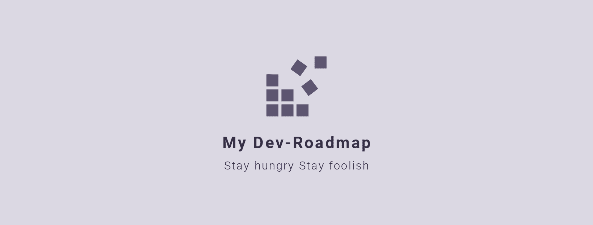

# <h1 align="center">My Dev Roadmap</h1>

## Intro

MyDevRoadMap 이란 

 

`UPDATE 21.11.20`

취업 전, 이 곳은 **단순한 나만의 개발 정리 노트**로서의 프로젝트 공간이였다. 그래서 [개발자 로드맵](https://github.com/kamranahmedse/developer-roadmap)을 참고하여 필요하다고 생각하는 부분들에 대해서 **나의 언어**로 정리해보고자 노력하였다. 또한 로드맵의 모든 내용을 다 알아야한다는 의미보다는 `개발 트렌트에 대한 방향성, 체크리스트`라고 생각하고 접근하였다.

취업 후, 개발자로서 실무를 경험하면서 스스로의 피드백을 통해서 많은 생각을 하게 되었다. 좋은 개발자가 되기 위해선 굉장히 다양하고 많은 지식과 다양한 경험이 필요하다고 생각한다. 프런트엔드 개발자로서 개발 인생의 첫 걸음을 시작했지만, 실무에서는 프런트엔드뿐만 아니라 백엔드, 나아가 컴공의 기본적인 지식들을 이해해야 알 수 있는 부분들도 있었다. 비전공자인 나로서는 많은 부분이 처음이였고, 어디까지 이것을 알아야 할지에 대한 고민을 하게 되었다. 이러한 고민은 끝은 결국 `내가 직접 다 공부해보고 경험해보자` 였다. 그래서 개발자로서 필요한 지식들, 특히 `컴공의 기본에 해당하는 부분` ( 컴퓨터 구조, 운영체제, 자료구조, 알고리즘, 네트워크, 데이터 베이스 등 )을 포함한 광범위한 부분을 차근 차근 나의 언어로 정리해보고자 한다. 더불어, 그 과정 속에서의 오답노트들과 의문들도 함께 정리할 것이다.

ps1. 인생과 개발은 비슷하다. 모두 오답 노트를 통해서 성장하기 때문이다. 인생은 오답 노트투성이, 개발도 오답 노트투성이.😅

ps2. 이 과정이 얼마나 오래 걸릴지, 얼마 후에 마무리될지는 알 수 없다. 하지만 꾸준히 정리하려고 노력할 것이다.🚀

 

## 📌 Computer Science

---

### ComputerStructure (컴퓨터 구조와 설계)

### Operator (운영체제)

### Database

### Network(네트워크)

### DataStructure

### Algorithm

### Software Engineering

 

## 📌 Language

---

### [Javascript](/javascript/javascript.md)

### HTML

- [Semantic(의미론적) HTML](./html/semantic.md)

### CSS

- [CSS unit(CSS 단위)](./css/css-unit.md)

- [Selector](./css/selector.md)

- [Box Model](./css/boxmodel.md)

- [Display](./css/display.md)

- [Flex Box](./css/float.md)

 

## 📌 Library & Framework

---

 

## 📌 Web

---

- 인터넷의 작동 원리

- [HTTP와 HTTPS](./web/http.md)

- [브라우저의 동작 원리](./web/how-browsers-work.md)

- DNS와 동작 방식

- 도메인이란 무엇일까??

- 호스팅이란??

- [나를 괴롭히는 CORS, 도대체 이것은 무엇일까??](./web/cors.md)

 

## 📌 Security

---

 

## 📌 NewTechnology & Trend

---

 
