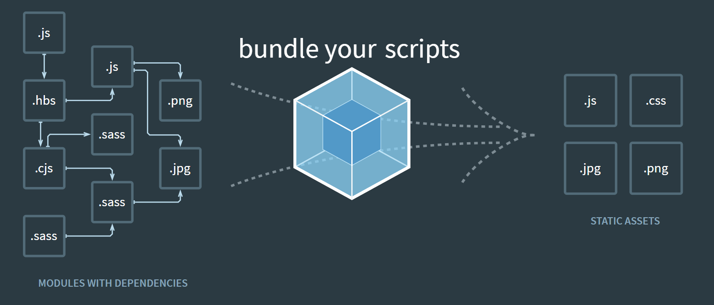

# What is Webpack



<br />

## 웹팩이 등장하게 된 이유와 필요성

> 웹팩이 등장하게 된 이유와 필요성을 이해하게 되면 웹팩이 무슨 일을 하는지에 대해서 좀 더 정확히 이해 할 수 있다.

**`웹어프리케이션의 성능 향상`:**

하나의 페이지에는 수많은 이미지 파일과 자바스크립트 파일, CSS파일들이 필요하다. 많은 파일들이 필요로 한다는 말은 그와 비례해서 서버와의 접속을 필요로 하게 된다. 하지만 서버와의 접속은 비싼 작업이기 때문에 많은 접속은 동시에 페이지 성능의 하락을 가져온다. 또한 그만큼 네트워크 비용 역시 지불해야 할 것이다. 이러한 문제를 해결하기 위해서 나타난 것인 `웹팩`이다. 웹팩은 `bundler` 라는 의미(`묶다`) 처럼 파일들을 묶는 기능을 한다. 여러 개의 CSS파일은 CSS파일별로, JS파일은 JS파일별로 묶어서 네트워크 비용을 최소화 시킬 수 있다.

이와 더불어 웹팩은 `Lazy Loading`과 같은 기능도 제공함으로서 리소스가 필요한 시점에 사용될 수 있게 해줌으로서 페이지의 성능 향상에 도움을 준다.

**`생상성 향상`:**

프런트엔드 환경에서 개발할 때 가장 많이 반복하는 행동이 `수정 후 리프레쉬 수정 후 리프레쉬...` 이다.
이외에도 HTML,CSS,JS압축 및 CSS 전처리기 등등 이러한 모든 과정을 하나 하나 셋팅해줘야만 했다. 하지만 웹팩과 같은 도구를 이용하면 이러한 것들을 한 번에 설정이 가능하기 때문에 좀 더 편리한 환경에서 개발을 진핼 할 수 있게 되었다.

**`자바스크립트 모듈 관리의 필요성`⭐:**

기본적으로 자바스크립트를 이용해서 무엇인가를 만들 때, JS파일을 `index.html`에 body의 하단에 그 파일을 삽입시켜서 자바스크립트 파일이 읽히도록 만든다. 점차적으로 프로그램이 커지면 넣어줘야 할 자바스크립트 파일이 많아지고, 그에 따라서 html에 넣어줘야 할 파일들이 많아진다. 여기서 또 생각해 줄 문제가 있다. 바로 `의존성 문제`이다. 그냥 JS파일을 만드는 순서대로 넣어준다면, 문제가 발생할 수 도 있다. JS파일을 html에 넣어준 순서대로 읽기 때문에, 만약에 세번째 JS파일에서 네번째 JS파일 안의 변수나 함수를 사용한다면, 문제가 생길 수 있다. 이렇게 파일이 많아지면 html에 파일을 관리하랴 의존성을 관리하랴 여러가지로 복잡해질 수 있다.

여기서 가장 중요한 문제가 발생할 수 있다. 바로 `전역공간의 오염`이다. 페이지가 로딩될 때 각각의 JS파일은 모두 하나의 JS파일로 인식되며, 각각의 파일에서 사용되었던 각 파일에서의 전역변수는 결국엔 하나의 파일에서의 전역변수로 인식된다. 그렇게 되면, 만약에 중복된 변수가 사용되었다면, 원하는 결과가 나올지 않을 확률이 크다. 또한 이로 인해 생길 연쇄적으로 어떤 문제가 발생 할지 알 수 없다.

이러한 문제를 해결하기 위해서 나타난 것이 `IIFE(Imediately Invoked Function Expression)(즉시실행함수)`를 사용하여 `인위적으로 스코프`를 만드는 것이다.

```javascript
//하나의 파일
(function () {
	//code here
})();
```

위에서 처럼 하나의 파일에 `큰 한 개의 스코프`를 만들고 그 안에서 작성하게 되면, html에 들어가게 되더라도 스코프 안에서 작동하기때문에 전역변수의 오염의 염려를 덜 수 있게 된다. 이러한 개념으로 여러가지 라이브러리가 등장하게 되었다. 그 중에 대표적인 것인 `CommonJS`와 `AMD` 이다. CommonJS는 Node.js에서 주로 사용하는 모듈 방식이다. `export`를 통해서 내보내고(모듈을생성) `require`라는 키워드로 받아서 사용한다. AMD는 비동기에서의 모듈을 지원하기 위한 것이다. 그러던 중 `자바스크립트 ES6`를 통해서 공식적으로 모듈 관련 문법을 지원해주기 시작했다. `import`, `export`가 그것이다. 이것을 사용하면 자바스크립트를 모듈화하여 사용할 수 있게 되었다. 하지만, 여기서도 문제가 있었다. <u>모든 브라우저가 이러한 모듈 시스테을 사용하지 않는다는 것이다.</u> 기술의 발전 속도에 비해 브라우저의 발전 속도가 더디기 때문이었다. 모듈을 모든 브라우저에서 동일하게 사용하고 싶은 욕구에 의해서 만들어진 것이 웹팩이다.

정리하면, **웹팩은 각각의 모듈을 의존성에 따라서 관리하고 번들링하여 하나의 정적인 파일로 만들어 주는 도구이다.**

## Webpack Configuration

`npm install -D webpack webpack-cli`:

> webpack-cli : command line에서 webpack명령어를 사용할 수 있게 해준다.

<br />

# Ref

- [웹팩 핸드북](https://joshua1988.github.io/webpack-guide/motivation/why-webpack.html#%EC%9B%B9%ED%8C%A9%EC%9D%98-%EB%93%B1%EC%9E%A5-%EB%B0%B0%EA%B2%BD)

- [프론트엔드 개발환경의 이해](https://jeonghwan-kim.github.io/series/2019/12/10/frontend-dev-env-webpack-basic.html)
