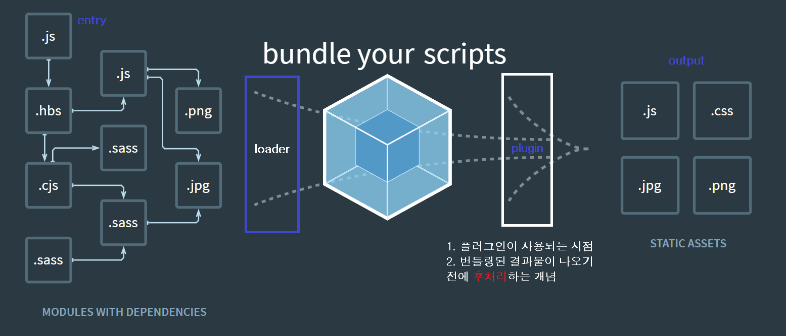

# Webpack Configuration

> 웹팩 설정을 하는데 필요한 옵션들에 대해서 알아본다.

## Install Webpack

`npm install -D webpack webpack-cli`:

> webpack-cli : command line에서 webpack명령어를 사용할 수 있게 해준다.

<br/>

## Core Concepts

> 기본적으로 웹팩은 `Mode, Entry, Output, Loader, Plugin` 옵션을 설정한다. 일반적으로 `webpack.config.js` 라는 설정 파일을 생성하여서 설정하지만, `cli 명령어`를 통해서도 가능하다.(webpack-cli를 설치했기 때문에)

```
node_modules/.bin/webpack --mode development --entry ./scr/app.js --output dist/main.js`
```

> `node_modules/.bin` 안에는 webpack 실행 파일이 들어있다. 이 실행 파일을 옵션과 함께 실행시키면 된다. 위 명령이 실행되면 최종적으로 `dist의 main.js`라는 번들링된 자바스크립트 파일이 생성된다. 이 파일을 `index.html에 추가`하여 로딩하면 된다.

> > 하지만 매번 옵션을 이렇게 지정해주면 매우 불편하다. 또한 실제로는 더 복잡하고 많은 옵션들이 필요하다. 그래서 위에서 말한 것처럼 `webpack.config.js`라는 설정 파일을 생성해서 번들링에 필요한 옵션들을 관리하게 된다.

> 일반적으로 웹팩의 실행은 <u>package.json의 scripts의 명령어</u>를 이용한다. package.json의 scripts에 `build : "webpack"`을 설정하여 `npm run build` 명령어를 실행한다. 그렇게 되면 npm은 현재 프로젝트의 node_module 안에 webpack관련 명령어를 찾아서 실행을 하게 된다.(위의 cli에서 처럼 bin 폴더에 가서 실행파일을 찾는다.) 그렇게 되면 webpack은 기본 설정파일인 `webpack.config.js`를 읽어서 빌드 작업을 실행한다.

<br/>

### Mode

> 웹팩의 실행모드를 설정한다. 이 실행모드에 따라서 웹팩의 결과물이 달라진다. 모드를 설정하지 않으면 기본값인 `production`으로 설정된다.

> development : 개발모드 / production : 배포모드 / none : 모드 설정 없음

```javascript
module.exports = {
  mode: 'development',
  //...
};
```

<br />

### Entry

> 모듈의 시작점의 `경로`를 지정한다.(자바스크립트라고 한다면, 자바스크립트 파일의 시작점)

> 여기서 경로라 함은 `JS파일의 경로`를 말한다.

> entry에 적힐 파일은 웹팩이 의존성 관계를 분석할 때, 최상위에 위치한 파일이다. 그 최상위로 부터 내려가면서 의존성 관계를 번들링한다. 그렇기 때문에 이 파일은 웹앱의 전반적인 구조를 담고 있어야 한다.

> 상황에 따라서 **여러 개의 entry파일**이 존재 할 수도 있다. 그런 경우에는 entry에 배열 혹은 객체를 사용 할 수 있다.

```javascript
module.exports = {
  entry: {
    main: './src/app.js',
  },
  //...
};
```

<br />

### Output

> 하나로 번들링한 후 그 결과 파일이 있는 경로를 지정한다.

```javascript
module.exports = {
  entry: {
    main: './src/app.js',
  },
  //...
  output: {
    filename: '[name].js',
    path: path.resolve(__dirname + '/dist'),
  },
};
```

> output 안에서는 **2가지 설정**을 한다.

- `filename`은 웹팩이 빌드한 파일의 이름을 말한다. 그런데 여기서 `[name]` 이라고 적은 것은 무슨 의미일까? 이것은 entry에서 객체로 옵션을 설정했을 경우, **객체의 키값이 name에 들어오게 된다**. 그래서 결국 `main.js`라는 이름을 가진 파일이 생성된다. 이 외에도 이름 관련된 옵션들이 존재한다.

  > 참고로 `bundle.js`라는 이름으로 자주 사용한다.

- `path`는 실제 결과값의 위치를 `절대경로`로서 지정해 주는 것이다. 여기서 node.js의 path 모듈을 사용한다.

  > **[참고]** [path module](https://nodejs.org/api/path.html)

<br />

### Loaders

> 앞에서 말한 바와 같이 웹팩은 `모듈 번들러`이다. <u>모든 파일을 모듈로 바라본다.</u> 그렇기 때문에 우리가 웹팩을 사용하면 JS, CSS, image, font 등등을 import 를 통해서 다른 파일 안으로 가져올 수 있게 된다. 하지만 무조건 그렇게 되는 것은 아니다. 해당 리소스(모듈)에 맞는 옵션을 지정해줘야만 한다. 그러한 **옵션에 대한 규칙을 설정하여 해당 리소스가 모듈로서 사용 가능하게 변환시켜 주는 부분이 `Loader` 에서 하는 일**이다.

> 각각의 로더는 `npm install`을 통해서 설치 후 사용할 수 있다. '설정만 하고 왜 안되지?' 하는 경우 종종 있어서 기록해 둔다.

```javascript
module.exports = {
  entry: './src/app.js',
  output: {
    fileName: 'bundle.js',
    path: path.resolve(__dirname + '/dist'),
  },
  module: {
    rules: [
      {
        test: /\.css$/,
        use: ['style-loader', 'css-loader'],
      },
    ],
  },
};
```

> 대표적인 `css-loader`를 설정한 것이다.

> <u>`module`이라는 객체</u> 안에 <u>`rules` 라는 배열</u>에 객체를 추가해줌으로서 로더를 설정한다. 새로운 리소스에 대한 설정이라면 여러 개의 객체를 추가할 수 있다.

> 객체 안에는 `test`와 `use` 라는 키값을 갖는 프로퍼티를 만든다. test는 <u>어떤 리소스 파일에 대한 것인지 패턴을 밝히는 프로퍼티</u>이다. 이 부분은 정규표현식으로 작성된다. use는 <u>이 리소스에 어떠한 로더를 사용할 것인지를 배열 안의 요소로서 추가</u>한다. 특히 <u>**먼저 적용이 되어야하는 로더는 배열의 끝에 위치하여 뒤에서부터 순서대로 실행된다**</u>.

`css-loader`:

css-loader가 실행되면 css파일을 모두 JS파일 안에 코드로서 집어 넣는다. 그렇기 때문에 css-loader만 실행되면 JS파일 안의 CSS를 CSS로서 실행할 수 없기 때문에 제대로 된 동작을 할 수 없다.

`style-loader`:

CSS가 제대로 된 동작을 하기 위해선 CSS만으로 읽힐 수 있게 만들어 줘야한다. inline-script로서 혹은 html파일 내에서 CSS파일을 불러오게 만들거나 등등의 방법이 있을 수 있다. style-loader는 JS파일 안의 CSS를 inline-script로서 불러와서 CSS를 해당 페이지에 적용시킨다.

> 이러한 일련의 과정이 필요하기 때문에 CSS를 모듈로서 사용하기 위해선 2가지의 로더가 필요하다.

#### 그 외 대표적인 로더들

`file-loader`:

file-loader는 말 그대로 파일을 처리하는 로더로서 이미지나 폰트 같은 것들을 모듈로서 사용가능하게 만들어준다.

```javascript
module.exports = {
  //...
  module: {
    rules: [
      {
        test: /\.(jpg|png|svg|gif)$/,
        use: ['file-loader'],
      },
    ],
  },
};
```

> 위에 처럼 사용하는 경우에 실제 페이지를 랜더링을 하게 되면 에러가 발생한다. 그 이유는 빌드 할 때, 이미지를 넣어준 위치와 실제 위치가 다르기 때문이다. 그렇기 때문에 빌드 후에 실제 존재하는 위치를 볼 수 있도록 옵션을 변경해줘야한다.

```javascript
module.exports = {
  //...
  module: {
    rules: [
      {
        test: /\.(jpg|png|svg|gif)$/,
        loader: 'file-loader',
        options: {
          publicPath: './dist/',
          name: '[name].[ext]?[hash]',
        },
      },
    ],
  },
};
```

> 위의 코드 처럼 옵션을 약간 변경시켜줄 수 있다. 이 외에도 다양한 옵션이 있다. 웹팩 공식문서를 참고하여 상황에 맞게 커스터마이징 할 수 있어야 하겠다.

> `publicPath`는 빌드 후 파일 경로를 말한다. `name`은 파일 이름에 대한 옵션을 설정한다. `[name]`은 원본 파일 이름을 그대로 가져오고, `[ext]`는 파일의 확장자명을 말한다. `[hash]`는 특정 빌드에 해당하는 해쉬값을 뜻하는 것으로서 요청시 브라우저에서의 캐슁을 피하는 전략으로 사용하기 위한 것이다.

`url-loader`:

> 작은 이미지 같은 경우, base64 방식을 통해서 데이터를 문자열로 인코딩하여서 자바스크립트 파일의 인라인 코드로 넣어줄 수 있다. 이런 식으로 변환시켜주는 로더가 url-loader 이다.

> > [참고\_data uri schema](https://developer.mozilla.org/ko/docs/Web/HTTP/Basics_of_HTTP/Data_URIs)

> url-loader를 사용하는 이유는 상황에 따라 달라질 수 있다. 예를 들어서 많은 파일을 받아야 하는 상황에서 작은 파일은 하나의 자바스크립트 코드 안에 넣어서 보내주는 것이 더 효율적이라면 url-loader를 사용할 수 있을 것이다.

```javascript
module.exports = {
  //...
  module: {
    rules: [
      {
        test: /\.(jpg|png|svg|gif)$/,
        loader: 'url-loader',
        options: {
          publicPath: './dist/',
          name: '[name].[ext]?[hash]',
          limit: 8196, //byte
          fallback: require.resolve('file-loader'),
        },
      },
    ],
  },
};
```

> url-loader를 사용하기 위해선 우선 `limit` 옵션을 추가해야한다. limit는 바이트 용량을 설정한다. 이 설정값을 넘지 않으면, url-loader를 사용하여 빌드한다. 하지만 이 용량을 넘어서게 되면 fallback에 설정된 로더에 의해서 빌드된다. 기본값으로는 file-loader가 설정되어있다. 그렇기 때문에 위 코드 처럼 명시적으로 적어주지 않아도 용량이 큰 파일의 경우는 file-loader에 의해서 처리된다. 만약에 용량이 큰 파일을 다른 로더로 처리하고 싶다면 위 옵션을 사용하여 설정해주면 된다.

`babel-loader`:

> babel-loader는 바벨은 웹팩에서 사용하기 위해서 필요한 로더이다. 바벨에 대해서 간략하게 알아보고 바벨 설정과 웹팩과의 통합 설정 과정을 통해서 어떠한 일들이 일어나는지 알아보자.

- 바벨이란 ES6버전의 자바스크립트 코드를 어떠한 브라우저에서도 일관된 자바스크립트 코드로서 사용하기 위해서 나온 `transpiler` 이다. 즉 ES6에서 ES5로 자바스크립트 코드를 만들어준다.

- 바벨은 3단계에 걸쳐서 코드의 변환을 진행한다. 첫번째는 코드를 읽고 추상구문트리(AST)로 `파싱`하는 단계이다.(간단하게 고수준의 코드를 기계어로 바꾸는 단계라고 생각하자!) 두번째는 추상구문트리를 각 환경에 맞게 일관된 코드로 변환시키는 작업을 한다. 여기서 `플러그인`이 관여한다. 세번째 단계는 변환된 코드를 출력하는 단계이다.

  > 이러한 과정을 구체적으로 안다기보다 전체적인 흐름을 익히는 수준으로 알아두자(위의 내용도 내 수준에서 간략하게 요약한 것😅)

- 플러그인은 각각 코드 문법을 변환하는 방법이라고 생각할 수 있다. 작성한 코드에 따라서 몇가지의 플러그인이 포함될지 일일히 찾아보는 것은 굉장히 불편한 방법이다. 그래서 플러그인 중에서 일반적으로 많이 사용하는 플러그인만 모아 놓은 집합이 `preset`이다. 보통 이걸 사용한다.

- 이러한 `preset`도 모든 코드를 다 변환시킬 수 없을 때가 있다. 그런 경우에는 `polyfill`이라고 하여 부족한 부분을 채우는 옵션을 추가해야한다.

- 일반적으로 이러한 바벨은 웹팩과 통합하여 사용한다. 이제 아래에는 `바벨과 웹팩의 통합 설정방법`에 대해서 알아본다.

  ```javascript
  //babel.config.js
  module.exports = {
    presets: [
      [
        '@babel/preset-env', //사용할 preset 종류
        {
          //preset option 객체 설정
          //아래 외에도 많은 옵션 설정이 존재한다.
          //또한 폴리필이 필요하다면 여기에서 설정을 해준다.
          targets: {
            //프로젝트가 진행될 브라우저, 환경에 대한 설정
            chromes: '80',
            ie: '11',
          },
        },
      ],
    ],
  };

  //webpack.config.js
  module.exports = {
    //...
    module: {
      rules: [
        {
          test: /\.js$/,
          loader: 'babel-loader',
          exclude: /node_modules/,
        },
      ],
    },
  };
  ```

  > 바벨을 설정하기 위해서 여러가지 패키지를 설치해야한다. `@babel/core @babel/cli babel-loader @babel/preset-env`가 그것이다.

  > 바벨 설정 파일(`babel.config.js or rcbabel.js`)을 만들어야한다.

  > 위 설정 파일이 작동하는 순서를 간략하게 보면, 웹팩이 실행되고 웹팩은 설정 파일 안의 `babel-loader`를 실행한다. babel-loader는 다시 `babel/core`를 실행한다. babel/core는 바벨 설정 파일을 읽어서 플러그인에 맞게 변환이 이루어진다.

  > 이 밖에도 무수히 많은 설정들이 존재하는 것 같다. 상황에 맞게 공식문서를 참고하면서 설정해야 하겠다.

`sass-loader`:

- sass파일을 웹팩으로 로딩하고 CSS로 컴파일하는데 필요한 로더이다.

- `npm install -D sass-loader node-sass`가 필요하다.

  > 난 sass를 설치하였다. sass는 dart-sass의 버전 중에 한 가지라고 한다. sass-loader를 사용하기 위해서는 < <u>node-sass나 dart-sass 둘 중 한 가지</u>가 필요하다.

  > 웹팩에서 설정 파일 안의 sass-loader를 읽고 실행시키면 `sass-loader`가 sass파일을 로딩하고 node-sass를 실행시킨다. 이어서 `node-sass`가 sass파일을 css파일로 컴파일한다.

  ```javascript
  module: {
    rules: [
      {
        test: /\.s[ac]ss$/,
        use: [
          'style-loader', // create style node(inline style) from JS string
          'css-loader', // translate css to commonJS
          'sass-loader', // compiles sass to css
        ],
      },
    ];
  }
  ```

<br />

### Plugins

> 플러그인은 로더와 비교할 수 있다. 로더는 파일 단위로 실행되고 그 파일을 모듈화한다. 반면 플러그인은 최종 빌드된(번들링된) 결과물 단위로 실행된다. 즉 최종 결과물에 추가적인 작업을 하고 싶을 때 플러그인을 추가하여 실행한다.



> 전체 흐름에서 흰색 박스가 플러그인이 실행되는 시점이다.

```javascript
module.exports = {
  //...
  plugins: [
    //new 연산자를 통한 인스턴스 생성
  ],
};
```

> 플러그인이라는 배열 안에 해당 플러그인의 생성자 함수를 new 연산자와 함께 실행시켜서 그 인스턴스를 요소로서 추가한다.(플러그인은 모두 `class`로 만들어지기 때문에 위와 같이 설정한다.)

#### 대표적인 플러그인들

`BannerPlugin`:

- 웹팩에서 기본적으로 제공해주는 플러그인으로서 따로 설치할 필요가 없다.

- 배너의 원의미는 길쭉한 현수막으로서 특정 의미나 표식을 담고 있는 것을 말한다. 이와 같이 BannerPlugin 은 최종결과물 맨 위에 주석처리로 원하는 표시, 문자등을 추가 할 수 있게 해주는 플러그인이다.

  > 일반적으로 빌드 정보, 커밋 버전 혹은 시간등의 정보를 나타낸다.

  ```javascript
  const webpack = require('webpack');
  //웹팩의 기본 플러그인인 경우 위에 처럼 webpack을 가져온 후 사용한다.
  //node 기반의 웹팩이기 때문에 CommonJS스타일로 작성해준다. 참고로 웹팩의 설정파일에서는 자바스크립트만 읽을 수 있다.

  module.exports = {
  	//....

  	//string
  	plugins : [
  		new webpack.BannerPlugin({
  			banner : 'Hello World'
  		});
  	]
  	//or

  	//function
  	plugins : [
  		new webpack.BannerPlugin({
  			banner : (something) =>`something : ${something}`;
  	]
  }
  ```

  > BannerPlugin의 인자로서는 문자열 혹은 함수로도 전달될 수 있다.

`DefinePlugin`:

- 웹팩에서 기본적으로 제공해주는 플러그인으로서 따로 설치할 필요가 없다.

- DefinePlugin은 컴파일시 사용할 수 있는 전역변수를 생성할 수 있게 해준다.

- **활용**

  > 어플리케이션의 개발 환경은 모드(development, production)에 따라서 상황이 필요한 환경변수들이 달라질 수 있다.(ex. API주소 등등) 이럴 때 일일히 환경에 따라서 셋팅하는 것보다 환경변수에 따라서 셋팅이 될 수 있게 만들어 주면 에러가 발생할 확률이 낮아질 수 있다.

  > > 환경 의존적인 변수를 소스가 아닌 다른 곳에서 관리한다는 개념

- DefinePlugin는 `node의 환경변수(process.env.NODE_ENV)`를 기본적으로 주입해준다.

  > node로 실행한 프로그램에서는 process라는 객체에 여러 가지의 시스템 정보(+설정된 값)가 담겨있다. 그 중에 `process.env`라 함은 시스템에서 설정한 값을 가져올 수 있다.(여기서 시스템은 서버를 말한다.) 여기서 `process.env.NODE_ENV` 처럼 `NODE_ENV`라는 환경변수를 설정하고 이를 코드에서 사용할 수 있다.

  > DefinePlugin에서는 `process.env.NODE_ENV`을 기본적으로 설정해준다. 좀 더 정확히 말하면, Node의 환경 변수를 설정하는 것은 아니고, <u>webpack 설정시 mode의 값을 여기서 할당</u>한다고 생각하면 된다. 어플리케이션에서 설정없이도 이 값을 사용할 수 있게 된다.

  ```javascript
  module.exports = {
  	//...

  	plugins: [
  		new webpack.DefinePlugin({
  			//여기와 key : value 로 직접 환경변수를 설정할 수 있다.
  			NAME: 'jjanmo',
  			DEV_URL: JSON.stringify('https://dev.example.com'),
  		}),
  	],
  };

  //어플리케이션에서 사용법
  if (process.env.NODE_ENV === 'development') const url = DEV_URL;
  ```

  > { } 안에 직접 변수를 넣어서 어플리케이션 상에서 전역변수로서 키값을 사용하여 접근이 가능하다. 개발 환경에 따른 환경 변수를 위와 같은 형태로 설정해줄 수 있다.

`HtmlWebpackPlugin`:

- 3rd party 플러그인으로서 설치가 필요하다.

- 웹팩으로 빌드한 결과물로서 HTML파일도 포함될 수 있도록 만들어 주는 플러그인이다

- **주의** 이 플러그인을 사용하게 되면 외부에 있던 index.html의 위치가 변경되기 때문에 경로 설정이 변경되는 부분이 존재하게 되기때문에 이를 수정해주어야만한다.(ex. image관련 file-loader 등등)

  ```javascript
  module.exports = {
    //...
    plugins: [
      new HtmlWebpackPlugin({
        template: './src/index.html',
        templateParameter: {
          env: process.env.NODE_ENV === 'development' ? '(개발용)' : '',
        },
        minify: {
          collapsWhitespace: true,
          removeComments: true,
        },
      }),
    ],
  };
  ```

  > `template` 는 HTML 파일의 경로를 설정한다. `templateParameter`은 HTML 파일에 넣어줄 변수를 설정한다.

- 이외에도 HTML파일을 압축하고, 주석을 없애는 등의 옵션을 추가할 수 있다. [참고\_추가옵션](https://github.com/jantimon/html-webpack-plugin#options)

`CleanWebpackPlugin`:

- 3rd party 플러그인으로서 설치가 필요하다.

- 빌드할 때마다 output 폴더를 삭제하고 난 후 다시 빌드를 하게 하는 역할을 갖는 플러그인이다.

  ```javascript
  const { CleanWebpackPlugin } = require('clean-webpack-plugin');
  //default로 export 되어있지 않기 때문에 주의!

  module.exports = {
    //...
    plugins: [new CleanWebpackPlugin()],
  };
  ```

`MiniCssExtractPlugin`:

- 3rd party 플러그인으로서 설치가 필요하다.

- CSS파일이 많아짐에 따라서 웹팩으로 빌드되는 JS파일도 커지게 된다. 그렇게 되면 파일 하나를 로딩하는 것이 오히려 페이지 성능에 부담으로 작용할 수 있다. 이러한 부담을 줄이기 위해선 CSS파일을 분리하여 JS파일과 CSS파일을 따로 관리하는 것이 좋다. 이런 상황에서 사용하기 위한 플러그인이 `MiniCssExtractPlugin` 이다.

- 다른 플러그인과 다르게 플러그인 설정과 함께 로더 설정도 해주어야만 한다. 이 플러그인을 사용하기 위해선 style-loader 대신 자체적으로 내장된 로더를 사용하는 것이 좋다.

  > **TIP** 이러한 부분은 process.env.NODE_ENV에 따라서 다르게 설정해주는 것이 좋다. 또한 플러그인에서도 다르게 설정해주었기 때문에 설정이 이어지는 부분이 있다.

  ```javascript
  const MiniCssExtractPlugin = require('mini-css-extract-plugin');

  module.exports = {
  	//...
  	module : {
  		rules : [
  			{
  				test : /\.css$/,
  				use : [
  					(process.env.NODE_ENV === 'developemnt'
  					? 'style-loader'
  					: MiniCssExtractPlugin.loader),
  					'css-loader'
  				]
  			}
  		]
  	}

  	plugins: [
  		...(process.env.NODE_ENV === 'development'
  			? []
  			: [new MiniCssExtractPlugin({ filename : '[name].css'})]
  			)
  		],
  };
  ```

  > 개발 환경에서는 JS파일 1개로 띄우는 것이 조금 더 빠를 수 있다. 그래서 플러그인 설정을 환경에 따라서 다르게 주는 것 좋다. 또한 `[name]` 설정을 안해주면 hash값으로 파일 이름이 설정되기 때문에 이 설정도 해준다.

<br />

# Ref

- [웹팩 핸드북](https://joshua1988.github.io/webpack-guide/motivation/why-webpack.html#%EC%9B%B9%ED%8C%A9%EC%9D%98-%EB%93%B1%EC%9E%A5-%EB%B0%B0%EA%B2%BD)

- [프론트엔드 개발환경의 이해](https://jeonghwan-kim.github.io/series/2019/12/10/frontend-dev-env-webpack-basic.html)

- [프론트엔드 개발환경의 이해와 실습 : 강의](https://www.inflearn.com/course/%ED%94%84%EB%A1%A0%ED%8A%B8%EC%97%94%EB%93%9C-%EA%B0%9C%EB%B0%9C%ED%99%98%EA%B2%BD)

- [웹팩 공식문서](https://webpack.js.org/plugins/)
