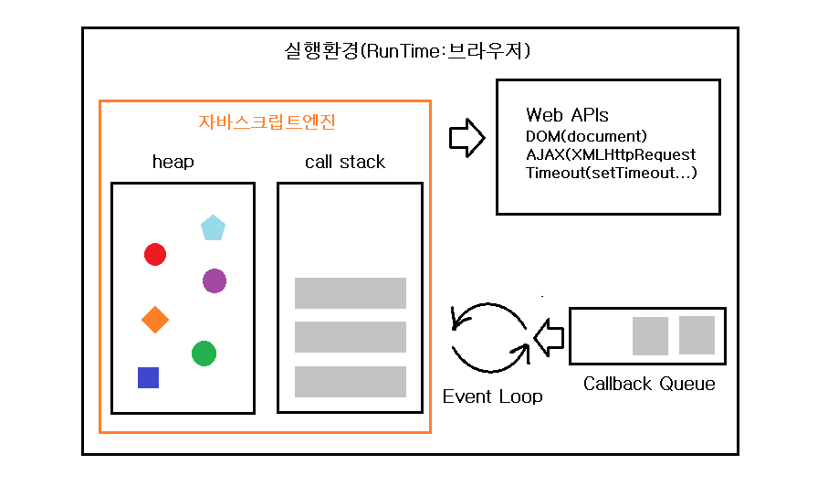
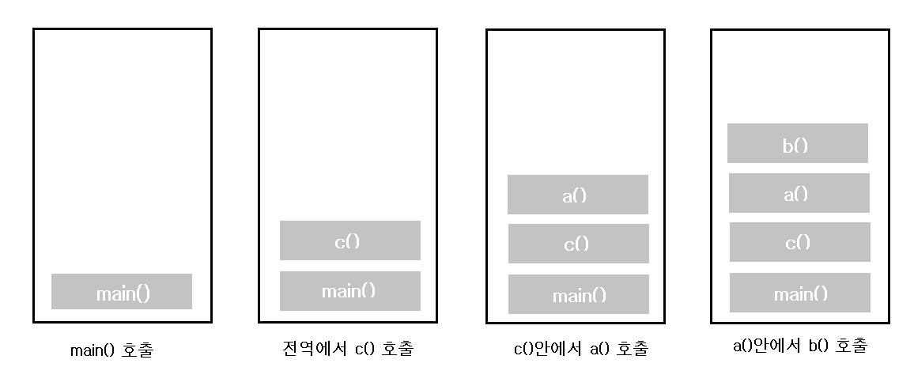
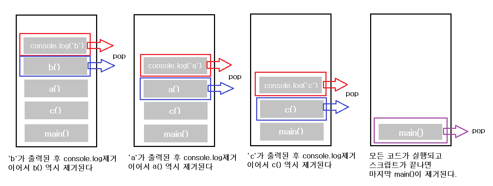

# What is callstack?

> 사실 콜스택은 자바스크립트 엔진이 동작하는 메카니즘의 한 부분이기 때문에 이벤트루프, 큐, WebAPI등과 떨어져서 설명하기가 쉽지않다. 하지만 최대한 콜스택에 집중하여 정리하고자 한다. 점차적으로 관련 개념들을 정리하면서 큰 덩어리의 흐름을 만들어갈 생각이다.

> 콜스택이 무엇인지 먼저 알기 위해선 `자바스크립트 엔진의 구성`에 대해서 알 필요가 있다.

> 자바스크립트 실행환경과 자바스크립트 엔진



자바스크립트 엔진은 기본적으로 `싱글스레드`이다. 그 말은 한 번에 한가지의 작업만 가능하다는 이야기다. 예를 들면, 브라우저에서 어떤 이벤트가 진행된다고 했을 때, 한가지 작업이 끝날때까지 우리는 계속 기다렸다가 그 이벤트가 끝난 후에 (웹상에서) 다른 일이 가능하다는 이야기다. 하지만 현재 우리에게 그런 일은 일어나지 않는다. 왜냐하면 자바스크립트 엔진 외에도 브라우저에서 여러가지( Web APIs, DOM APIs, HTTP request, setTimeout 등)를 지원해주고 있기 때문이다. 그럼 위 이미지에서 각각의 구성요소들이 무슨 역할을 하는지 대해서 이해해보자 🚀

### Call Stack(호출스택)

- 함수들이 호출되는 상태를 기록하는 논리적인 구조이다. 함수가 호출될 때마다 스택프레임이 생성되고 콜스택의 맨 위에 올라간다(push). 호출된 함수의 결과값이 반환하면 콜스택에 올라간 스택프레임은 제거된다(pop).

- 자바스크립트는 기본적으로 비동기적 작동하지만, 콜스택 자체에서는 **동기적**으로 작동한다. 비동기적인 작동하기 위해서는 콜스택뿐만 아니라 이벤트루프 등으로 인해 동시성을 보장받게 된다.(비동기적 작동을 가능하게 해준다)

```javascript
function a() {
  b(); //3
  console.log('a'); //5
}

function b() {
  console.log('b'); //4
}

function c() {
  a(); //2
  console.log('c'); //6
}

c(); //1
```

> 위 코드를 콜스택에 쌓이고 제거되는 순서대로 표현한 것이다.(왼쪽에서 오른쪽으로 진행된다) 또한 코드 옆에 적힌 순서대로 콜스택에 쌓이고 제거된다.




- `Uncaught RangeError: Maximum call stack size exceeded` : 이런 에러가 뜨기도 한다. 보통 재귀적구현을 할 때 재귀탈출조건을 잘못 설계해서 콜스택 사이즈를 넘어서는 경우 나타난다.

### Memory Heap

- 힙은 객체를 할당하는 영역으로 비구조화된 메모리이다. 변수와 객체에 대한 메모리의 할당은 이 부분에서 일어난다.

### Callback Queue(큐)

- 실행될 콜백함수 혹은 실행될 메세지들이 담기는 공간이다. 콜스택이 비는 경우 큐에 있는 콜백함수나 메세지들이 콜스택으로 올라와서 실행된다.

### Web APIs

- 비동기이벤트들을 다루기 위한 브라우저에서 제공하는 API이다.

### Event Loop(이벤트루프)

- 싱글스레드인 자바스크립트 엔진을 비동기적으로 작동하게 만들어주는 방식
- 콜스택과 큐사이에서 콜스택이 비어있는 경우 큐에 있는 콜백을 콜스택으로 전달해주는 역할을 한다. 그렇기 때문에 동기적으로 작동하는 콜스택이 마치 비동기적으로 작동하게끔 만들어준다.

# Ref

- [JavaScript Visualized: Event Loop](https://dev.to/lydiahallie/javascript-visualized-event-loop-3dif)
- [자바스크립트 호출 스택(Call Stack) 이해하기](https://new93helloworld.tistory.com/358)
- [Understanding Javascript Function Executions — Call Stack, Event Loop , Tasks & more 번역판](https://velog.io/@jakeseo_me/2019-03-15-2303-%EC%9E%91%EC%84%B1%EB%90%A8-rmjta5a3xh)
