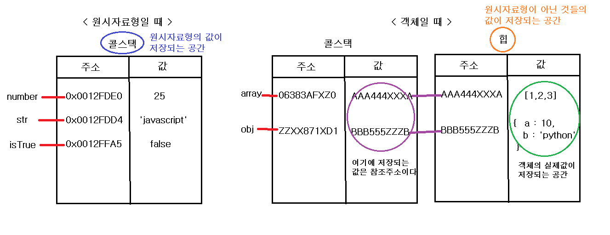
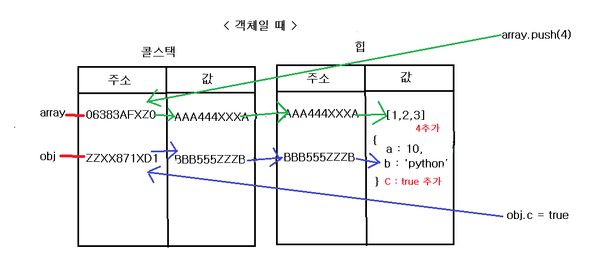

# 프로퍼티의 변경이 있는 객체 혹은 요소의 변경이 있는 배열에 let키워드를 사용할까?

> 위의 질문에 대한 예시를 들어서 구체화 해보겠다.

```
예시1
어떤 배열을 생성하고 그 배열에 숫자를 추가(push())하고 삭제(pop())해야하는 기능을 구현한다고 하자.
이 때 배열의 값이 변하기 때문에 let array = [] 이라고 생성할 수 있다.

예시2
어떤 객체를 빈객체를 생성하고 상황에 따라 적절한 프로퍼티를 추가하거나 삭제하여
완성된 객체를 배열에 넣어서 객체를 담은 배열을 만든다고 할 때, 객체의 내용(값)이 변하기 때문에
let obj = {} 라고 생성할 수 있다.
```

> 위와 같은 상황에서 보통 let키워드를 사용하려고 할 것이다. 하지만 변하지 않는 값일 경우는 const를 사용하는것이 추천된다.
> _무슨소리야? 값이 변한다고 그랬자나🤯_ 그래서 지금부터 변수할당과 선언에 대해서 메모리 차원에서 자세히 살펴보자

## 우리가 착각하고 있는 것들

1. 변수가 담고 있는 것

   

   > 사실 변수가 담고 있는 실제 값이 아니라 메모리(콜스택)에 있는 주소값이다.(빨간줄) 원시자료형의 경우엔 그 주소가 가르키고 있는 공간에 값이 저장되지만 객체의 경우엔 실제 값은 힙영역에 저장되기 때문에 변수가 가르키는 공간에 다시 힙영역의 주소를 담고 있다.(보라줄) 재참조가 일어난다고 생각하면 좀 쉽게 이해할 수 있을 것이다.

2. let, const 에서 `재할당이 된다` 혹은 `재할당이 안된다`는 말의 의미
   > 우리는 이 말의 의미를 `값이 재할당이 되어야 할 때(값이 변경될 때)`는 `let`을 사용하고 `값이 재할당이 안되는 경우(값의 변경이 없을때)`는 `const`를 사용한다라고 생각하고 있다. 하지만 이 부분이 오류이다. 왜냐하면 위에서 보았듯이 변수는 주소값을 갖고 있기 때문에 값이 어떤지를 알지 못한다. 즉 값의 재할당 혹은 값의 변경이 아니라 `주소의 재할당, 주소의 변경`이 정확한 표현이다.

## 그렇다면 주소값은 언제 할당되는가

1. 원시자료형의 경우엔 `immutable`하기 때문에 새로운 값이 생성될 때마다 그 값에 새로운 주소를 부여한다. 다시 말해 값이 바뀌는 것과 주소가 바뀌는 상황이 일치하기 때문에 별문제없이 값의 변경 여부에 따라서 let 혹은 const를 사용해도 무방하다.

2. 객체의 경우엔 다르다. 객체의 값의 변경은 주소값의 변경과는 전혀 상관이 없다. 만약에 array의 요소를 변경하려고 한다면 아래 이미지 처럼 (주소값의 변경없이) 힙영역의 주소를 찾아가서 그 안의 값만을 바꾸면 된다. 그렇기 때문에 **메인 질문**인 `프로퍼티의 변경이 있는 객체 혹은 요소의 변경이 있는 배열에 let키워드를 사용할까?`에 대한 대답은 **NO**이다. let을 사용해야하는 조건에 해당하지 않는다. 즉 const를 사용하는게 맞다고 할 수 있다.

   > 값의 변경이 없는 경우는 **const**를 무조건 추천한다. 단, 이 값이 `주소값`이라는 사실을 다시 한번 인지하자

   하지만 만약에 변수에 `새로운 배열을 할당하는 상황`이라면 그것은 배열의 주소가 달라지기 때문에 그런 경우는 `let`을 사용하는 것이 맞다.

   

# Ref

- [<번역>자바스크립트의 메모리 모델](https://junwoo45.github.io/2019-11-04-memory_model/)
