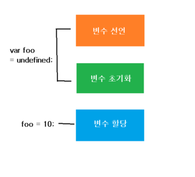
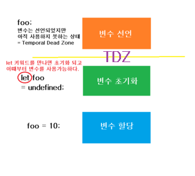

# Understanding Variables, Scope, and Hoisting

## Variables(변수)

> 변수란 값을 저장하는 공간이라고 할 수 있다. ES6이전에는 `var` 키워드로만 변수를 선언하였다. 하지만 ES6부터는 `const`와 `let`이라는 키워드로 변수를 선언할 수 있게 되었다. 이렇게 키워드가 더 생기면서 좀 더 변수의 활용이 명료해지는 효과가 생겼다. 이제 각각의 키워드들이 어떤 의미와 기능을 갖고 있는지 알아보자.

## 변수의 생성 과정

- 선언 과정 (Declaration phase)
  - 스크립트가 시작되면 스크립트 내의 모든 변수가 `렉시컬 컴퍼넌트의 환경레코드`에 올라간다.
- 초기화 과정 (Initialization phase)
  - 변수에 `undfined`라는 값이 기본값으로 주어진다. 이 때부터 변수를 사용할 수 있다.
- 할당 과정 (Assignment phase)
  - 변수에 값이 할당되는 과정이다.

> `var` 와 `let`,`const`는 변수 생성 과정이 다르고 그로 인해 동작 방식의 차이점이 발생한다.

### **var** 키워드의 특징

> 여러가지로 자유로운 영혼(?)을 지닌 키워드 😅

1. 생성 과정

   ```javascript
   var a; //변수 선언과 초기화 => 'undefined'
   a = 10; //값 할당

   var b = 20;
   ```

   > `var` 키워드는 변수 선언과 초기화가 **동시에** 일어난다. 그래서 `var`로 변수를 어느 곳에서나 선언을 하면 동시에 초기화가 되어서 그 변수의 값을 출력하면 기본값으로 `undefined`가 찍힌다.

   

2. 재선언이 가능하다.

   ```javascript
   var foo = 10;
   console.log(foo); //10;
   var foo = 'javascript';
   console.log(foo); //'javascript';
   ```

3. 재할당이 가능하다.

   ```javascript
   var foo = 10;
   console.log(foo); //10;
   foo = 'javascript';
   console.log(foo); //'javascript'
   ```

4. `function scope` 를 갖는다.

   > 👁‍🗨 `scope` 란 `식별자 해결(Identifier Resolution)`을 결정하기 위한 `현재 코드의 문맥(context), 유효 범위`라고 할 수 있다. _😵이게 무슨말이냐??🤪_

   > > `식별자(indentifier)`란 값 혹은 참조를 할당하는 변수를 말한다. 예를 들어 `var a = 10;`이라고 하면 `a`가 식별자를 의미한다.

   > > `Indentifier Resolution`이란 식별자에 어떤 값을 할당할지를 스코프(체인)를 통해서 해결하는 일련의 과정을 말한다. 간단히 말하면 **변수의 값을 결정하는 것**이라고 할 수 있다.

   > 정리하면 `scope` 란 `변수의 값을 결정할 수 있는 코드의 문맥, 범위`이며 `function scope`란 **함수에 의해서 만들어지는, 변수 값을 결정하는 유효범위**라고 말할 수 있겟다.

   ```javascript
   function foo() {
     var name = 'jjanmo';
     console.log(name); //1 'jjanmo'
   }
   foo();
   console.log(name); //2 error : name is not defined
   ```

   > `var`로 선언된 변수는 변수가 선언된 function 안에서만 그 값이 결정될 수 있고 유효하다. 위의 코드의 결과처럼 함수 밖에서 name에 접근하려고 하면 값을 찾을 수 없기 때문에 `error`가 발생한다.

   ```javascript
   var foo = 'madeleine';
   if (true) {
     var bar = 'marley';
   }
   console.log(foo); //'madeleine'
   console.log(bar); //'marley'
   ```

   > `if문의 {}`은 `block scope`이다. 즉 `fucntion scope`가 아니기 때문에 {}안에 선언된 var변수는 `{} 밖`에서 **접근이 가능하다**.

5. 호이스팅(hoisting)이 일어난다.

   > 👁‍🗨 `hoisting`이란 `hoist`라는 단어의 의미를 알면 좀 더 쉽게 이해 할 수 있다. hoist는 `끌어올림`이라는 뜻이다. 즉 `변수가 속한 스코프의 최상단`으로 변수의 `선언부`만을 끌어올린다.

   ```javascript
   var location = 'outside';
   function foo() {
     console.log(location); //undefined
     var location = 'inside';
   }
   foo();
   ```

   > 함수 foo 안의 `location`변수는 `함수스코프`를 갖는다. 그렇기 때문에 함수 안의 최상단으로 변수의 선언부가 끌어올려지게 된다. 아래와 같은 형태라고 생각하면 된다.

   ```javascript
   var location = 'outside';
   function foo() {
     var location = undefined; //hoisting : 선언과 초기화 동시에 일어난다.
     console.log(location); //undefined
     location = 'inside';
   }
   foo();
   ```

6. Quiz

   ```javascript
   var x = 10;

   function foo() {
     if (x > 100) {
       var x = 50;
     }
     console.log(x);
   }

   foo();
   ```

   <details>
   <summary>정답</summary>
   <div markdown="1">
   > undefined
   </div>
   </details>

   > 실제 동작 과정

   ```javascript
   var x = 10;

   function foo() {
     //var x = undfined;
     if (x > 100) {
       x = 50;
     }
     console.log(x);
   }
   foo();
   ```

### **let** 키워드의 특징

1. 생성 과정

   > `let` 키워드로 변수를 생성하면 기존의 `var`와는 다르게 작동한다. 그 부분을 살펴보자.(`let`과 `const` 동일하게 작동한다.)

   

   > let으로 변수의 선언이 일어나면 그 순간부터 초기화되기 전까지는 `TDZ(Temporal Dead Zone)`이 만들어져서 변수에 접근할 수 없다. 만약 접근하려고 `reference error`가 발생한다. 그 뒤에 let 키워드를 만나면 초기화가 이루어져서 `undefined`값을 갖게된다. 이후 값이 할당된다.

   > 여기서 `reference error`가 의미하는 것은? 변수가 생성될 때, 변수(이름)를 위한 메모리 공간을 마련하고 그 주소값이 주어진다. 또 할당할 값을 위한 메모리 공간을 마련하고 그 주소값이 역시 주어진다. 그 두개의 주소값을 연결시키는 과정이 메모리 상에서 내부적으로 일어난다. `reference error`라는 것은 아직 변수에 대한 메모리 공간을 마련하지 않아서 그 메모리에 대한 주소값 역시 알 수 없기 때문에 나타나는 에러라고 할 수 있다.

2. 재선언이 일어나지 않는다.

   ```javascript
   let a = 10;
   let a = 20; //Uncaught SyntaxError: Identifier 'a' has already been declared
   ```

   > 같은 이름의 변수는 1번만 선언 가능하다.

3. 재할당이 가능하다.

   ```javascript
   let result = 0;
   function sum(a, b) {
     result = a + b;
   }
   console.log(result); // 0
   sum(5, 10);
   console.log(result); // 15
   ```

   > result를 `전역변수(global scope)`로 선언하였기 때문에 함수 안에서도 접근하여 할당이 가능하다.

4. `block scope`를 갖는다.

   > `block scope`란 위에서 `function scope`에 대한 정의를 한 것처럼 정의해보면, **블럭에 의해서 만들어지는, 변수의 값을 결정하기 위한 유효범위**라고 할 수 있다.

   > 여기서 블럭이란 `{ }`를 말한다. 예를 들어 `if(){ }`, `while(){ }` 등이 있다.

   > `let`으로 선언된 변수는 `변수가 선언된 block 안`에서만 그 값이 결정될 수 있고 유효하다.

   ```javascript
   let number = 10;
   function foo() {
     if (true) {
       let number = 50; //1
     }
     console.log(number); //2
   }
   foo();
   ```

   > 위 코드의 결과는 10이 나온다. 1번 코드는 `if문 블럭 안`에 존재한다. 그렇기 때문에 함수 안의 number는 `if문 안에서만 접근이 가능하다`. 그렇기 때문에 2번 코드의 number는 함수 foo안에서는 그 값을 찾을 수 없다. 그래서 함수 밖에서 생성된(전역 변수인) number에 접근해서 그 값을 가져오게 된다.

5. <del>호이스팅(hoisting)이 일어나지 않는다.</del>

   > 사실 이제까지 `let`과 `const`는 호이스팅이 일어나지 않는 것으로 알고 있었다. 하지만 그건 내가 잘못알고 있었던 지식이였다. **강조하건대 `let`과 `const`도 호이스팅이 일어난다.** 단지 호이스팅이 일어나는 않는 것처럼 보이는 것뿐😵

   ```javascript
   let number = 10;
   function foo() {
     console.log(number); //1
     let number = 50;
     console.log(number); //2
   }
   foo();
   ```

   > 아마도 위 코드의 결과값은 `1번에서는 10`, `2번에서는 50`으로 예상할 수도 있다. 이러한 가정하에 설명해보면 "let은 호이스팅이 일어나지 않기 때문에 `1번의 number`는 `함수 밖의 스코프에 존재하는 number`에 접근해서 값을 가져오고 `2번의 number`는 `함수 안에서 생성된 number`에 접근해서 값을 가져온다" 라고 설명할 수 있다. _과연 그럴까?_

   > 결과는 1번코드에서 `Uncaught ReferenceError: Cannot access 'number' before initialization` 라는 문구가 뜬다. `number라는 변수를 초기화 전에는 사용할 수 없다` 라고 한다. 이게 무슨말이지? 실제 작동과정을 코드로 설명해보겠다.

   ```javascript
   let number = 10;
   function foo() {
     //(let) number; //1) number라는 변수가 호이스팅 된다.
     //하지만 초기화는 되지않았기 때문에 사용이 불가능하다.
     //이 지점이 TDZ라고 불리는 시점이다.
     console.log(number); //2) error 발생
     let number = 50; //3) 만약에 진행이 되었다면 let을 만나는 시점에
     //undfined라고 초기화가 되고 값 50을 할당한다.
     console.log(number); //4) 50이라는 값이 출력된다.
   }
   foo();
   ```

   > `var`와 비교해 보자

   ```javascript
   var number = 10;
   function foo() {
     console.log(number); //1
     var number = 50;
     console.log(number); //2
   }
   foo();
   ```

   > 위 코드의 실제 동작은 아래와 같이 이루어진다.

   ```javascript
   var number = 10;
   function foo() {
     var number = undefined;
     console.log(number); //1
     number = 50;
     console.log(number); //2
   }
   foo();
   ```

   > 결과값은 `1번에서는 undefined`, `2번에서는 50`이 출력될 것이다. var인 경우와 let인 경우 호이스팅이 일어나지만 변수 생성과정의 차이로 인해 결과값이 달라지는 것을 알 수 있다.

   > More파트(아래) 에서 `TDZ(Temperal Dead Zone)`에 대해서 다룹니다.

### **const** 키워드의 특징

> const는 let과 유사하지만 다른 점은 바로 `constant`라는 말에 있다. `constant`는 상수를 말한다. 즉 `const`는 한 번 값을 할당하면 `절대로 변하지 않을 값`에 주로 사용한다. 그리고 const는 변수 선언과 할당이 동시에 이루어져야한다. 그렇지 않으면 에러가 나타난다. **관습적으로** const의 변수 이름은 `대문자`혹은 `_`를 이용해서 작성한다.(반드시 이렇게 작성해야하는 것은 아니다.)

```javascript
//bad
const NAME; //Uncaught SyntaxError: Missing initializer in const declaration
NAME = 'jjanmo';

//good
const NAME = 'jjanmo';
```

1. 생성 과정

   > `let`과 동일하게 작동한다.

2. 재선언이 일어나지 않는다.

   ```javascript
   const FOO = 'javascript';
   const FOO = 'python'; //Uncaught SyntaxError: Identifier 'foo' has already been declared
   ```

3. 재할당을 할 수 없다.

   ```javascript
   const BAR = 'java';
   BAR = 'javascript'; //Uncaught TypeError: Assignment to constant variable.
   ```

4. `block scope`를 갖는다.

5. <del>호이스팅(hoisting)이 일어나지 않는다.<del>
   > `let`에서 말했듯이 `const` 역시 호이스팅이 일어난다.

## 객체에서의 let과 const

> 🚀 [프로퍼티의 변경이 있는 객체 혹은 요소의 변경이 있는 배열에 let키워드를 사용할까](const_object.md)

# Practices

> Practice1

```javascript
console.log(myVar); // => ???
console.log(myConst); // => ???

var myVar = 'value';
const myConst = 3.14;
```

> Solution1

```
위 코드를 동작원리에 따라서 다시 작성하면 이렇다.
var myVar;               //hoisting
console.log(myVar);      //undefined
console.log(myConst);    //myConst is not defined

myVar = 'value';
const myConst = 3.14;
```

> Practice2

```javascript
var b = 1;
function outer() {
  var b = 2;
  function inner() {
    b++;
    var b = 3;
    console.log(b); // => ???
  }
  inner();
}
outer();
```

> Solution2

```
위 코드는 함수 inner 부분은 아래와 같이 동작한다.
 function inner() {
    var b;          //hoisting => undefined
    b = b + 1;      //재할당 => undefined + 1 => NaN
    b = 3;          //재할당 => 3
    console.log(b); //3
}
```

> Practice3

```javascript
const arr = [];
for (var i = 0; i < 3; i++) {
  arr.push(function () {
    console.log(i); //=> ???
  });
}

arr.forEach(function (func) {
  func();
});
```

> Solution3

```
위 코드는 0,1,2 가 출력될 것을 예상하고 작성한 코드일 것이다. 하지만 결과는 3,3,3이 나온다. 왜 그럴까? 바로 var의 함수스코프 때문이다. var는 for문의 블럭스코프를 보장하지 않으며 호이스팅이 일어난다. 즉 여기서 var는 전역변수가 되어있는 상태이다.그 모습은 아래 코드와 같다.

var i;
const arr = [];
for(i = 0; i < 3; i++){
    // 생략
}

 for문이 3번 순회하는 동안 그 안에서 작동하는 지역변수가 아니기 때문에 이미 i++연산이 진행되게 된다. 그래서 우리가 원했던 결과가 아닌 3,3,3이 출력된다. 이 문제를 해결하는 방법은 i를 어떻게 지역변수, 즉 for문 안에서 각각 작동하게 만들 것인가이다.
첫번째 풀이는 클로저를 만들어서 바깥변수를 접근이 가능하도록 만들어주는 것이다.

for (var i = 0; i < 3; i++) {
    arr.push(
        (function (index) {
            return function () {
                console.log(index);
            }
        })(i)
    );
}

두번째는 i의 키워드를 var가 아니라 let으로 변경해주는 것이다. 그렇게 하면 let의 블럭스코프로 인해 매순회마다 각각 다른 i의 값이 넘어가게 된다.

for (let i = 0; i < 3; i++) {
    arr.push(function () {
        console.log(i);
    });
}

이 부분을 펼쳐서 생각해보면, 아래처럼 블럭스코프가 생겼다고 볼 수 있다.

{
    let  i = 0;
    arr.push(function () {
        console.log(i);
    });
}

{
    i = 1;
    arr.push(function () {
        console.log(i);
    });
}

{
    i = 2;
    arr.push(function () {
        console.log(i);
    });
}
```

# Ref

- [Understanding Variables, Scope, and Hoisting in JavaScript](https://www.digitalocean.com/community/tutorials/understanding-variables-scope-hoisting-in-javascript)

- [The Difference Between Function and Block Scope in JavaScript](https://medium.com/@josephcardillo/the-difference-between-function-and-block-scope-in-javascript-4296b2322abe)

- [ES6: var, let and const — The battle between function scope and block scope](https://www.deadcoderising.com/2017-04-11-es6-var-let-and-const-the-battle-between-function-scope-and-block-scope/)

- [37 Essential JavaScript Interview Questions](https://www.toptal.com/javascript/interview-questions)

- [변수의 스코프](https://ko.javascript.info/closure#tasks)

- [JavaScript Basics: Identifier Resolution and Scope!](https://medium.com/@danparkk/javascript-basics-identifier-resolution-and-scope-with-es6-block-scope-897abacb1458)
