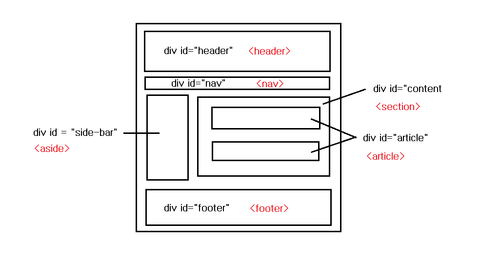

# 시맨틱 태그(Semantic tag)

> `semantic` 은 `의미의, 의미론의` 뜻을 가지고 있다. `semantic tag` 란 브라우저와 개발자에게 명확하게 의미를 전달해 주는 태그를 말한다.

> 예전에 페이지의 레이아웃을 만든다고 가정을 하면 `div tag`와 `span tag`의 나열을 통해서 만들었다. 그렇기 때문에 태그만으로 그 구역이 무슨 의미를 지녔는지 어떠한 설명이 존재하지 않으면 알기 힘들었다. 그래서 주석처리를 통해서 설명을 남기는 방법을 사용하기도 했다. HTML5에서는 이러한 불편함을 해소하고 생산성 향상을 위해서 태그에 의미를 부여한 시맨틱 태그가 탄생하였다. 그렇게 되면 태그만을 보고도 그 태그가 무슨 의미를 주는지 빠르게 파악하는게 가능하게 되었다. 즉 **의미론적인 문서(페이지)정보를 `태그만으로 전달` 가능하게 되었다**.



> 시맨틱태그의 비교 : 검은색에서 빨간색 으로 변화

# 시맨틱태그가 중요한 이유

-   위에서 언급했듯이 특별한 설명이 없이도 그 문서(페이지)에서 `구현하고자 하는 바(의도)`를 명확히 알 수 있게 되었다.
-   `SEO(Searching Engine Optimization, 검색엔진최적화)`란 검색엔진이 자료를 수집하고 순위를 매기는 방식에 맞게 웹페이지를 구성하는 것을 말한다. 여기서 검색엔진이 어떤 자료를 수집하고 어떻게 순위를 매기는지에 대한 기준은 HTML 태그이다. 예를 들어서 타이틀에 대한 정보를 두가지 방법으로 넣는다고 해보자.

    ```HTML
    //non semantic
    <div>시맨틱태그의 중요성</div>

    //semantic
    <h1>시맨틱태그의 중요성<h1>
    ```

    > 검색엔진은 div태그보다 h1태그안의 정보를 더 의미있는 정보로 인식하여 더 높은 순위를 매기게 된다. 그렇데 되면 검색결과의 상위에 노출될 가능성도 높아진다. 즉 시맨틱 태그는 `페이지에 대한 접근성을 높여주는 방법`이 될 수 있다.

-   개발자로 하여금 그 문서(페이지)에 대한 내용을 좀더 명확하게 이해할 수 있게 해준다. 코드에 대한 `가독성`이 높아진다.

# 시맨트태그의 종류

> 🚩 [더 많은 정보](https://www.w3schools.com/tags/default.asp)

|        tag        |                                                              description                                                               |
| :---------------: | :------------------------------------------------------------------------------------------------------------------------------------: |
|    `<address>`    |                                               문서에 연락처 정보를 넣는 영역을 지정한다.                                               |
|    `<article>`    |                                                 문서의 독립된 컨텐츠 영역을 지정한다.                                                  |
|     `<aside>`     |                                                  페이지의 사이드 바 영역을 지정한다.                                                   |
|     `<audio>`     |                                                       사운드 컨텐츠를 지정한다.                                                        |
|  `<blockquote>`   |                                  텍스트가 긴 인용문 구역을 설정한다. 들여쓰기가 자동으로 이루어진다.                                   |
| `<dl>, <dt>,<dd>` |                              무엇인가를 정의하는 구역의 리스트와 해당 컨텐츠를 구성하는 태그를 의미한다.                               |
|    `<details>`    |                                   "열림" 상태일 때만 추가 정보를 보여주는 정보 공개 위젯을 생성한다.                                   |
|    `<figure>`     |                                                  독립적인 컨텐츠를 정의할때 사용한다.                                                  |
|  `<figcaption>`   |                                    `<figure>`에 해당하는 컨텐츠의 설명을 추가할 수 있게 만들어준다.                                    |
|    `<footer>`     |                   문서의 하단을 정의하는 태그이다. 보통 구획의 작성자, 저작권 정보, 관련 문서 등의 내용을 담고 있다.                   |
|    `<header>`     |                       문서의 상단을 정의하는 태그이다. 일반적으로 소개 및 탐색에 도움을 주는 콘텐츠가 포함된다.                        |
|     `<mark>`      |          특정 단어를 두드러지게 표시할 때 사용한다. 예를 들어 검색결과에 찾은 키워드등을 두드러지게 표시할 때 사용할 수 있다.          |
|      `<nav>`      | navigation의 약자로 페이지에서 다른 페이지로의 이동에 관한 정보(링크)를 담을때 사용된다. 보통 메뉴, 목차, 색인과 같은 위치에 사용한다. |
|    `<section>`    |                                                     문서의 독립된 구역을 설정한다.                                                     |

> dl(definition list), dt(definition term), dd(definition description)

> `<detail />` [예시](https://developer.mozilla.org/ko/docs/Web/HTML/Element/details)

### 👁‍🗨 참고 `<aricle />` vs `<section />` vs `<div />`

>

-   `<aricle />` : `하나의 독립적인 내용`을 담을 때 사용한다. 예를 들어 각각의 뉴스들을 나열할 때 `<article />`을 사용할 수 있다.
-   `<section />` : `관계있는 문서들을 나눌 때` 사용한다. 문서를 주제에 따라서 분리할 때 사용할 수 있다(주제별 컨텐츠).
-   `<div />` : 어떠한 의미론적인 내용이 아닐때, 단순하게 영역의 의미만을 나타날 때 사용한다.

#### 어느 것을 선택해야 하는가?

-   동봉된 컨텐츠가 그 `독립된 자체만으로도 의미가 통하는가`? 만약 그렇다면 `<article>`를 사용하자.
-   동봉된 컨텐츠가 `주제와 관련된 것`이가? 그렇다면 `<section>`을 사용하자.
-   만약 `의미론적인 관련성이 없다면`, `<div>`를 사용하자.

> 보통 `<section />` 여러 개를 `<aricle />` 로 묶어서 사용하는 형태 갖는 것 같다. 하지만 이와 반대되는 구조(`<section />` 내부에 `<aricle />` 여러개)도 사용될 수 있다. `<aricle />`내부에는 타이틀 요소(h태그)를 넣어주는 것이 웹접근성면에서 좋다고 한다.

# Ref

-   [시멘틱 태그 Semantic Tag](https://kutar37.tistory.com/entry/%EC%8B%9C%EB%A9%98%ED%8B%B1-%ED%83%9C%EA%B7%B8-Semantic-Tag)
-   [Semantic Elements in HTML](https://www.w3schools.com/html/html5_semantic_elements.asp)
-   [Semantic code: What? Why? How?](https://boagworld.com/dev/semantic-code-what-why-how/)
-   [HTML section요소, main 요소](https://velog.io/@apricotsoul/HTML-section%EC%9A%94%EC%86%8C-main-%EC%9A%94%EC%86%8C)
-   [HTML5의 구조적인 요소들 #2](https://webclub.tistory.com/268)
