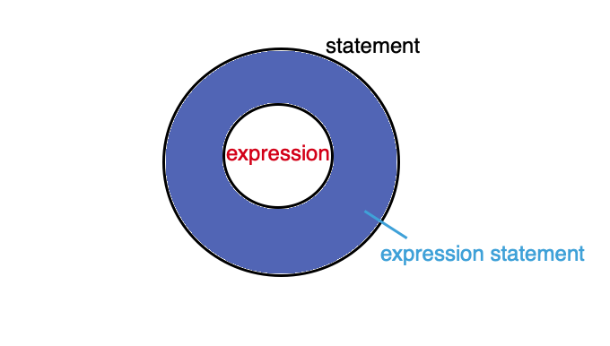
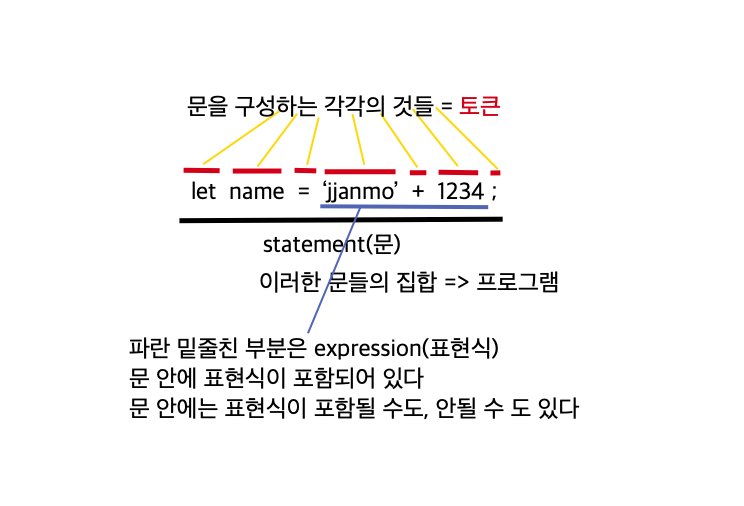

# Expression vs Statement vs Expression Statement

> [All you need to know about Javascript's Expressions, Statements and Expression Statements](https://dev.to/promhize/javascript-in-depth-all-you-need-to-know-about-expressions-statements-and-expression-statements-5k2) 를 보고 이해한 내용에 대해서 정리한다.

> 위 3가지는 아래의 이미지와 같은 관계로 표현된다. 그렇다면 각각의 어떤 차이점을 갖고 있는지에 대해서 알아보자



## Expression(표현식)

-   `값`을 기대할 수 있는 코드 조각, 즉 어떤 특정한 코드조각의 결과값으로 `값`이 나오는 것으로 평가된다면, 그 코드는 표현식이다.

    ```javascript
    314 + 314 * 2

    functionCall()

    true && getValue()

    name === 'jjanmo' ? 'Hello" : 'Who are you?'

    ```

-   표현식이 반드시 상태를 변경시키는 것은 아니다. 예를 통해서 이해하면 좀 더 쉽게 이해할 수 있다.

    ```
    let number = 25; //statement

    number + 10 //35 expression

    number + 20 //45 expression

    number - 15 //10 expression

    console.log(number); //25

    function changeNumber() {
        number = 100;
    }

    changeNumber() //expression
    ```

    > 위의 예시를 살펴보면 첫번째 라인은 특정 값을 할당한 `문`이다. 하지만 그 밑의 라인에 있는 코드들의 모두 특정 값을 반환하기 때문에 표현식이 된다.

    > `number`라는 변수를 사용해서 새로운 값이 계속 생성되었지만, `number`라는 값의 상태는 변하지 않았다.

    > 마지막 라인의 `함수 호출 하는 부분`은 `표현식`이다. 함수가 호출되면 무엇이든 특정값을 반환하기 때문이다. 하지만 `함수선언문`은 `문`이다. 그 문 안에서 상태가 변경되는 표현식이 포함 될 수 있다.

## Statement(문/문장)

-   코드 실행에 `힌트`가 되는 것들이 있는 코드 조각
-   코드 실행에 있어서 `기본 단위` 이자 `최소 실행 단위`
-   문은 표현식과 다르게 값을 반환하지 않는다. 그렇기 때문에 브라우저의 콘솔창에 `블록문 { }`을 입력하면 특정값이 반환되는 경우가 있지만 사실 그 값은 아무런 의미가 없는 값이다.

    ```javascript
    if (true) {
        9 + 9;
    }
    ```

-   `블록문 { }`은 값이나 표현식으로 사용할 수 없기 때문에 `블록문 { }`이 연산에 활용된다면, 내부적으로 `0`으로 처리하여 연산을 진행한다. 이러한 이유로 아래 표현식의 값을 예상할 수 있다.

    ```
    { } + 5  // 5
    { } + 11 // 11
    ```

    <br />

    ```
    if / if-else : 조건문
    while    : 반복문(while문)
    do-while : 반복문(do-while문)
    for / for-in : 반복문(for문)
    switch : 스위치문
    debugger :
    variable declaration : 변수 선언문

    -------------------------------

    assignment statement : 할당문
    ```

    > 자바스크립트에서 이러한 것들이 `문`에 해당한다. 위에서 밑줄로 구분을 해놓았다. 밑줄 위에 부분은 표현식이 포함되지 않은 문, 밑줄 아래 부분은 표현식이 포함된 문이다.

    > > 명확하게 저렇게 나누어 떨어지는 것은 아니지만 크게 보면 저렇게 나눌 수 있다. 물론 예를 들어 while문 안에 표현식이 포함될 수도 있다. 그렇게 따진다기보다 문을 구성하는 키워드만으로 러프하게 생각했을때를 말한다. 또한 할당문이라는 것 자체가 값을 특정 변수에 할당하는 것이기 때문에 이미 그 안에는 표현식이 포함될 수 밖에 없다.

    <br />

    

    > 문의 구성

## Expression Statement

-   단순하게 표현식에 세미콜론이 붙으면 `Expression Statement`이 된다.

-   문에 대해서 언급할 때, 말했던 것처럼 표현식이 포함된 문을 `expression statement(표현식 문)` 이라고 한다.

    ```javascript
    10 + 4; //expression statement

    foo(); //expression statement

    let name = 'jjanmo' + 123; //expression statement
    ```

## 세미콜론과 쉼표의 역할

```javascript
const number = 10; function add(x, y) { return x + y; }; let name = 'jjanmo'; 
```

> 세미콜론을 통해서 여러 줄의 문을 한 줄의 문으로 나타낼 수 있다. 세미콜론은 문을 연결할 수 있는 기능을 갖는다.

```javascript
function add(x, y) {
    return x + y;
}

console.log((2 + 2, 4 + 4, add(10, 11)));
```

> 쉼표는 여러 개의 표현식을 연결할 수 있도록 해준다. 그리고 마지막 반환은 가장 마지막에 있는 표현식의 값을 반환한다.

<br />

## 함수 관련 문과 표현식

> 함수는 그 이름 안에서 문인지 식인지를 알 수 있다.

-   함수 선언`문`

    ```javascript
    //statement
    function myFunc() {
        //code here
    }

    myFunc(); //expression
    ```

    > 함수 선언문은 말그대로 문(statement)이다. 하지만 함수의 호출은 위에서 말했던 것처럼 값을 반환하기때문에 표현식이다.

-   함수 `표현식`

    ```javascript
    const myFunc = function () {
        //code here
    };
    ```

    > 함수 표현식도 말 그대로 표현식이다. 함수의 이름을 정하지 않기때문에 익명함수라고 불린다. 하지만 이름을 정해도 상관없다. 이름을 정할 경우 함수내에서 자신을 참조할 때 사용될 수 있으며, 혹은 디버거 내의 스택 추적에서 함수를 식별하는데 사용된다.

-   IIFE(Immediately Invoked Function `Expression`)
    ```javascript
    (function () {
        //code here
    })();
    ```
    > 즉시실행함수라고 불리는 함수이다. 정의되자마자 실행되는 함수이다. 즉 함수가 선언되자마자 호출된 것이기때문에 사실상 그 자체로 값을 반환한다. 그렇기때문에 표현식(expression)이 되는 것이다.

# Ref

-   [Expression and Statement(표현식과 문)](https://velog.io/@kim-jaemin420/Expression-and-Statement%ED%91%9C%ED%98%84%EC%8B%9D%EA%B3%BC-%EB%AC%B8)
-   [자바스크립트 개발자라면 알아야 할 33가지 개념 #7 표현식(Expression)과 문장(Statement) (번역)](https://velog.io/@jakeseo_me/%EC%9E%90%EB%B0%94%EC%8A%A4%ED%81%AC%EB%A6%BD%ED%8A%B8-%EA%B0%9C%EB%B0%9C%EC%9E%90%EB%9D%BC%EB%A9%B4-%EC%95%8C%EC%95%84%EC%95%BC-%ED%95%A0-33%EA%B0%80%EC%A7%80-%EA%B0%9C%EB%85%90-7-%ED%91%9C%ED%98%84%EC%8B%9D%EA%B3%BC-%EB%AC%B8Statement-%EB%B2%88%EC%97%AD-2xjuhvbal7)
