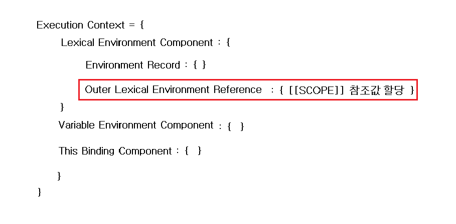
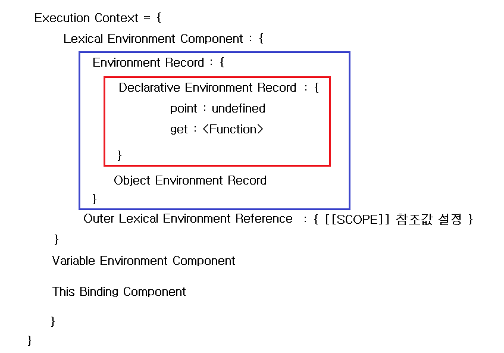

# Execution Context

## 정의

## 구성

## 과정

## Execution Context(실행컨텍스트)란?

- 함수가 실행되는 영역, **묶음**을 말한다.
- 함수 코드를 실행하고 실행결과를 저장한다.
- 함수가 호출되는 시점에 실행컨텍스트가 생성된다.
- 함수가 호출되면 `3가지의 값`을 실행 컨텍스트로 넘겨준다.
  - 함수를 호출한 `object` 🧷 `this binding component`에 설정
  - `함수 코드(함수 안에 작성된 코드)` 🧷 `function object`의 `[[Code]]` 프로퍼티에 설정
  - 호출한 함수의 `인자(parameter값)` 🧷 `Argument object`에 설정

## Execution Context has two phases

- Creation phase

- Code execution phase

### 실행 컨텍스트의 구성

> 아래 코드의 실행 컨텍스트 처리 과정을 정리해보기

```javascript
function book() {
  function get() {
    return point;
  }

  var point = 123;
  return get();
}
console.log(book());
```

<준비단계>

1. `function` 키워드를 만나면 `function object(book)`를 생성한다.
2. 이 때, `function object` 안의 내부프로퍼티인 `[[SCOPE]]` 에 **함수 밖의 스코프**(여기선 global scope)를 설정
   > 이렇게 생성되는 것을 `Lexical Environment(정적환경)`에 의해 결정된 스코프이다.

> 처음 `function object`를 생성할 때는 함수의 내부를 해석하지 않는다.

3. 이 후 `book()이 호출`되면, 해당 함수의 `실행컨텍스트가 생성`된다.
4. 엔진은 이 생성된 실행컨텍스트 안으로 이동한다.

<준비 단계>

5. 실행 컨텍스트 안의 여러가지 컴포넌트와 레코드를 생성한다.
   이 때 생성된 컴퍼넌트와 레코드는 우선 빈 값을 갖게 된다.

6. function object 생성시 결정되었던 `[[SCOPE]]`의 `참조값`을 실행 컨텍스트 안의 `Lexical Environment Component`의 `Outer Lexical Environment Refenence`에 첨부한다.

> 여기까지의 실행컨텍스트의 상태



<초기화 단계>

7. 이제부터 함수 내부의 변수와 함수를 초기화 한다.

> 함수 내부의 변수와 함수들은 실행 컨텍스트 안의 `Lexical Environment Component`의 `Environment Record`의 `Declarative Environment Record`안에 설정된다.

8. 여기서 내부의 함수 `function get() { }`로 된 `함수 선언식`이 있기 때문에 다시 위에 한 작업을 진행한다. 즉 함수에 대한 `function object`를 생성하고 이 `function object 외부 환경`을 `[[SCOPE]]`에 연결 해준다.

9. 변수의 경우, `변수이름 = undefined`로 초기화 된다.(변수의 선언)

> `var` 가 아닌 `let, const`같은 경우, `변수 이름 = uninitialized` 가 된다. `ES6`의 차이점이다

10. `parameter`가 있다면, 넘겨받은 값을 `값`으로, parameter의 이름을 `이름`으로 하여 함수의 parameter에 `맵핑`시켜서 설정한다. 또한 이 때 `Arguments` 객체가 생성된다.

> 여기까지의 실행컨텍스트의 상태



<실행 단계>

11. 이제 변수 `point`에 값을 할당하고, 값을 return 한다.
    이 때 return값이 함수 호출하는 것이기 때문에 get()에 대한 실행 컨텍스트가 생성되고 `준비 단계와 초기화 단계`를 거쳐서 `point`에 대한 `indentifier resolution`이 되어 `123`이라는 값이 출력된다.

> `parameter mapping` 과정을 엔진관점에서 설명하기

> `paramter mapping`이란? 호출한 함수에서 넘겨준 인자(parameter 값)를 호출된 함수의 `작성순서`에 따라서 `function object의 [[FormalParameters]]` 프로퍼티에 작성된 이름(function object생성시 이미 작성되어있음)에 값을 매핑하고 실행컨텍스트의 `Declarative Environment Record`에 결과를 설정하는 것을 말한다.

```javascript
var obj = {};
obj.getTotal = function (one, two, two) {
  console.log(one + two); //66
};
obj.getTotal(11, 22, 55);
```

1. `function object의 [[FormalParameters]]`에 `one, two, two`라는 parameter의 이름이 설정된다.
2. getTotal()이 호출될 때, 실행컨텍스트가 생성이 되고 function object에 설정된 parameter 이름의 `작성순서`에 따라서 parameter값(arguments:11,22,55)이 `Declarative Environment Record`에 입력된다.
3. console.log()의 실행단계에서 one과 two에 해당하는 값을 찾는데, one은 그래도 11이 오게되지만 two는 순서대로 22와 55가 존재하기때문에 마지막에 설정된 two의 값을 가져오게 된다.

## Ref

- [자바스크립트 중고급자 되기: 근본 핵심 이해 Section4](https://www.inflearn.com/course/%EC%9E%90%EB%B0%94%EC%8A%A4%ED%81%AC%EB%A6%BD%ED%8A%B8-%EC%A4%91%EA%B3%A0%EA%B8%89)

- [모던 자바스크립트 입문 8장](http://www.yes24.com/Product/Goods/59410698)

- [Understanding Execution Context and Execution Stack in Javascript](https://blog.bitsrc.io/understanding-execution-context-and-execution-stack-in-javascript-1c9ea8642dd0))
