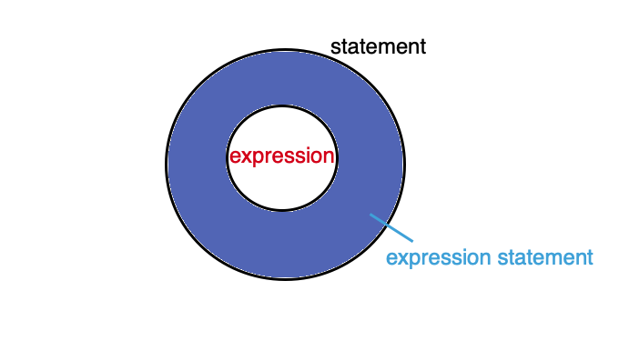

# Expression vs Statement vs Expression Statement

Expression(**표현식**/식), Statement(문장/**문**) 그리고 Expression Statement(표현식 문장)간의 관계는 아래의 다이어그램처럼 표현할 수 있다. 그렇다면 각각의 어떤 차이점을 갖고 있는지에 대해서 알아보자



## Expression(표현식)

- `값`을 기대할 수 있는 코드 조각, 즉 어떤 특정한 코드 조각의 결과값으로 `값`이 나오는 것으로 평가된다면, 그 코드는 `표현식`이다.

  ```js
  314 + 314 * 2

  functionCall()

  true && getValue()

  name === 'jjanmo' ? 'Hello" : 'Who are you?'

  ```

- 표현식이 반드시 상태를 변경시키는 것은 아니다. 예를 통해서 이해하면 좀 더 쉽게 이해할 수 있다.

  ```
  let number = 25 // → statement

  number + 10 // 35 → expression

  number + 20 // 45 → expression

  number - 15 // 10 → expression

  console.log(number); // 25

  function changeNumber() {
    number = 100;
  }

  changeNumber() // → expression
  ```

  > 위의 예시를 살펴보면 첫번째 라인은 특정 값을 할당한 `문`이다. 하지만 그 밑의 라인에 있는 코드들의 모두 특정 값을 반환하기 때문에 `표현식`이 된다.

  > `number`라는 변수를 사용해서 새로운 값이 계속 생성되었지만, `number`라는 값의 상태는 변하지 않았다.

  > 마지막 라인의 `함수 호출 하는 부분`은 `표현식`이다. 함수가 호출되면 무엇이든 특정값을 반환하기 때문이다. 하지만 `함수 선언문`은 말 그대로 `문`이다. 그 문 안에서는 상태가 변경되는 표현식이 포함될 수 있다.

## Statement(문장/문)

- 코드 실행에 `힌트(키워드)`가 되는 것들이 있는 코드 조각 (아래는 문이 될 수 있는 대표적인 키워드이다.)

  - if / if-else : 조건문

  - while : 반복문(while문)

  - do-while : 반복문(do-while문)

  - for / for-in : 반복문(for문)

  - switch : 스위치문

  - debugger : 디버깅

  - variable declaration : 변수 선언문

  - assignment statement : \*할당문 (표현식이 포함된 문)

    > 할당문은 값을 변수에 할당하는 것이므로 이미 그 안에는 표현식이 포함될 수 밖에 없다.

- 코드 실행에 있어서 `기본 단위` 이자 `최소 실행 단위`

- 문은 표현식과 다르게 값을 반환하지 않는다. 그런데 아래와 같은 코드를 브라우저의 콘솔창에 치면 18이라는 값을 반환하는 것을 확인할 수 있다. 하지만 해당 값은 어디에도 할당되지 않는 값이다. 그렇기 때문에 콘솔에는 출력되지만 코드적으로 사용할 수 없는 값이다. 즉 의미 없는 값인 것이다.

  ```js
  if (true) {
    9 + 9;
  }
  ```

- `블록문 { }` 은 값이나 표현식으로 사용할 수 없기 때문에 `블록문 { }`이 연산에 활용된다면, 내부적으로 `0`으로 처리하여 연산을 진행한다. 이러한 이유로 아래 표현식의 값을 예상할 수 있다.

  ```
  {  } + 5;  // 0 + 5 = 5
  {  } + 11; // 0 + 11 = 11
  ```

### 문의 구성

> 문을 분석해보자.


### Expression Statement(표현식 문장)

- 단순하게 표현식에 세미콜론이 붙으면 `Expression Statement`이 된다. 즉 표현식에 세미콜론이 붙으면 이것을 표현식 문장이라고 부른다. 그래서 이를 `표현식이 포함된 문`이라고 한다.

  ```js
  10 + 4; // expression statement

  foo(); // expression statement

  let name = 'jjanmo' + 123; // expression statement
  ```

### 세미콜론(Semi-colon) vs 콤마(Comma operator)

```
const number = 10; function add(x, y) {return x + y;}; let name = jjanmo';
```

> 세미콜론을 통해서 여러 개의 문을 한 줄의 문으로 나타낼 수 있다. 세미콜론은 문을 연결할 수 있는 기능을 갖는다.

```javascript
function add(x, y) {
  return x + y;
}

2 + 2, 4 + 4, add(10, 11); // 21
```

> 쉼표는 여러 개의 표현식을 연결할 수 있도록 해준다. 그리고 마지막 반환은 가장 마지막에 있는 표현식의 값을 반환한다.

> 브라우저의 콘솔에 위의 코드를 복붙하면 마지막으로 실행된 `add(10, 11)`에 의해서 `21`만이 반환되는 것을 확인 할 수 있다.

### 함수 관련 문과 표현식

> 함수는 그 이름 안에서 문인지 표현식인지를 알 수 있다.

- 함수 선언`문`

  ```js
  // statement
  function myFunc() {
    //code here
  }

  myFunc(); // expression
  ```

  > 함수 선언문은 말그대로 문(statement)이다. 하지만 함수의 호출은 위에서 말했던 것처럼 값을 반환하기 때문에 표현식이다.

- 함수 `표현식`

  ```javascript
  const myFunc = function () {
    //code here
  };
  ```

  > 함수 표현식도 말 그대로 표현식이다. 함수의 이름을 정하지 않기 때문에 익명함수라고 불린다. 하지만 이름을 정해도 상관없다. 이름을 정할 경우 함수내에서 자신을 참조할 때 사용될 수 있으며, 혹은 디버거 내의 스택 추적에서 함수를 식별하는데 사용된다.

- IIFE(Immediately Invoked Function `Expression`)
  ```javascript
  (function () {
    //code here
  })();
  ```
  > `즉시 실행 함수`라고 불리는 함수이다. 약자를 풀어 쓰면 끝에 `E`가 `Expression`이라는 것을 알 수 있다. 즉 이것은 표현식이다. 또 즉시 실행 함수의 동작 방식을 이해하면, 이것이 표현식이라는 것을 이해할 수 있다. 즉시 실행 함수가 선언되자마자 호출되어 값을 반환하기 때문에 표현식이 되는 것이다.

### 객체 리터럴(Object Literal) vs 블럭문(Block Statements)

객체를 생성하는 방법에는 3가지가 있다.

- new 연산자

- Object.create() 메소드

- 객체 `리터럴`

  > 리터럴 : 변수에 할당하는 고정 형태의 값

이 중에서 가장 많이 사용하는 방법이 객체 리터럴이고 특별한 방법을 말하는 것이 아니다. `{ }`를 이용해서 객체를 생성하는 방법이다.

```js
var obj = {
  a: 1,
  b: 'jjanmo',
  c: [10, 20, 30],
};
```

**[참고]**

객체 리터럴을 통해서 객체를 주로 생성하는 이유는 다른 것에 비해 더 짧고 직관적이다. 또한 부작용을 방지할 수 있다. 예를 들어 new Array()안에 몇 개의 인자가 들어가냐에 따라서 어떻게 새로운 배열이 생성될지가 달라진다.

```js
var a = new Array();
var b = new Array(1);
var c = new Array(1, 2);
var d = new Array(1, 2, 3);

console.log(a, b, c, d);
// a : []
// b : [empty]
// c : [1, 2]
// d : [1, 2, 3]
```

> 위 코드는 모두 인자로 들어간 숫자를 요소를 갖는 배열을 생성하기 위해서 배열을 생성하였다. 그런데 결과적으로 생성된 배열의 모습이 다르다. 이처럼 new 연산자에 의한 객체 생성은 우리가 의도한 대로 작동이 안될 수도 있다.

객체 리터럴과 같은 형식으로 쓰지만 `{ }`는 블럭문으로 사용될 때도 있다. 이 때는 문과 표현식 문장을 그룹화하는데 사용한다.

```js
{
  var nickname = 'jjanmo';

  callMe();

  'Hello' + 'World';
}
```

직관적으로 느낄수 있지만, 객체 리터럴과 블럭문은 다르다. 객체 리터럴은 값으로서 사용될 수 있다. 하지만 블럭문은 값으로서 사용될 수 없다. 알기 쉬운 예로 브라우저에서 로그를 찍을 때, 객체 리터럴과 블럭문을 인자로 넣어보면 객체 리터럴은 작동이 되지만 블럭문은 에러를 발생한다.

```js
console.log({a : 1}); // {a : 1}

console.log({a = 1; func(){}; 2+3 }); // SyntaxError
```

위에서 한번 언급했지만, 블럭문은 값을 반환하지 않기 때문에 내부에서 0으로 강제형변환 시켜서 반환한다.

```
{ } + 1 // 0 + 1 → 1

{2} + 2 // 0 + 2 → 2

{2+2} + 3 // 0 + 3 → 3

{2+2} - 3 // 0 + -3 → -3
```

### Label(레이블/라벨)

다른 언어에서는 레이블/라벨 구문을 많이 보고 사용해봤지만 자바스크립트에서는 해당 구문을 사용한 적이 별로 없다. 하지만 자바스크립트에서도 역시 유효한 구문이다. 레이블을 사용함으로 특정 구역(블럭)에 대한 이름을 지정할 수 있게 된다. syntax는 아래와 같다.

```
label :
   statement
```

주로 반복문에서 사용된다. 이 때 문의 위치를 지정해주고 break나 continue를 통해서 레이블된 반복문에 대한 로직을 구현할 수 있다.

```js
loop1: for (let i = 0; i < 3; i++) {
  loop2: for (let j = 0; j < 3; j++) {
    if (i === 1 && j === 1) {
      continue loop1;
    }
    console.log('i :', i, 'j : ', j);
  }
}
/*
i : 0 j :  0
i : 0 j :  1
i : 0 j :  2
i : 1 j :  0
i : 2 j :  0
i : 2 j :  1
i : 2 j :  2
*/
```

위 코드의 결과값을 보면 알겠지만, 레이블을 통해서 원하는 반복문을 쉽게 드나들 수 있다.

## Ref

- [자바스크립트 개발자라면 알아야 할 33가지 개념 #7 표현식(Expression)과 문장(Statement) (번역)](https://velog.io/@jakeseo_me/%EC%9E%90%EB%B0%94%EC%8A%A4%ED%81%AC%EB%A6%BD%ED%8A%B8-%EA%B0%9C%EB%B0%9C%EC%9E%90%EB%9D%BC%EB%A9%B4-%EC%95%8C%EC%95%84%EC%95%BC-%ED%95%A0-33%EA%B0%80%EC%A7%80-%EA%B0%9C%EB%85%90-7-%ED%91%9C%ED%98%84%EC%8B%9D%EA%B3%BC-%EB%AC%B8Statement-%EB%B2%88%EC%97%AD-2xjuhvbal7)
