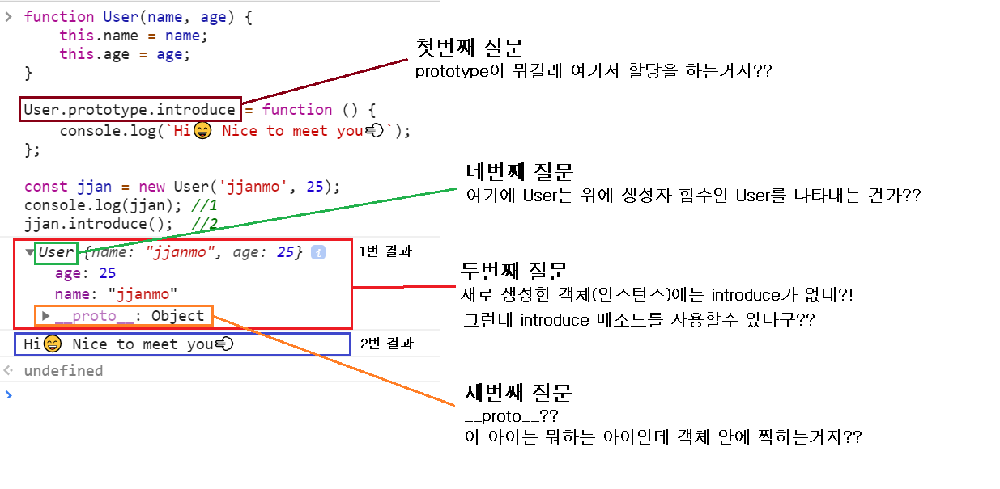
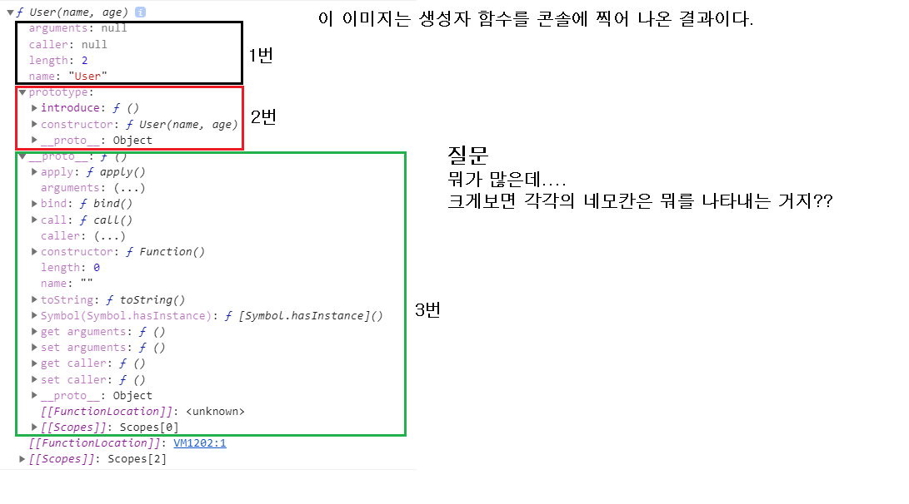
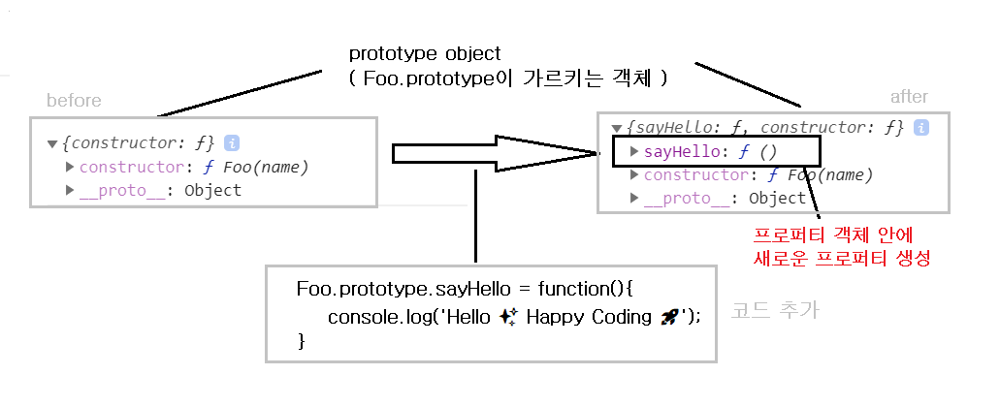

# Prototype Inheritance and Prototype Chain

> 자바스크립트의 객체 지향에 대해서 이야기 할 때 `프로토타입 상속`, `프로토타입 체인`이라는 말을 한다. 여기서 `프로토타입`이 무엇인지부터 알 필요성이 있다. 지금부터 자바스크립트의 `프로토타입`이란 무엇이며 나아가 `프로토타입 상속`과 `프로토타입 체인`에 대해서 알아보자.

✅ 참고 프로토타입 기반 언어(Prototype based language)

> 객체 지향 언어를 크게 두가지로 나눌 수 있다. 먼저 우리가 일반적으로 객체지향 언어라고 하면 생각하는 `클래스` 라는 틀을 이용하는 클래스 기반 객체 언어가 있다. Java가 가장 대표적인 클래스기반 언어이다. 또다른 하나가 앞으로 알아볼 `프로토타입 기반 언어`이고 자바스크립트가 `바로 여기에 속한다.

https://developer.mozilla.org/ko/docs/Learn/JavaScript/Objects/Object_prototypes 참고해서 이 부분 채우기

## prototype을 사용하는 이유

> prototype을 사용하여 변경되는 코드를 보면서 나오는 용어를 먼저 살펴보고 **궁금한 점**에 대해서 생각해보자

```javascript
function User(name, age) {
  this.name = name;
  this.age = age;
  this.introduce = function () {
    console.log(`Hi😄 Nice to meet you💨`);
  };
}

const jjan = new User('jjanmo', 25);
const jjin = new User('jjinmo', 15);
//....1억명의 유저를 생성한다고 가정
```

> 위의 코드 처럼 생성자 함수를 이용하여 1억명의 유저 객체(인스턴스)를 만든다고 해보자. 그렇게 되면 위의 생성자 함수에서 `name, age, introduce` 라는 프로퍼티를 가진 객체(인스턴스)가 1억개 생성된다. 물론 이것 자체가 크게 문제 되지 않을 수도 있다. 그런데 여기서 더 상상해보자. 생성자 함수에서 3개의 속성이 아니라 1억개의 속성을 만든다면...😅. 이것을 생성하는데 많은 자원(메모리 등)이 필요하게 될 것이다. 위 생성자 함수만 보더라고 `introduce`라는 메서드는 공통된 것이기 때문에 굳이 매번 만들어줄 필요가 없다. 이를 조금 더 디테일하게 설명하면 `introduce` 메서드를 모든 객체(인스턴스)들의 `부모 객체`에게 만들어 준 다음 그 `부모객체`를 참조하여 `introduce` 메서드를 사용할 수 있다. 그렇게 되면 객체(인스턴스)에서 공통적으로 사용하는 메소드나 변수 새로운 객체(인스턴스)를 생성할 때마다 생성을 안해주기 때문에 그만큼 자원소비를 막을 수 있다. 이것이 `prototype의 상속` 이고, 이러한 의도로 prototype을 이용한다.(물론 이것이 prototype의 전부는 아니다💨)

```javascript
function User(name, age) {
  this.name = name;
  this.age = age;
}

User.prototype.introduce = function () {
  console.log(`Hi😄 Nice to meet you💨`);
};

const jjan = new User('jjanmo', 25);
console.log(jjan); //1
jjan.introduce(); //2
console.dir(User); //3
```

> 위 코드는 prototype을 사용하여 변경한 코드이다. 아래는 이것에 대한 콘솔에서 출력한 결과값 이미지들이다.

> 1번과 2번



> JS GOD : 위에서 적힌 질문에 답을 할 수 있냐? 그렇다면 다음 단계로 넘어가거라

> 3번



> JS GOD : 요건 모르겠지?? 모르면 지금부터 잘 찾아봐라😈 GO GO

- 위의 이미지에서 나온 질문들을 요약하면 다음과 같다.
  1.  객체 내부에서 의미하는 `prototype은 무엇`인가
  2.  `prototype을 어떻게 사용`해야할까?
  3.  `__proto__`는 무엇인가?
  4.  `생성자 함수의 내부`에는 무엇이 있는가?

> 이 각각에 대해서 대답하는 과정이 자바스크립트의 prototype에 대해서 이해하는 과정이 될 것이다.

## prototype이란

- `prototype`이라는 말은 `원형, 초기형태`라는 뜻을 갖는다. 이 의미를 잘 음미하면서 `prototype`을 생각해보자.

- 모든 함수는 생성되면 2가지의 객체가 생성된다. 첫번째는 함수 객체(function object)이고 두번째는 프로토타입 객체(prototype object)이다.

- 둘 다 모두 객체이기 때문에 프로퍼티를 갖고 있다. 함수 객체에서의 `prototype`이라는 프로퍼티가 있다. 이것은 `프로토타입 객체`를 가르킨다. 반대로 프로토타입 객체는 `constructor`라는 프로퍼티가 있다. 이것은 `함수 객체`를 가르킨다. 즉 이 둘은 `상호 참조`를 하고 있는 상태가 된다.

- 함수 객체는 말 그대로 함수 자체에 대한 정보를 프로퍼티 형식으로 갖고 있다. 예를 들어서 `arguments` 라는 프로퍼티는 함수에 들어오는 인자 정보 갖는다. `prototype`도 역시 프로퍼티로서 프로토타입 객체를 가르키고 있는 것이다.

- 프로토타입 객체는 함수 객체를 만든 원형(?)으로서 그 안에도 역시 프로퍼티를 갖고 있다. `constructor`라는 프로퍼티에 함수 객체를 가르키게 함으로서 함수 객체에게 `생성자로서의 역할`을 부여한다.

- 자바스크립트에서 생성자라 함은 객체를 생성할 수 있는 함수를 말한다. 생성자 자격을 부여받은 함수가 new 연산자를 통해서 새로운 객체(인스턴스) 생성할 수 있게 된다.

- 보통 자바스크립트에서는 대문자로 작성된 함수를 생성자라고 한다. 하지만 기본적으로 모든 함수는 생성자 자격을 부여받기때문에 new 연산자를 통해서 객체(인스턴스)를 생성할 수 있다. 대문자로 사용하는 이유는 생성자 함수와 일반 함수를 구분하기 위한 하나의 방법이다.

  

  > 위의 설명을 그림으로 표현하였다.

### 요약해보자면,

🚀 prototype 이란 `모든 함수 객체가 갖고 있는 프로퍼티`로서 이것은 `프로토타입 객체`를 가르킨다. prototype 프로퍼티는 함수 객체가 가진 프로퍼티로서 그 프로퍼티가 가르키고 있는 것이 프로토타입 객체인 것이다. 이 둘을 헷갈리지 말자.

그래서 프로토타입 객체는 뭔데?? 추가!!🚀

> 그렇다면 왜 이 둘을 상호 참조를 하게 만들어져 있을까? `prototype link(__proto__)`에 대해서 알고 나면 그 이유를 알게 될 것이다.

## prototype 사용법

> 앞에서도 말했듯이 prototype은 함수 객체의 프로퍼티이고 `Foo.prototype`이라고 하면 프로토타입 객체를 가르킨다. 즉 `Foo.prototype`이라는 **객체**에 접근해서 속성을 변경하는 방법이라고 생각하면 된다. 일반적인 객체의 속성에 접근해서 변경하는 것과 동일하다.

```javascript
function Foo(name) {
  this.name = name;
}
console.log(Foo.prototype); //1

Foo.prototype.sayHello = function () {
  console.log('Hello ✨ Happy Coding 🚀');
};

console.log(Foo.prototype); //2
```

> 위 결과에 대한 이미지이다. 이미지에서 볼 수 있듯이 프로토타입 객체에 새로운 프로퍼티가 추가되었음을 확인할 수 있다.
> 

## **proto**는 무엇일까?

- 모든 객체는 `__proto__`라는 프로퍼티를 갖고 있다.
- 함수 역시 객체이기때문에 `__proto__`를 갖고 있다.
- `__proto__`는 `prototype link` 라고 하는 객체 간의 연결고리이다.
-

```javascript

```

# Ref

- [객체 지향 언어의 두 가지 줄기](http://mohwa.github.io/blog/javascript/2015/10/16/prototype/)

- [Javascript: prototype 이란\_마이구미의 HelloWorld](https://mygumi.tistory.com/312)

- [프로토타입](https://poiemaweb.com/js-prototype)
-
- [[속깊은 자바스크립트 강좌] 객체지향의 기본: prototype](https://unikys.tistory.com/316)
- [Javascript 와 Prototype 프로토 타입](https://medium.com/@pks2974/javascript-%EC%99%80-prototype-%ED%94%84%EB%A1%9C%ED%86%A0-%ED%83%80%EC%9E%85-515f759bff79)

- [프로토타입 상속](https://ko.javascript.info/prototype-inheritance#ref-1206)

- [Prototype in JavaScript: it’s quirky, but here’s how it works](https://www.freecodecamp.org/news/prototype-in-js-busted-5547ec68872/)

- [JavaScript — Prototype](https://codeburst.io/javascript-prototype-cb29d82b8809)

- [Javascript 프로토타입 이해하기](https://medium.com/@bluesh55/javascript-prototype-%EC%9D%B4%ED%95%B4%ED%95%98%EA%B8%B0-f8e67c286b67)

- [Object prototype 이해하기\_Insanehong](http://insanehong.kr/post/javascript-prototype/)
