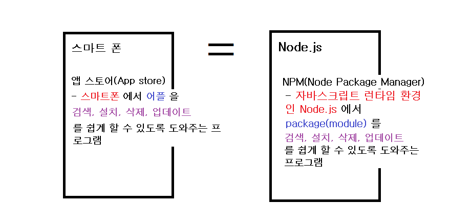
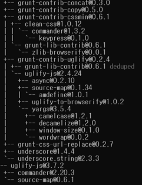
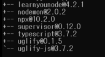

# NPM이란

-   Node.js 환경에서 package(module)를 관리하는 manager(프로그램)이다.

    

# NPM 설치

-   Node.js를 설치하면 NPM이 같이 설치된다.

-   NPM 설치 확인
    -   `node -v` : node.js 의 버전 확인
    -   `npm -v` : npm의 버전 확인
        > 정확히 설치되었다면, node.js와 npm의 해당 버전 정보가 출력된다.
    -   `npm` : npm 명령어 사용설명서
        > npm 명령어를 모를 때는 `npm` 을 통해서 찾아볼 수 있다.

# NPM 사용법

> 예시로서 [local-web-server package](https://www.npmjs.com/package/local-web-server) 를 사용하였다.

> package가 달라지는 경우, **package 이름**에 해당하는 부분만 변경하여 적용하면 된다.

## Package 검색

> 설치하고 싶은 package를 **[NPM](<[npmjs.com](https://www.npmjs.com/)>)** 사이트에서 검색하거나 **구글링**을 통해서 관련 package를 직접 찾아가면서 설치할 수 있다.

## Package 설치

```
📖 NPM을 통해서 설치하는 패키지의 종류
  1. 독립적인 패키지
    독립적으로 실행되는 Command Line Program(CLI Program)
  2. 종속적인 패키지
    일종의 부품으로서 다른 프로그램 안에서 사용되는 패키지
```

-   `npm install local-web-server`

    -   현재 위치하는 디렉토리에 패키지가 설치된다.
    -   내가 지금 만들려는 프로그램의 부품으로서 이 패키지를 사용하겠다는 의미일 때 보통 이렇게 명령어를 사용한다.

-   `npm install -g local-web-server`

    -   전역적인, 독립적인 프로그램으로서 이 패키지를 설치하고 싶을 때는 옵션 `-g`를 사용한다.
    -   -g : global

-   `ws`
    -   독립적인 프로그램으로서, 웹서버로서 프로그램이 실행된다.
    -   실행 명령어는 각각 설치하는 패키지마다 다르다.

## Package 목록 검색

-   `npm list`
    -   현재 디렉토리에 설치된 패키지의 목록과 패키지의 의존관계를 보여준다.
-   `npm list -g`

    -   전역적으로 설치된 패키지의 목록을 보여준다.
    -   설치한 패키지 + 그 안에 부품으로서의 패키지 모두 보여준다.

    (목록의 일부분)

-   `npm list -g --depth=0`

    -   설치한 프로그램에 대한 목록만 보여준다. 즉 의존관계에서 가장 처음에 있는 부분에 해당하는 목록만 보여준다.

    

## Package 업데이트

-   `npm update -g local-web-server`

## Package 삭제

-   `npm uninstall -g local-web-server`
-   `npm remove -g local-web-server`

> 전역으로 설치하지 않았다면, 업데이트와 삭제 명령어에서 -g를 빼면 된다.

# 참고

[생활코딩](https://opentutorials.org/module/4044)
