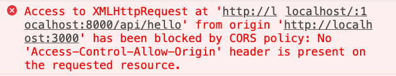

# CORS 에 대해서 알아보자.

> 웹 개발, 특히 프런트 작업을 하다보면 자주 마주치는 오류가 바로 `CORS`이다. 사실 고백하건데 이 오류를 해결하기 위해서 여러가지 문서를 보고 이해하려고 했지만 제대로 이해가지 않아서 아주 쉬운 해결 방법인 [크롬의 익스텐션](https://chrome.google.com/webstore/detail/allow-cors-access-control/lhobafahddgcelffkeicbaginigeejlf?hl=ko)을 이용해서 결과만 나오게 하여 넘어갔다. 하지만 이번엔 개념을 꼭 이해하려는 다짐과 함께 정리해보고자 한다.

> 아래 이미지는 해당 프로젝트인 프런트(리액트)와 서버(노드)의 통신 중에 나타난 에러이다. 여태까지는 아주 친숙하지만 본질(?)을 이해하지 못한채 해결하기 급급한 에러였다. 사실 위 에러를 해석해보면 자연스럽게 이해하고 무엇을 찾아서 이해해야할지 알 수 있다. 아주 친절한 에러 메세지 였던 것이다.

> `from origin A to B 로의 요청에 대한 접근이 CORS 정책에 의해서 블락되었다.`라는 것이 위 에러에 대한 해석이다. <strike>참 쉽죠잉~</strike> 이라고 할뻔...😅 &nbsp; 사실 정확히 이해하지 못하겠다. 그래서 뭐?? 라는 대답이 절로 나온다. 자 그럼 이제 위 에러 메세지가 무엇을 의미하는지 살펴보도록 하자.

 

## CORS

**CORS**란 `Cross-Origin Resource Sharing`의 줄임말로서 `교차-출처 자원 공유`라는 아주 정확하고 **이해하기 어려운 의미**로 직역할 수 있다. 각각의 단어 자체가 어려운 것은 아니다. 단지 그 단어가 웹 상에서 나타내는 의미가 우리가 일반적으로 생각하는 의미와 다르기 때문에 이해하기 어려운 것이다. 그렇다면 각각의 단어가 웹 상에서 무엇을 의미하는지부터 알아보자.

- 교차-출처

- 자원

- 공유
